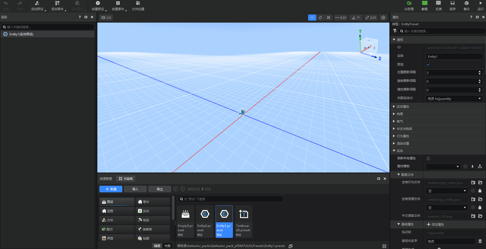
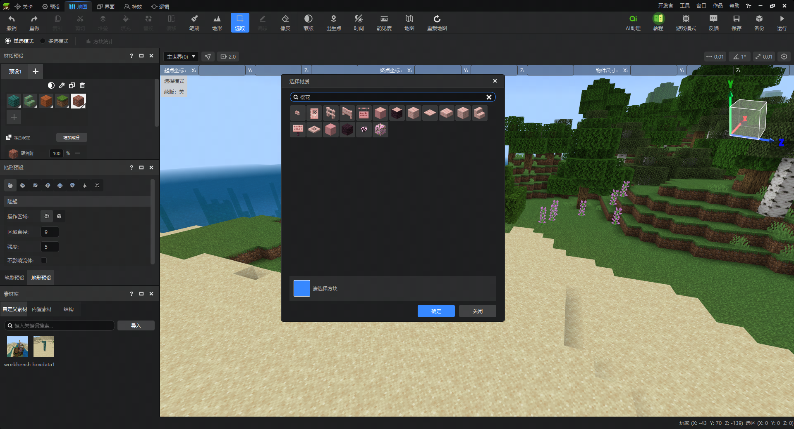
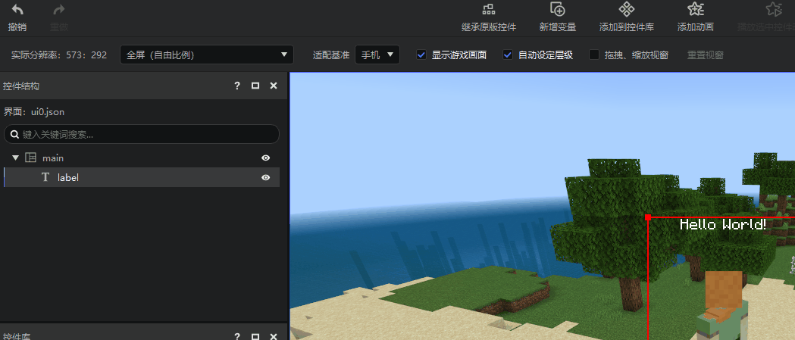

#  2024.6.20 版本1.1.11

## 实体预设新增

1. 添加悦灵、监守者实体预设。现在您可以复用悦灵、监守者的内容创建自定义实体，亦或是覆写原有的实体资源和行为。

   > 由于原生游戏的限制，自定义实体无法复用骆驼、嗅探兽的部分原版组件。我们在本次更新中暂时屏蔽了这两种实体的预设模板。将在未来整包更新时放出。

## 地图编辑器

1. 方块材质库补充了1.19到1.20.10的新方块。

## 界面编辑器

1. 现在按下Del键删除控件名称不会再一并删除UI控件。

## 其他

1. 其他体验优化和问题修复
