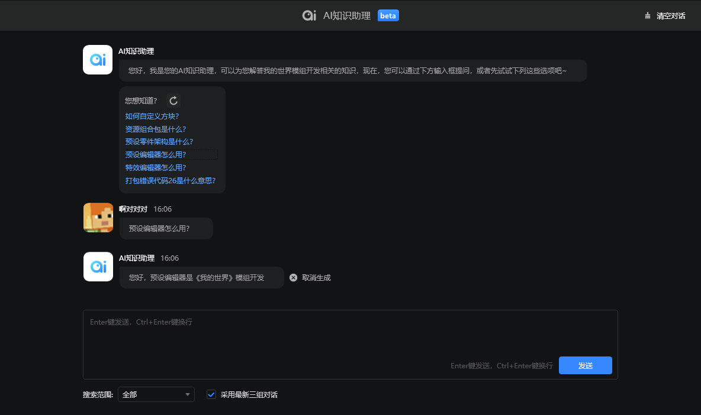
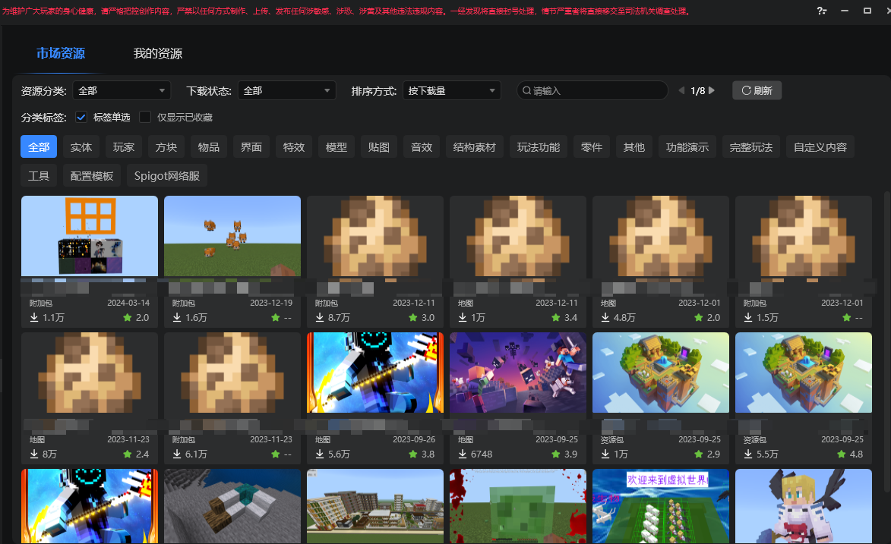
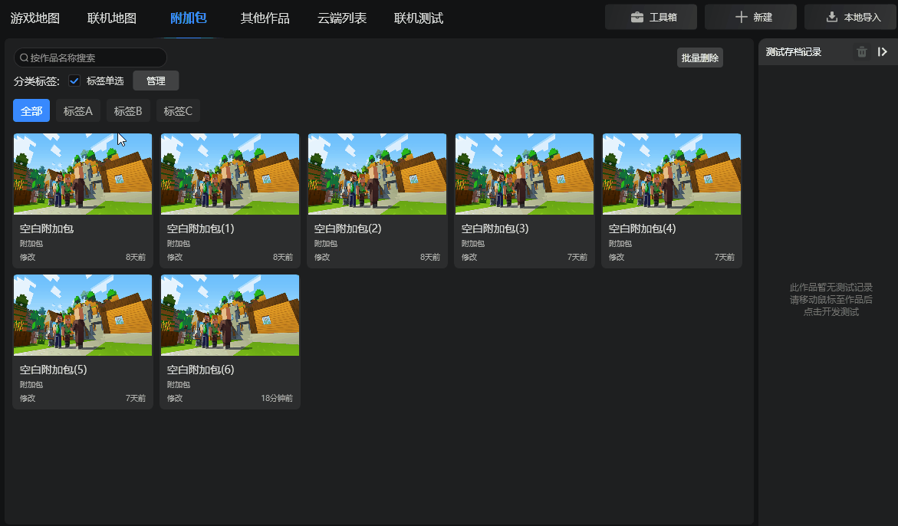
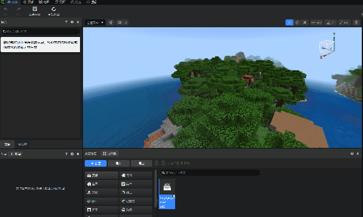
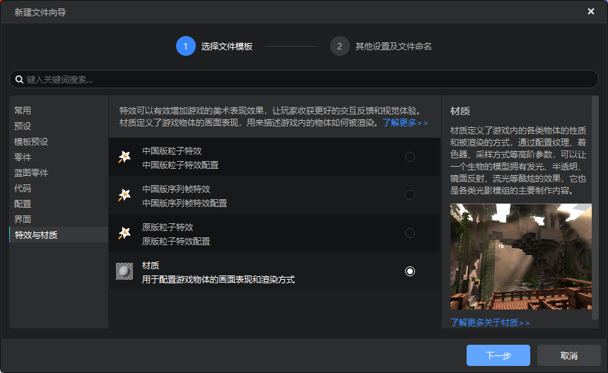
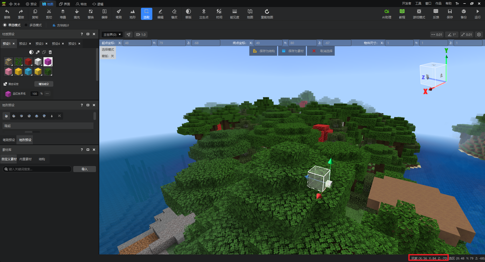
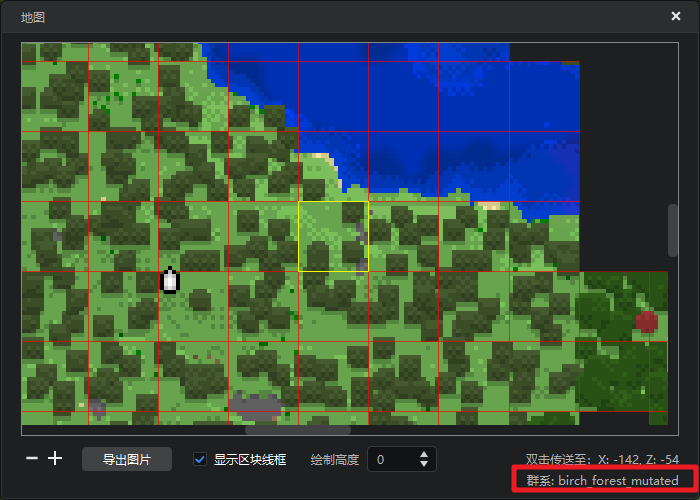
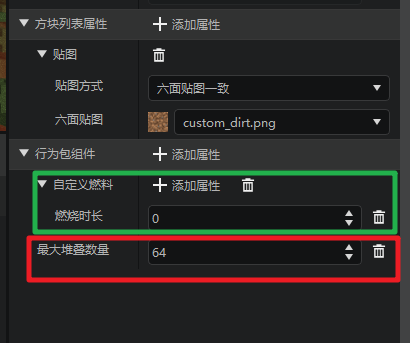

# 2024.4.11 版本1.1.8

## AI知识助理迭代
1. 支持指定搜索范围。
2. 支持流式返回，提高返回速度。
3. 支持保留最近三次对话连续问答。
4. 支持渲染代码块和一键复制。
5. 返回参考链接带上锚点，更精准的指向目标文章的目标段落。

详情参考[AI知识助理](../../12-入门教程/25-AI知识助理.md#进阶用法)。

## 内容库全新升级
1. 合并资源包、作品模板、其他三个分页，提高搜索效率。
2. 搜索功能支持搜索详情页文字。
3. 增加收藏功能，标记你最需要的资源。
4. 新增评分功能，为你喜欢的资源打个满分吧！
5. 增加下载量的显示，了解最受开发者欢迎的资源。
6. 增加排序功能，支持按照下载量，评分和更新时间排序。

详情参考[内容库](../../15-资源管理/11-内容库.md)。

## 启动器组件管理优化
1. 支持标签管理
你是否在为组件库中上百个作品烦恼，现在组件库支持为作品打上标签，支持按照标签筛选功能，快来为你的组件分类管理吧！

2. 支持批量删除组件
现在在组件库的右上角新增批量删除功能，点击后，你可以快速查看和删除所有本地作品！
> 注意：删除操作不可撤销，请谨慎操作！

## 新增天空盒零件
1. 编辑器新建文件向导中，新增了天空盒零件，支持在编辑器中快速设置和调试天空盒相关参数，如雾气颜色，范围，天空颜色，贴图等等，详情参考[天空盒零件](../../20-玩法开发/14-预设玩法编程/0-理解预设系统/11-内置零件/07-天空盒零件.md)。

## 支持新建材质及模板
新建文件向导新增材质，可选择指定模板快速创建对应材质。

## 其他

1. 地图编辑器右下角的玩家位置从头部位置修改为脚底坐标

2. 地图编辑器小地图支持显示选中位置的生物群系

3. 方块配置支持配置最大堆叠数和燃烧时长，详见[自定义方块](../../20-玩法开发/15-自定义游戏内容/2-自定义方块/1-JSON组件.md)。

