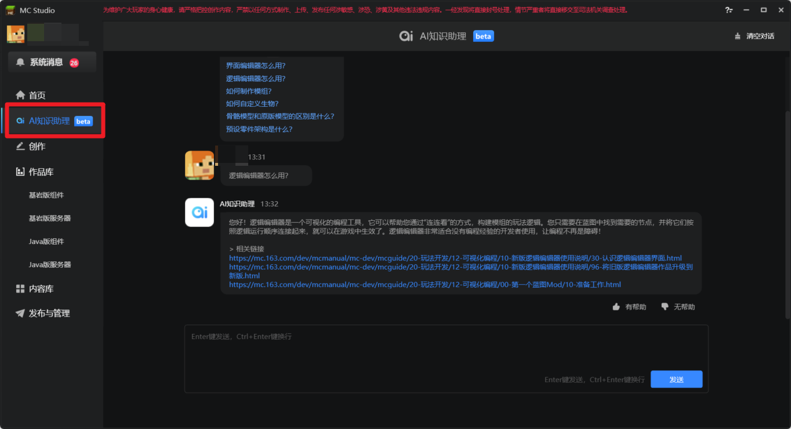
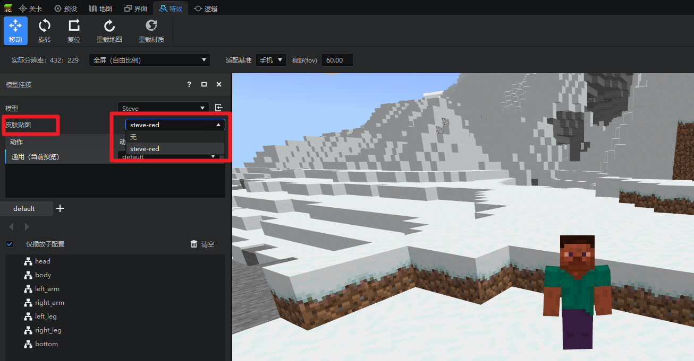
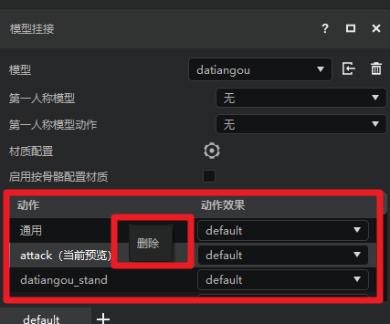
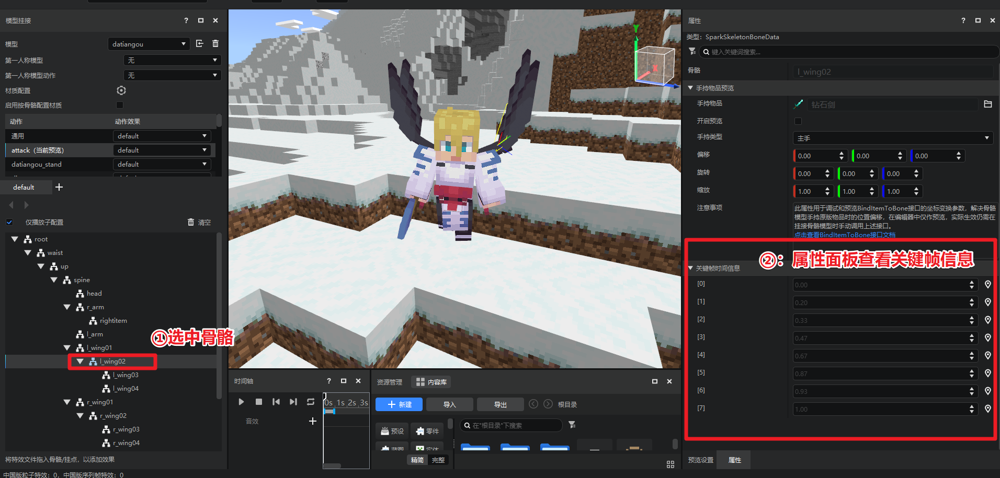
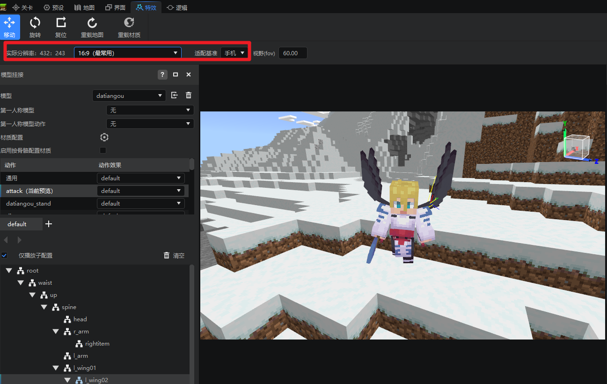
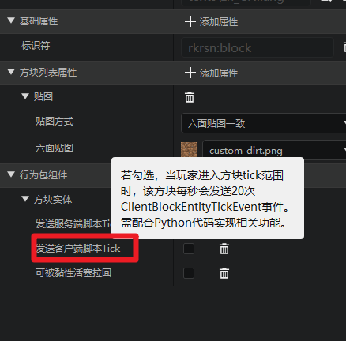
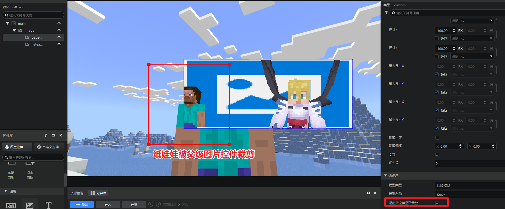
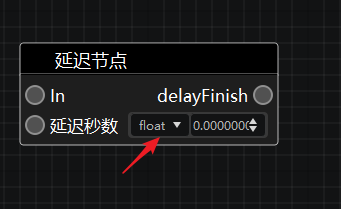
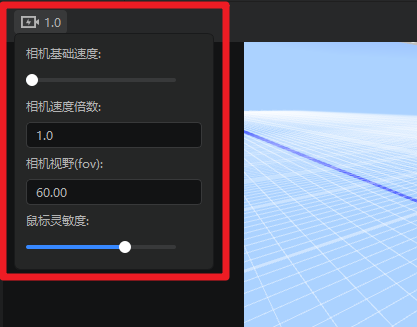
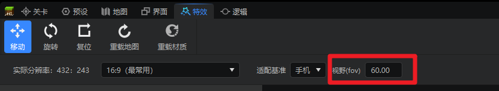

# 2024.1.18 版本1.1.7
## AI知识助理开启beta测试！
我的世界开发工作台全新推出AI知识助理，它是一个基于大模型训练的生成式AI问答助手，熟知开发者官网内的所有文档，你可以向它询问任意模组开发的问题，它会竭尽所能为你一一解答，详情请参考[AI知识助理使用文档](../../12-入门教程/25-AI知识助理.md)。

## 特效编辑器

1. 支持显示和修改steve（史蒂夫）的皮肤贴图，可参考[这篇文档](../../16-美术/9-特效/50-预览功能.md#修改和预览steve皮肤贴图)，如图所示

2. 骨骼模型和bb模型支持右键删除指定动作，可参考[这篇文档](../../16-美术/9-特效/10-模型导入.md#5删除单个模型动作)，如图所示：

3. 支持显示某个骨骼动画的关键帧信息，可参考[这篇文档](../../16-美术/9-特效/50-预览功能.md#预览模型动画关键帧信息)，如图所示：

4. 支持调整和预览窗口分辨率，可参考[这篇文档](../../16-美术/9-特效/50-预览功能.md#调整预览窗口的分辨率)，如图所示：

## 关卡编辑器
1. 方块配置新增方块实体的客户端tick字段，字段含义可参考[自定义方块实体](../../20-玩法开发/15-自定义游戏内容/2-自定义方块/4-自定义方块实体.md#添加自定义方块实体)，如图所示：

## 界面编辑器
1. 原版纸娃娃和网易纸娃娃控件支持【超出父控件区域后是否裁剪】属性，属性含义可参考[UI控件说明文档](../../18-界面与交互/30-UI说明文档.md#paperdoll)，如下图所示：

> 注意，该属性需要父控件开启裁剪内容（clip_children）选项方可生效。

## 逻辑编辑器
1. 延迟节点支持修改参数类型，如下图：

## 其他

1. 支持编辑器设置fov并保持各子编辑器fov一致。

> 关卡、预设、地图编辑器修改位置
>
> 
>
> 特效编辑器修改位置：
> 

2. 物品配置的贴图属性支持递归搜索子文件夹的贴图。
3. 资源管理器筛选功能仅针对左侧选中目录生效。
4. Apollo引擎版本选择按照版本号排序。