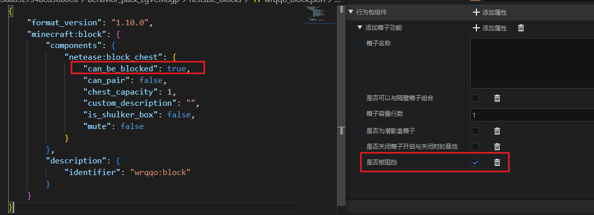
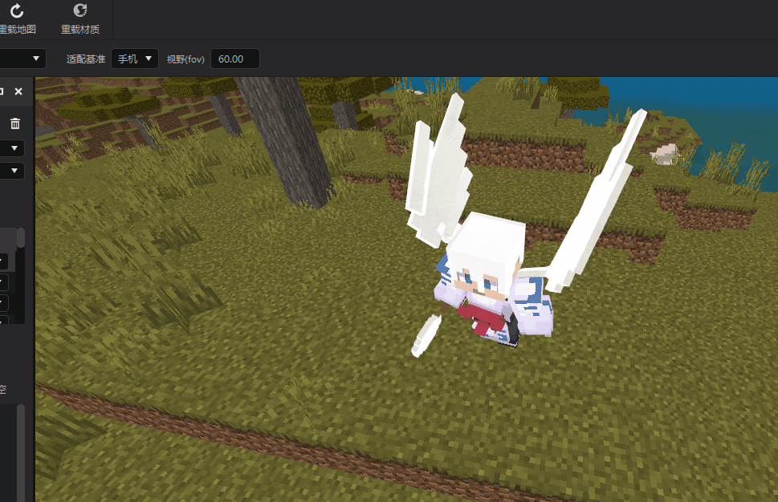
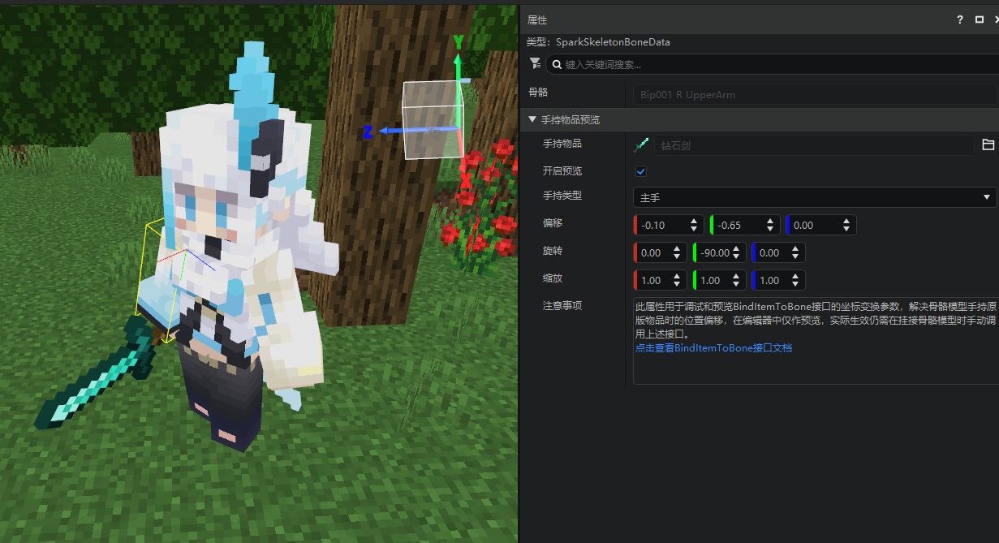
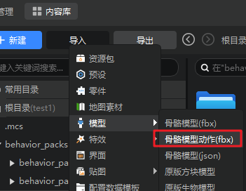
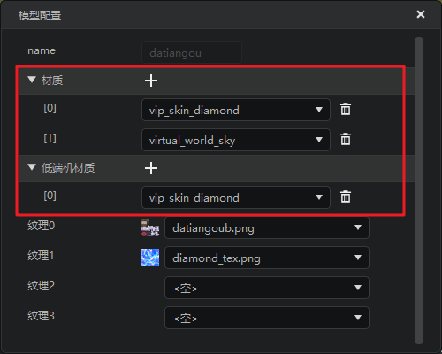
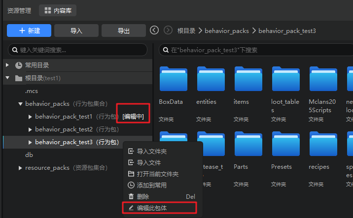
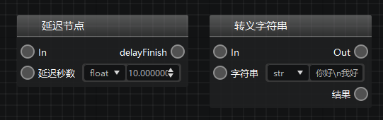

# 2023.11.16 版本1.1.4

## 关卡编辑器
方块配置-自定义箱子组件增加是否被实心方块阻挡字段，详见[方块配置](../../20-玩法开发/15-自定义游戏内容/2-自定义方块/1-JSON组件.md#netease-block-chest)。

## 特效编辑器

1. 编辑器新增重载材质按钮，修改shader或材质文件后，可以点击该按钮进行重载刷新，详见[重载材质](../../16-美术/9-特效/10-模型导入.md#3-重载材质)，如下图：

2. 支持骨骼模型主副手手持物品的绑定到指定骨骼，详见[预览手持物品绑定](../../16-美术/9-特效/50-预览功能.md#预览手持物品绑定位置)。

3. 支持一次性导入多个骨骼模型动作，可以直接多选fbx动作文件，如下图：

4. 支持配置骨骼模型多pass材质，详见[配置多pass材质](../../16-美术/9-特效/10-模型导入.md#配置多pass材质)。

## 资源管理器

资源管理器现在支持在完整模式下切换当前编辑的行为包和资源包了。

> 注意：切换编辑包体会影响文件创建、导入、保存的初始路径。

## 逻辑编辑器

新增延迟节点和字符串转义节点

## 其他
1. 优化了网络服分页的加载速度。
2. 修复了编辑器更新时文件占用的异常问题。
