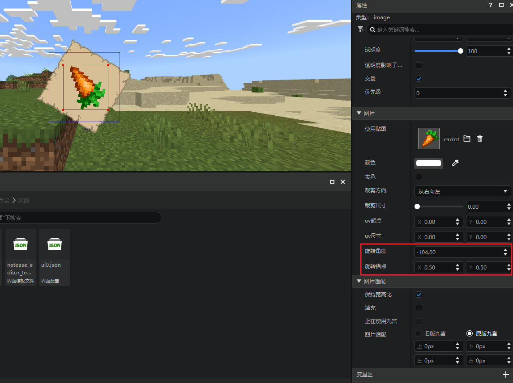
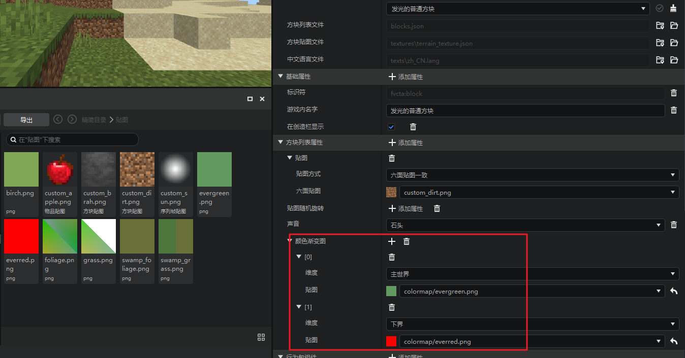
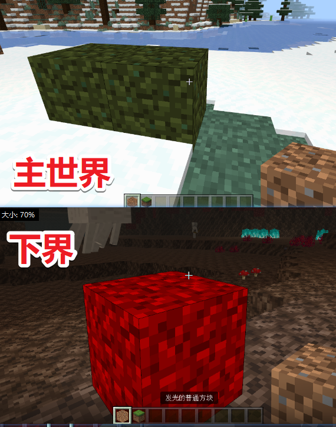
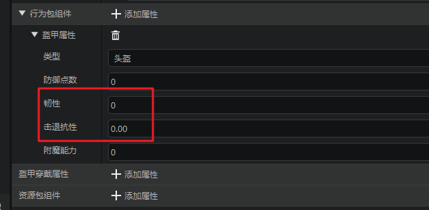
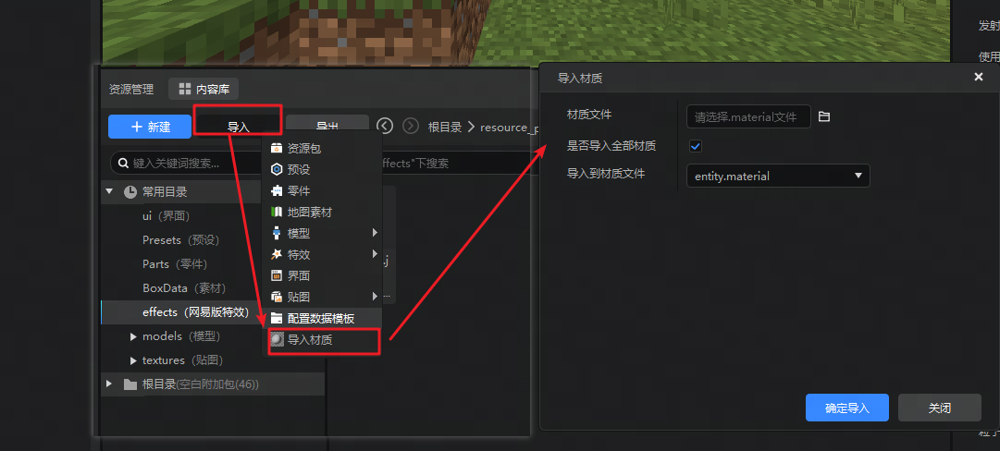
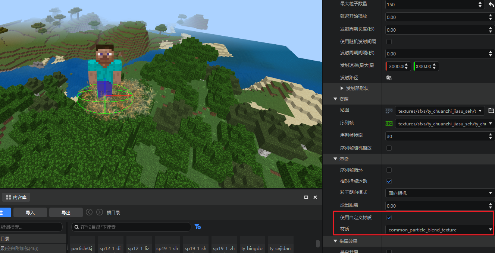
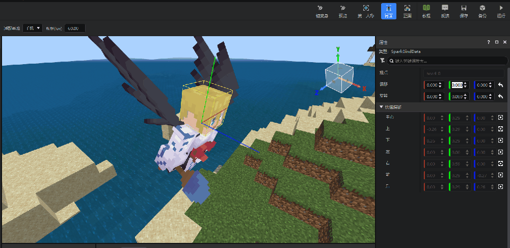
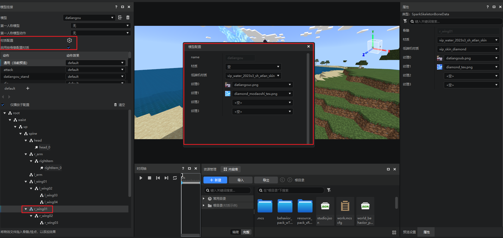
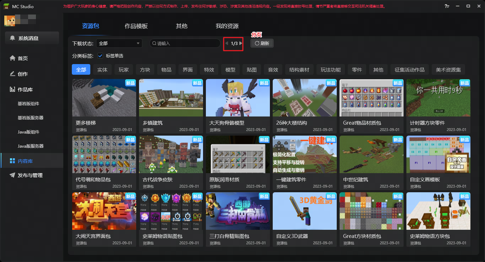

# 2023.09.07 版本1.1.2

# 界面编辑器
1. 图片控件支持配置旋转角度和旋转锚点，详情参考[图片控件属性](../../18-界面与交互/30-UI说明文档.md#image)。

# 关卡编辑器
1. 方块配置支持颜色渐变图（colormap）,可让一个方块在不同维度的不同群系叠加不同的颜色，详情参考[自定义方块群系颜色](../../20-玩法开发/15-自定义游戏内容/2-自定义方块/2-功能.md#自定义方块及自定义方块模型的群系颜色)

> 配置示例：

> 效果：

2. 物品配置支持盔甲韧性和击退抗性，属性请参考[自定义盔甲](../../20-玩法开发/15-自定义游戏内容/1-自定义物品/3-自定义盔甲.md#json组件)

# 特效编辑器

1. 支持导入材质

2. 中国版粒子特效支持自定义材质

> 注意，不同类型的着色器（shader）可能不支持用于中国版粒子特效，请参考[内置材质清单](../../16-美术/7-材质与着色器/2-内置材质清单.md#particles-material-材质文件)使用着色器。

3. 支持骨骼模型的挂点快捷偏移到包围盒的各面中心点，详情参考[骨骼模型挂点偏移](../../16-美术/9-特效/10-模型导入.md#3骨骼模型挂点偏移)，如图所示：

4. 支持骨骼模型更换材质，包括模型整体的材质和按照骨骼分别配置材质，详情参考[骨骼模型的使用](../../16-美术/6-模型和动作/04-骨骼模型的使用.md)

# 启动器
内容库资源展示列表改为按照分页展示，如图所示：

