# 2023.06.27 版本1.1.0

## 性能监测工具
启动器→工具箱新增一个性能监测工具，用于帮助开发者监测开发包运行时的实时帧率、内存、CPU占用等性能指标，帮助开发者评估模组的性能情况，详情使用请参考文档[性能监测工具](../../30-测试/5-性能监测与调试工具.md)。
> 该工具仅支持在2.7稳定版及以上的ModPC开发包使用，不支持低版本或者上线测试的正式客户端。

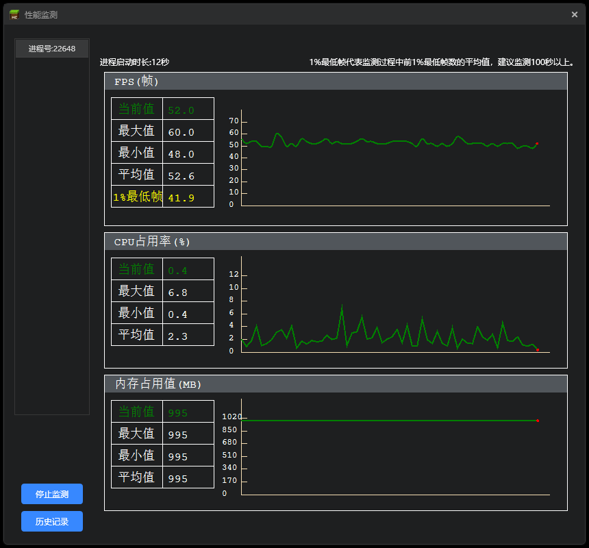

## 特效编辑器
1. 中国版粒子新增拖尾属性，支持配置粒子拖尾效果,具体属性详情参考[中国版粒子拖尾属性](../../16-美术/9-特效/70-中国版特效属性详细说明.md#粒子拖尾效果属性说明)。

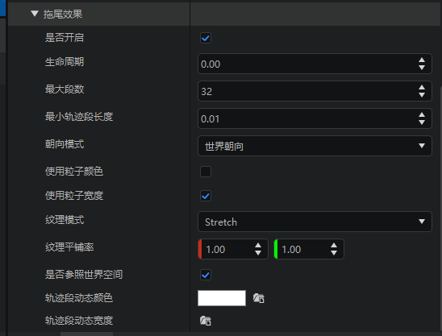

2. 中国版粒子特效新增实例属性，用于在场景中实时地编辑粒子的发射路径，详情参考[中国版粒子发射路径](../../16-美术/9-特效/70-中国版特效属性详细说明.md#tips如何可视化编辑发射路径)。

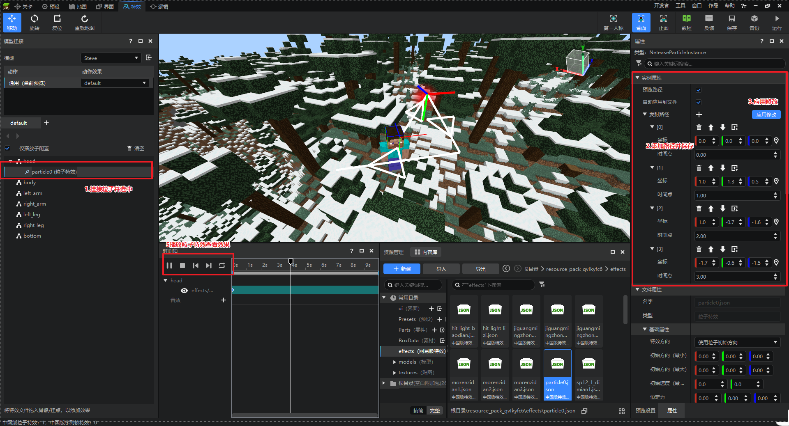

3. 中国版粒子支持随机发射间隔和摄像机偏移量

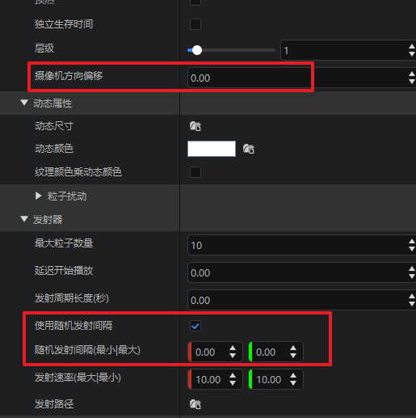

4. 序列帧和粒子特效的动态属性栏默认展开，不再自动收起。

## 关卡编辑器
1. 添加属性窗口支持鼠标悬浮提示。

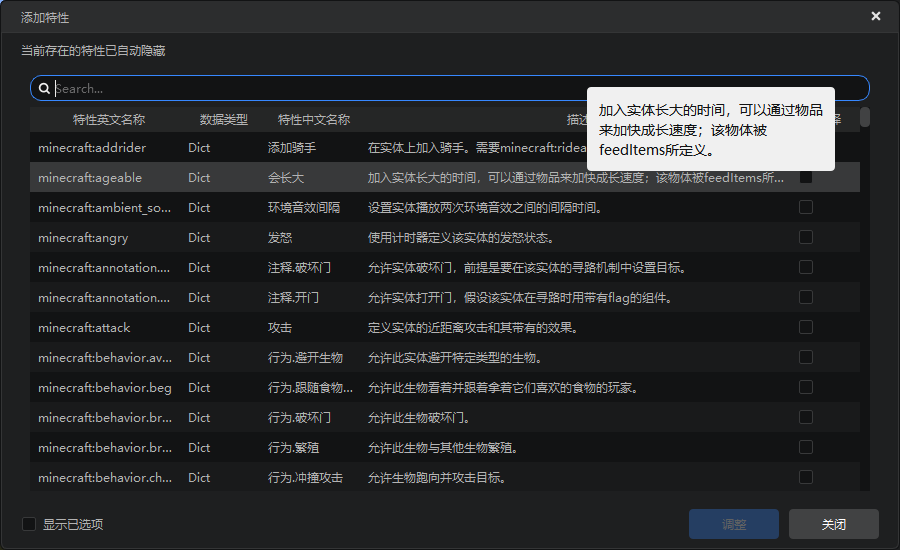

2. 部分配置ICON更新。

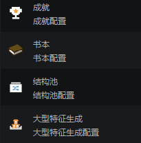

3. 自定义书本支持展示全部配套的目录和章节文件。

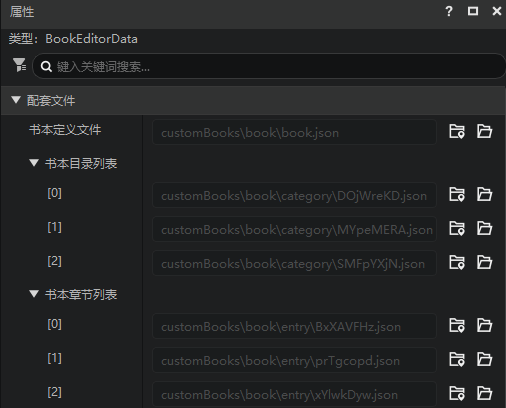

4. 方块配置支持五个自定义特殊方块的字段，如自定义工作台、自定义箱子等等，详情参考[方块配置](../../20-玩法开发/15-自定义游戏内容/2-自定义方块/1-JSON组件.md#neteaseblockrandomoffset)。

## 地图编辑器
1. 新增拼图方块笔刷与大型结构地形工具，用于帮助开发者快速配置自定义大型特征的结构，详情参考[自定义大型特征](../../20-玩法开发/15-自定义游戏内容/4-自定义维度/6-自定义大型特征.md)。

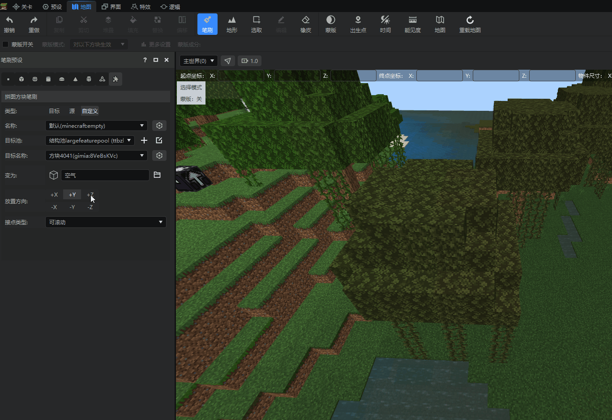

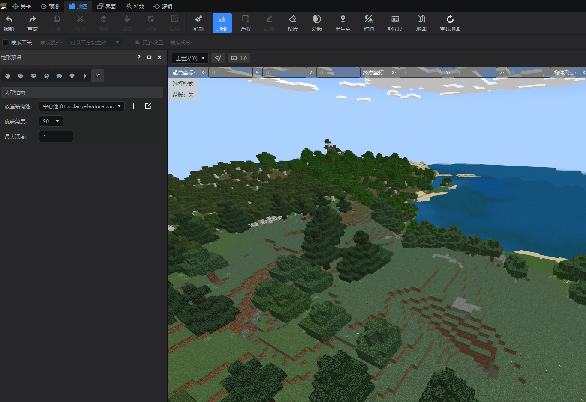

2. 小地图功能支持自定义绘制高度。

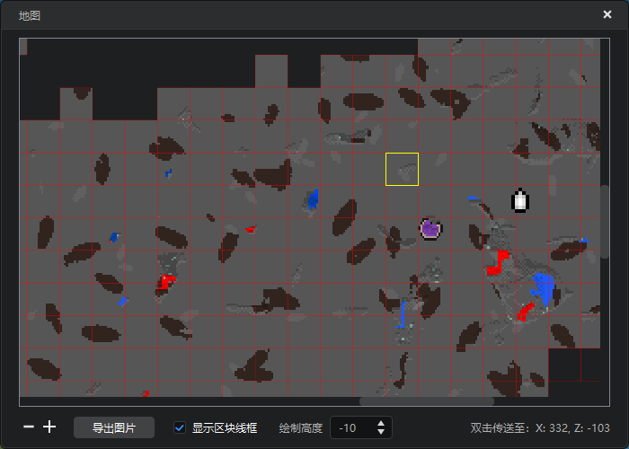

> 注意：范围[-60,320],默认为0代表当前区块最高高度。

3. 编辑工具的旋转和伸缩新增应用按钮，需点击按钮才能生效。
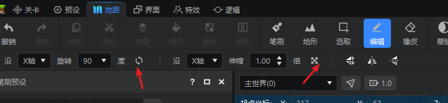

## 界面编辑器

1. 新增轮盘控件，支持开发者自定义轮盘内径、外径、切片数量等属性，详情使用请参考[轮盘控件](../../18-界面与交互/10-控件和控件属性.md#控件简介)。

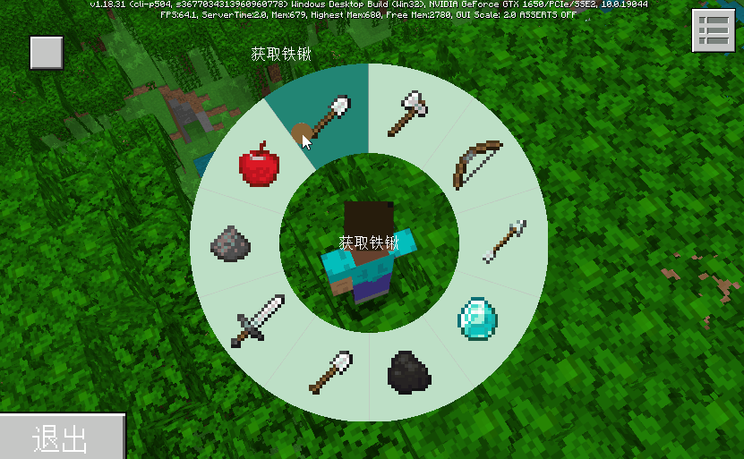

2. 界面编辑器的点击面板控件新增【是否吞噬点击事件】属性。
