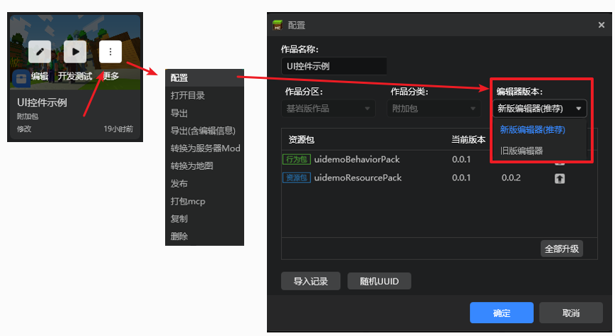
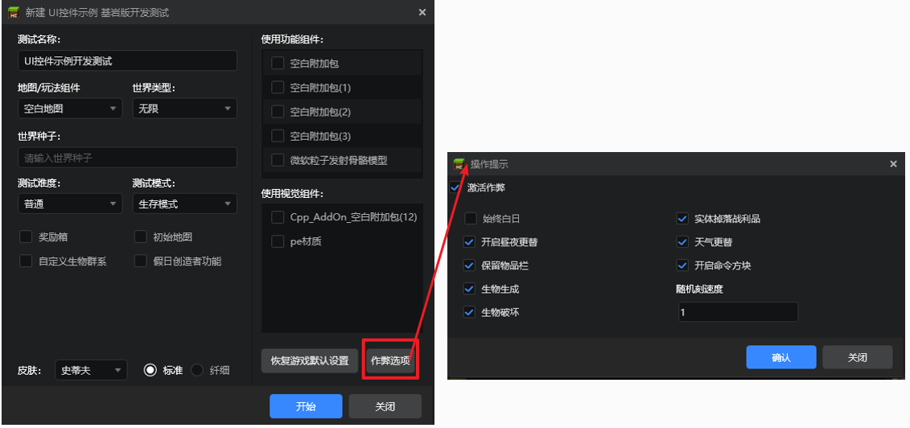
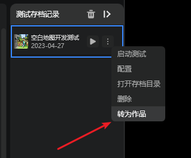
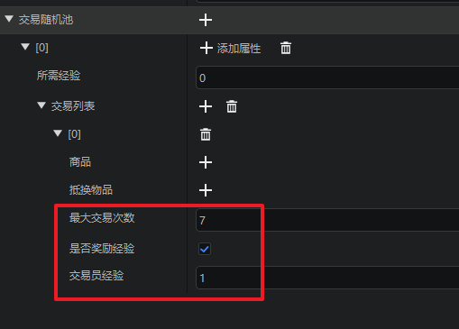
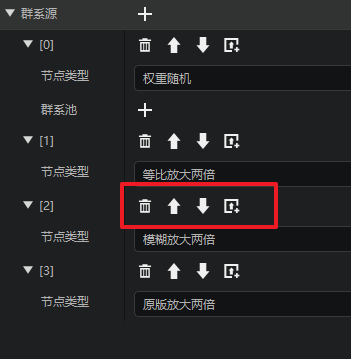
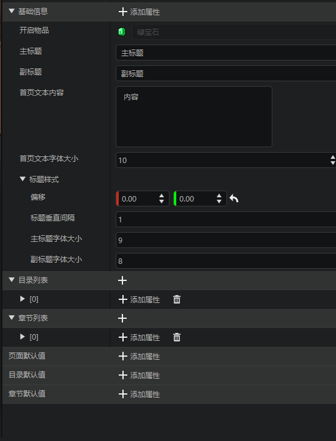
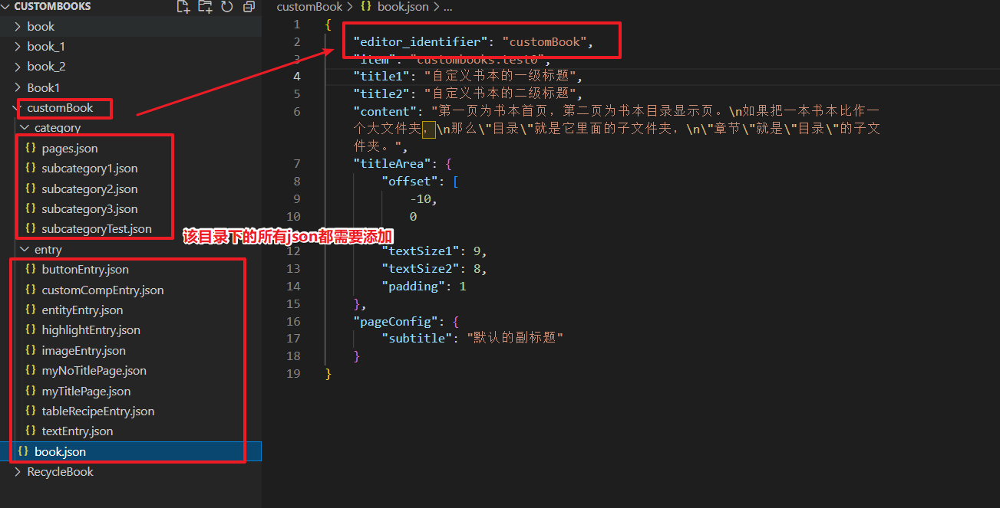
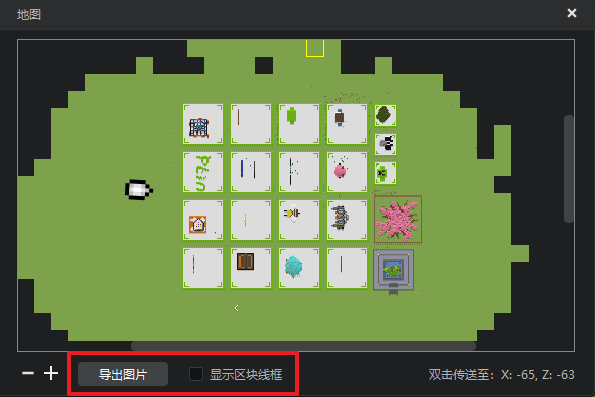
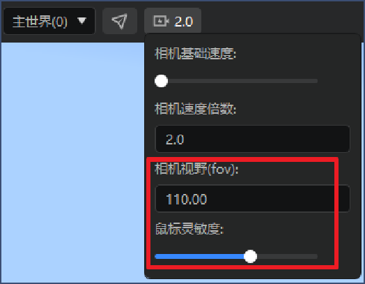
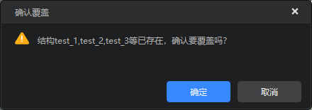

# 2023.05.30 版本1.0.32

## 内容库支持开发者平台投稿
1. 内容库现已支持在开发者平台进行提审和上架发布，目前正在限量测试中，我们将会尽快优化体验，开放给所有开发者使用，感谢您的耐心等待！
2. 内容库新增【我的资源】分页，用于存放开发者账号投递的内容库资源，可以类比为基岩版组件的云端测试分页。

对于内容库投递相关问题可以参考文档[内容库投递指南](../../35-上架与入驻/课程15-内容库资源投递指南.md)。


## 作品默认使用新版编辑器启动
从本版本开始，我们将不包含旧版特有组件的所有作品都默认识别为新版作品，默认使用新版编辑器打开，旧版编辑器已不再进行功能更新和维护，请开发者使用新版编辑器进行模组开发。
> 如需使用旧版编辑器打开特定作品，可在作品的配置界面修改该作品的编辑器版本，如下图：




## 启动器优化
1. 开发测试界面支持完整的作弊选项
将原有的作弊复选框修改为【作弊选项】按钮，开发者可以在此定义游戏内的所有作弊选项，方便设置测试环境，如下图：



2. 地图类的测试存档支持转为新作品，开发者可以将在测试时的微调保存到一个新作品副本中，如下图：




## 关卡编辑器
1. 交易表补充了最大交易次数、是否奖励经验、交易员经验三个属性，如下图：



2. 自定义维度配置中的群系源属性支持列表的移动和插入操作，如下图：



3. 新增自定义书本配置，关于自定义书本，可以参考[自定义书本](../../20-玩法开发/15-自定义游戏内容/5-自定义书本/01-自定义基础书本.md)。




> 受限于书本配置结构，无法自动识别此前已存在的书本配置，开发者需要在书本的每个json内新增一个`editor_identifier`字段,并将值统一写为改书本的最外层文件夹名称，即可被编辑器正常识别,如下图：



1. 新增大型特征生成和结构池配置，用于支持自定义大型特征的生成，详情参考[自定义大型结构特征](../../20-玩法开发/15-自定义游戏内容/4-自定义维度/6-自定义大型特征.md)


> 目前对于拼图方块的编辑仅支持通过give指令获取，并在地图编辑器的游戏模式下进行填写，我们将在后续更新2.7稳定包时，在地图编辑器支持通过笔刷的方式放置结构池和拼图方块，敬请关注！
```
指令:
/give @s jigsaw 64
```
## 地图编辑器
1. 小地图界面支持导出为图片、支持隐藏区块线框，如下图：



2. 镜头设置增加视野（fov）和鼠标灵敏度属性



3. 保存切分结构覆盖问题优化，现在不会出现覆盖未生效的问题。




## 其他优化
1. 取色器按钮取色时将其按钮选中。
2. 方块配置新增侧面贴图属性，支持只配置上、下、侧面三张贴图。
3. 优化了导入作品时的选项记忆功能。
4. 优化了界面编辑器的控件截图体验。