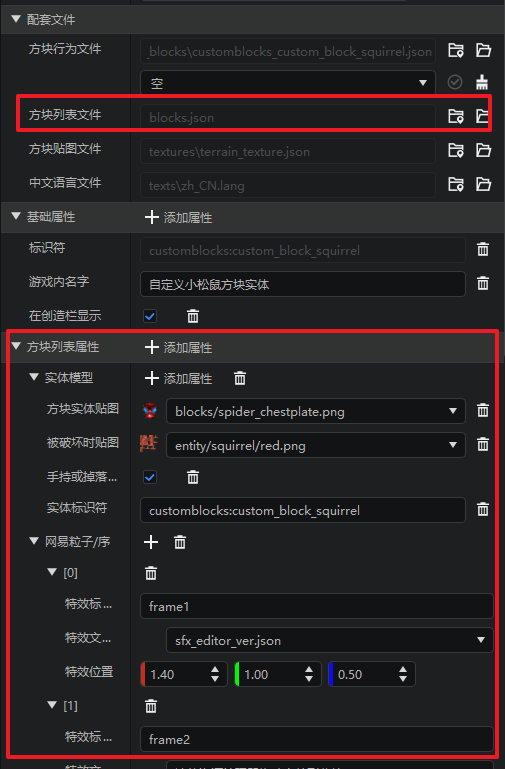

# 2023.05.04 版本1.0.30
## 地图编辑器替换窗口支持同类方块合并替换
选取地图结构并替换时，自动合并同类不同状态方块，点击左侧展开按钮即可展开。
1. 选中总类别方块进行替换时，则替换全部状态的同类方块。
2. 选中子类别方块进行替换时，则只替换该状态值的方块。

## 界面编辑器

1. 颜色属性支持通过屏幕进行取色。
2. 控件的位移，尺寸属性支持小数。

## 云端列表优化
1. 云端列表作品的最近修改时间固定为云端资源更新时间。
2. 本地的云端作品更多菜单支持重新下载选项。
3. 本地的云端作品有更新时通过角标提示更新。

## 方块配置更新
1. 新增了自定义含雪、含水方块的字段。
2. 新增了配套文件【方块列表属性】，即资源包下的block.json，并将原有的自定义模型、剩余、贴图、贴图随机旋转等选项，一般迁移至方块列表属性下。
3. 新增实体模型、粒子特效、序列帧特效、颜色渐变图、交叉物品模型和贴图等字段。

## 配置增加数据模板
1. **生物群系设置**：新增群系高度实现空岛示例模板。
2. **特征生成配置**：新增主世界平原生成特征模板。
3. **附魔配置**：新增稀有稿附魔模板。
4. **音效配置**：新增自定义创造模式音乐模板。
5. **自定义维度配置**：新增群系源节点示例模板。
6. **成就配置**：新增根节点与非根节点示例模板。
7. **方块配置**：新增红石源、红石元器件示例模板。

## 其他
1. Apollo网络服支持设置game服的人数。
2. 实体配置勾选【自然生成属性】时，自动设置生物蛋的中文名称为游戏内名称。
3. 附魔配置的右键菜单新增【预览设置】，支持设置预览时生成的附魔等级。

4. 地图编辑器退出游戏模式时，不再重置编辑器的窗口布局。
5. 附加包更多菜单→转换为地图时，支持选择已有地图存档。

6. 逻辑编辑器的连接字符串节点增加默认输入参数。
7. 新建插件支持开服工具2.0的客户端Mod。
8. Mod PC包支持聊天优化，如下图，在开发者启动器的设置 - Mod PC开发包中可以找到“是否开启聊天优化”的选项，勾选表示启用聊天优化。我们建议您开启聊天优化进行模组测试。

