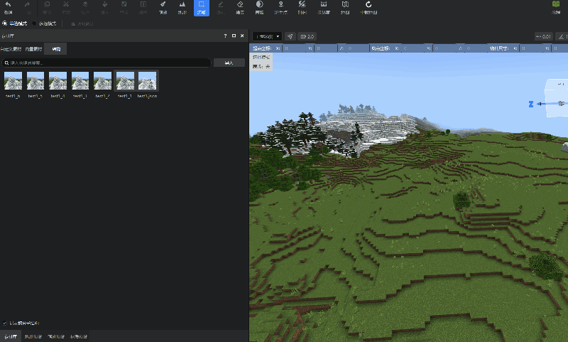
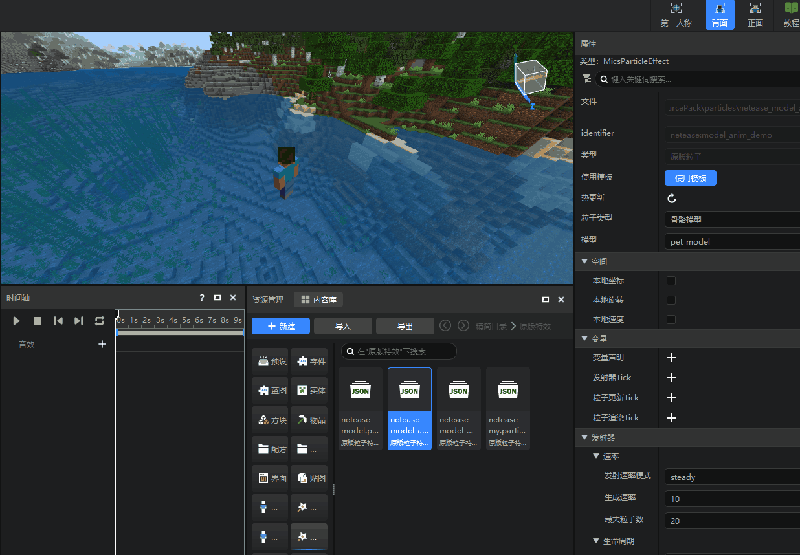
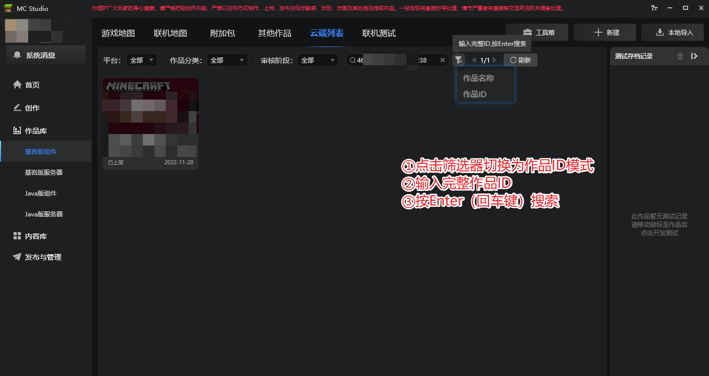

# 2023.04.18 版本1.0.29
## 地图编辑器结构分页优化
素材库的结构分页支持直接放置切分信息的json文件从而放置整个结构，并通过**显示切分子结构**复选框隐藏掉切分后的子结构。

## 支持配置微软粒子发射骨骼模型
在特效编辑器的原版粒子特效中，新增支持了发射骨骼模型的配置属性，并且支持右键快速预览，如下图：

## 云端列表支持作品ID搜索
在云端列表支持了按照完整作品ID搜索的功能，如下图：

## 其他
1. 作品创建界面，选择**超平坦**时禁用**世界种子**选项。
