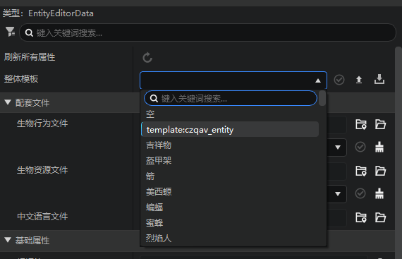
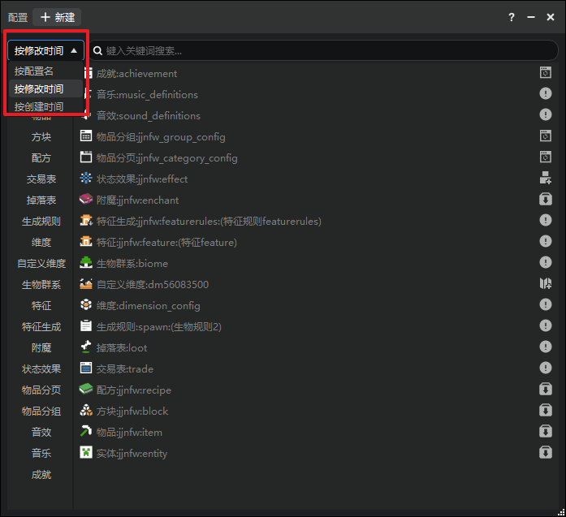
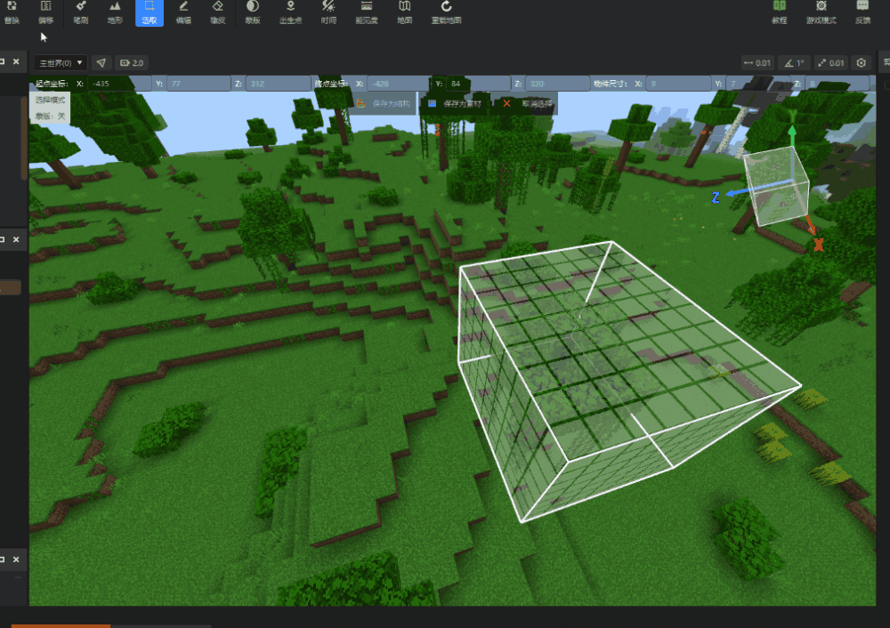
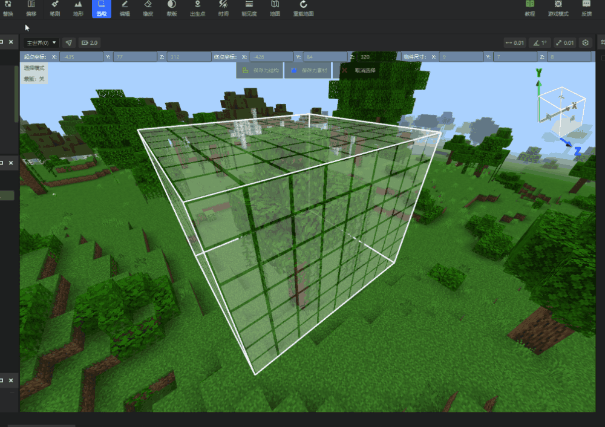

# 2023.04.06 版本1.0.28
## 配置编辑优化
1. 部分配置支持快捷预览
点击配置条目右侧的快捷按钮，可快速在ModPC包进行预览和测试，详见[这篇文档](../../20-玩法开发/11-组装简单玩法/0-关卡编辑器.md)。

2. 配置数据模板支持导入导出
部分配置的数据模板支持导出为dt文件，并在其他作品中导入复用，详见[这篇文档](../../15-资源管理/13-配置数据模板.md)。

3. 配置属性面板新增筛选器

配置属性面板新增筛选器，可以筛选当前配置的一级属性，如下图：

4. 配置面板支持多种排序规则

5. 配置属性面板支持记忆当前进度条所在位置。

## 地图编辑器支持替换全部状态值
当开发者需要替换不同状态的同类方块（如藤曼，楼梯），勾选此选项，即可将不同状态的同类方块聚合成同一个选项，开发者可以批量替换此类方块。

当开放需要单独替换某个状态的某一类方块（红色羊毛），则只需取消勾选此选项，即可单独指定每个状态的方块的替换目标。

## 导入组件功能优化
1. 统一导入各类型本地组件的交互界面，并自动扫描并判断组件类型。

2. 当选择类型和导入组件不匹配时，弹窗提示。

## 其他

1. 启动编辑器加载引擎时禁用地形编辑器的游戏模式。
2. 优化了原版模型转换工具无法正常转换某些动画和贴图的问题。
3. 内容库其他类型资源下载交互优化。
4. 开服工具2.0服务器支持提升Mod版本。
5. 蓝图增加新的模组SDK接口节点，包含2.6的新接口。