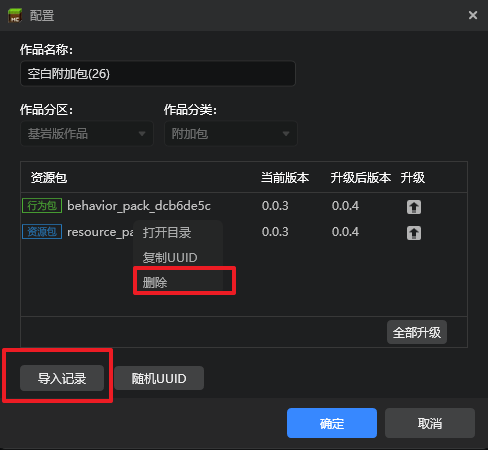

# 2023.03.23 版本1.0.27

## 原版模型转换工具
启动器工具箱新增原版模型转换工具，可帮助开发者将作品中的原版模型转换为骨骼模型，详见[这篇文档](../../16-美术/6-模型和动作/11-原版模型转换工具.md)。

## 内容库新增【其他】分页
1. 在原有的资源包和作品模板两个分页基础上，新增【其他】分页。
2. 此分页用于存放无法被编辑器导入或创建为作品的其他资源，如spigot插件、bbmodel格式模型、SDK示例模型等等，下载后可直接在对应目录进行查看和使用。

## 内容库资源上新

1. 内容库征集活动二期共计35款获奖资源上线内容库！获奖信息可前往[活动网站](https://mc.163.com/dev/nrkzj2/)查询。

2. 内容库**其他**分页上线3个spigot插件和一个SDK的示例模型包，详情参考[这篇文档](../../27-网络游戏/课程10：使用Spigot开服/99-下载内容.md)。

## 作品编辑与开发测试界面优化
1. 优化编辑和开发测试界面的选项布局，调整选项之间的依赖关系，移除无效选项。
- 编辑界面

- 开发测试界面

2. 导入记录功能移至作品→更多→配置界面，内部文件管理功能调整为配置界面资源包的右键菜单，调整了配置界面的功能布局与交互。

