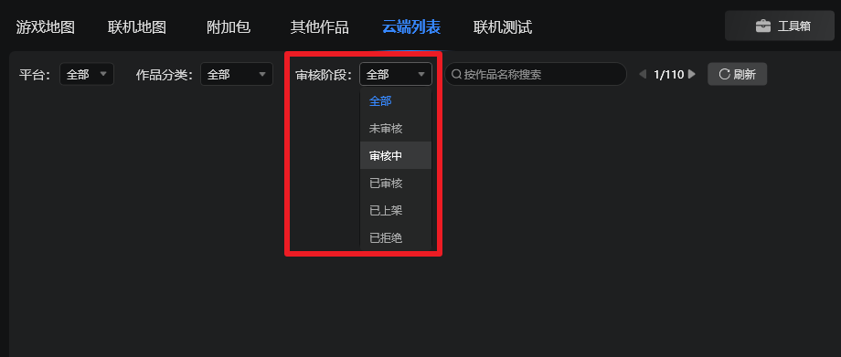
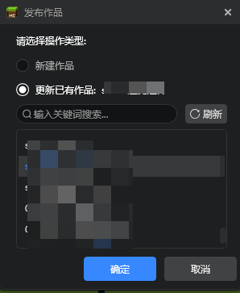
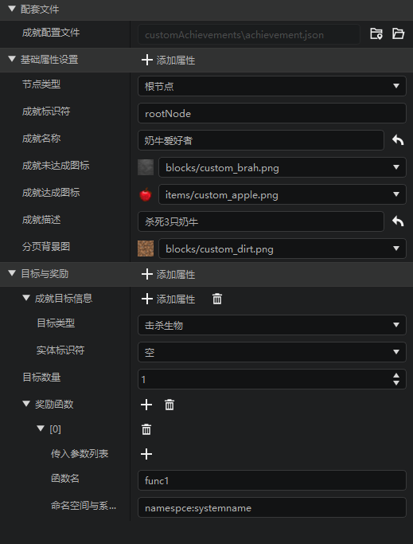
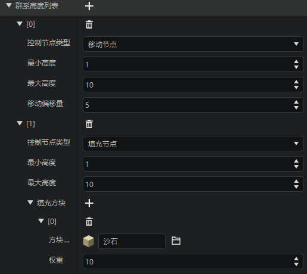

# 2023.03.09 版本1.0.26

## 启动器优化

1. 云端列表、线上网络服分页支持按审核阶段筛选。

2. 优化了发布作品界面，现在支持通过**作品名称**进行搜索。

3. 优化了启动时自动清理本地不合规存档的逻辑，现在开发者手动保存的存档不会被强制清除了。

## 关卡编辑器

1. 新增**成就配置**，开发者可以在编辑器内配置成就节点，关于成就系统可以参考[这篇文档](../../20-玩法开发/15-自定义游戏内容/16-自定义成就系统.md)。

2. 优化了**生物群系配置**，补充了自定义高度相关的属性字段，关于自定义地形高度，你可以参考[这篇文档](../../20-玩法开发/15-自定义游戏内容/4-自定义维度/2-群系地貌.md)。

## 特效编辑器

1. 中国版序列帧特效现已支持点滤波。

## 调试工具

1. 日志界面现在会展示正在测试的PE存档、联机大厅存档名称了。
2. 在调试工具内置的指令代码输入框内，对某一行文本按下快捷键ctrl+/就能注视掉这一行代码，再按一次，就取消注释。
3. 指令代码输入框内支持tab增加缩进、回车自动缩进。
4. 指令代码输入框内支持ctrl+滚轮缩放字体大小。
5. 支持在快捷指令窗口内直接新建指令，并优化了部分功能的交互体验。
