# 2023.02.21 版本1.0.25

## 开发者文档新增原版Json参考资料
在开发模组时，开发者不仅需要网易版独有的Json字段，也经常需要使用《我的世界》基岩版原版的合法字段，但原版文档多为英语所著，对许多开发者的理解和使用造成了一定阻碍；

为此，我的世界中国版将基岩版原版的Json参考文档整理并翻译，提供给所有需要的开发者进行查阅，详情请查看[原版参考文档](../../20-玩法开发/100-参考资料/0-索引.md)。

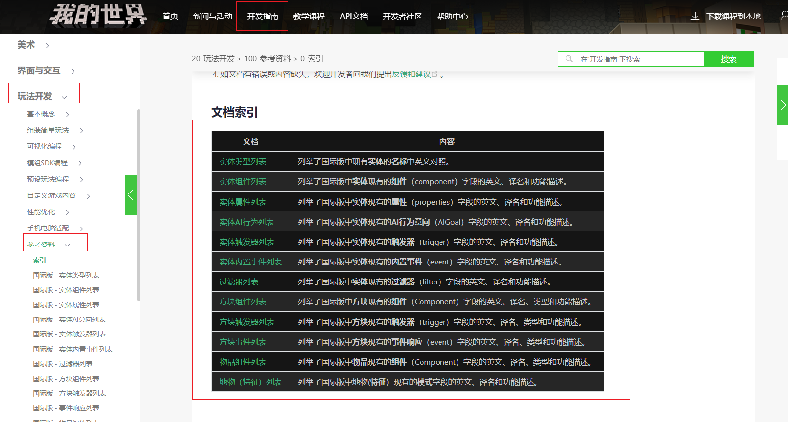

## 关卡编辑器
### 1. 多结构特征配置

参照旧版编辑器的交互方式，在新版关卡编辑器中支持了多结构特征的配置。

> **提示：**
> 旧版作品升级为新版作品时，也会同步进行多结构特征的配置升级，如果开发者自行修改过特征或特征生成配置的Json文件名或标识符等内容，可能会导致升级失败。

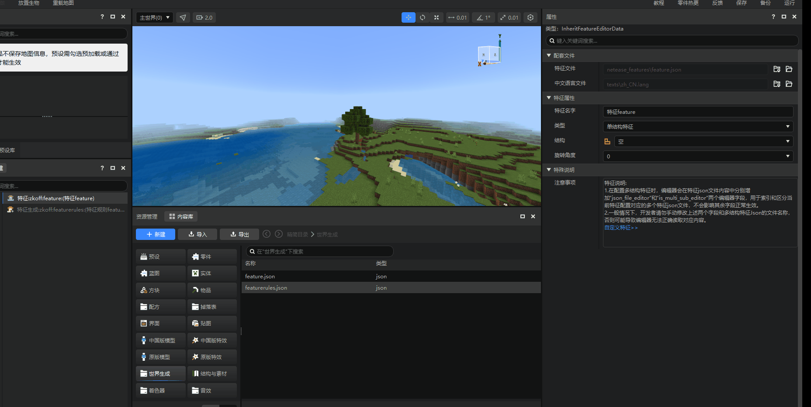

## 地图编辑器

### 1. 【植被】工具支持范围放置

现在植被工具可以在【单点放置】和【范围放置】两种模式直接切换了。【范围放置】模式下支持调整植被的生成区域大小和密度。请阅读[植被工具相关文档内容](../../14-地图制作/7-地形工具.md#7-植被)来了解具体的使用方式和注意事项。

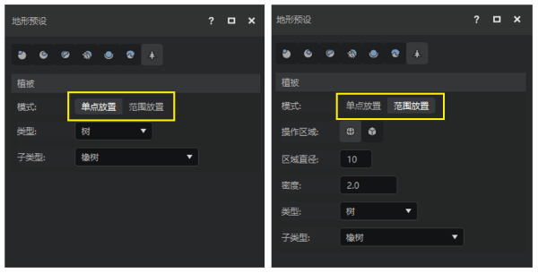

### 2. 【植被】工具支持的植物类型大幅拓展

植被工具现在支持放置绝大部分原生植物了，从树木到花草、洞穴植物、水生植物，都可以直接生成。

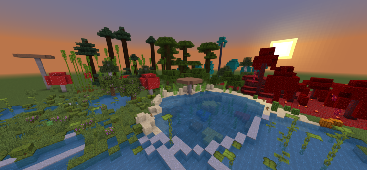

### 3. 笔刷工具直线生成规则调整

过去笔刷工具的`直线生成`选项，在所选终点位置必然生成一个笔刷形状，这导致实际间距与开发者指定的间距不符。我们这次更新中修改了这一特性，直线生成的终点位置将不在强制生成笔刷形状。

## 逻辑编辑器

### 1. 蓝图零件变量、自定义接口支持分组

开发者在编辑大型蓝图的时候可能会遇到蓝图零件变量、自定义接口的数量过多，现有的排序功能无法满足开发者整理需求的情况。因此，在这个版本，我们推出了蓝图零件变量、自定义接口的分组功能，开发者们可以在[这里](../../20-玩法开发/12-可视化编程/10-新版逻辑编辑器使用说明/40-事件、接口、变量.md)找到详细说明。

默认情况下，蓝图零件变量会被存放在【蓝图零件】分组下，自定义接口会被存放在【接口】分组下。开发者如果需要添加新的分组，只需要在对应的变量/接口属性菜单中找到`变量分组`或者`接口分组`字段，修改它的名字，即可按照这个名字添加新的分类。

> 在分组内仍然支持对变量、接口进行上下拖拽调整顺序。

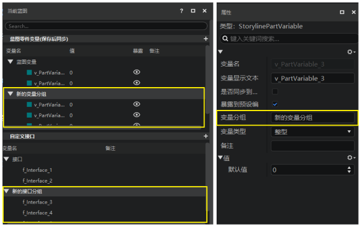

### 2. 其他优化

- 对部分包含tuple类型引脚的节点进行了容错处理。

## 特效编辑器

### 1. 原版特效配置模板

使用原版特效进行特效制作的开发者现在可以直接在编辑器中应用一些预设的粒子配置模板了。我们只需要在原版特效的属性面板中找到蓝色的【使用模板】按钮，并在弹窗中通过下拉框选择需要应用的模板，即可用该模板的数据覆盖当前原版特效的数据。

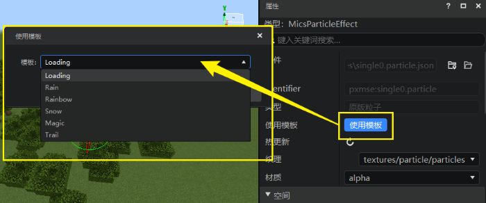

### 2. 原版特效属性配置字段补充

补充了`粒子更新Tick（Paticle Update）`和`粒子渲染Tick（Paticle Render）`两个字段。开发者可以在[原版特效属性详细说明文档](../../16-美术/9-特效/21-原版特效属性详细说明.md)中查看原版粒子配置的详细说明。

## 调试工具

### 1. 右上角新增【更多】菜单，集成常用工具

我们在调试工具右上角新增了【更多】下拉菜单，存放了一些常用的版本号查看、文档跳转、清除缓存等功能，方便开发者使用。

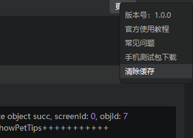

## 模板和内容库

### 1. 模板新增

- 新建作品界面新增起床战争（纯零件版）模板，并调整了各个分类的作品模板顺序。

    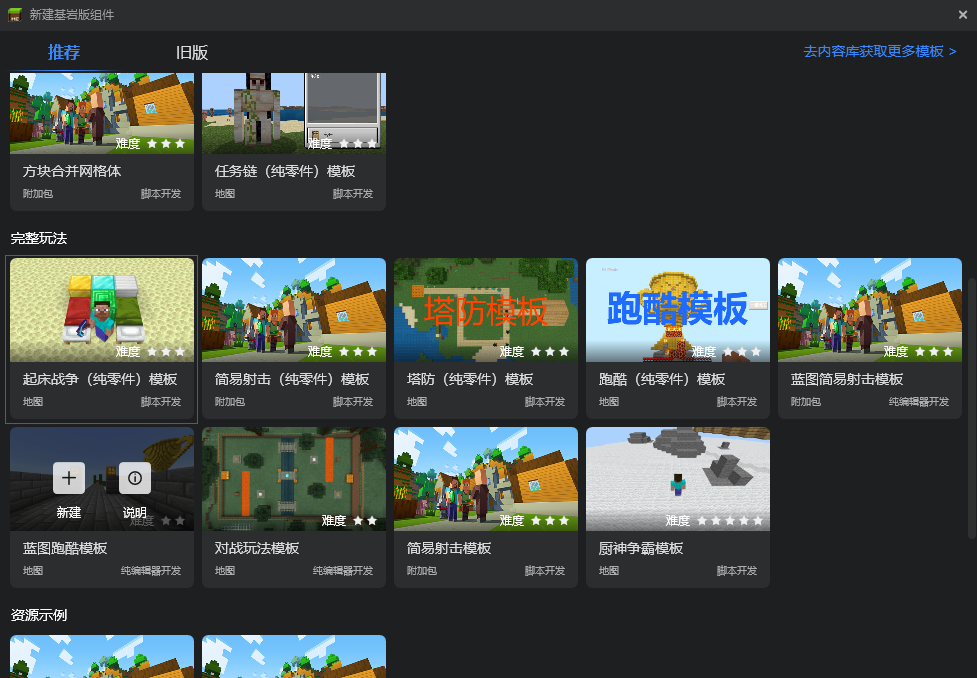

- 内容库新增《海滨小岛地图》和《零件界面示例》两个官网教程配套的模板。

    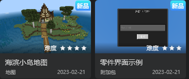

## 其他
### 1. 编辑器内支持启用或屏蔽脚本代码逻辑
使用MODSDK格式编写的脚本代码之前在编辑器内会强制运行生效，导致开发者在编辑器内的操作受到脚本的影响（尤其是涉及游戏模式和传送位置等逻辑时），现在将作品的脚本代码逻辑默认设为关闭，开发者可在下列两个位置进行修改：
- 游戏预览窗→设置→其他→启用脚本代码选项，如图：

    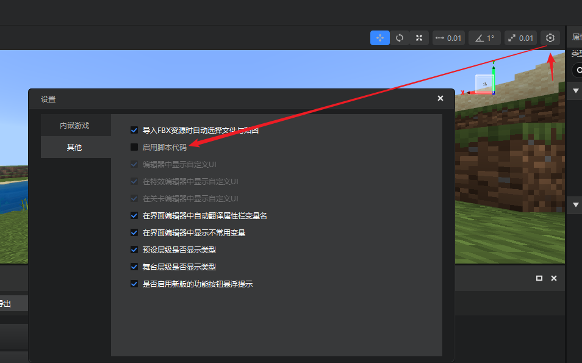

- 编辑作品→启用脚本代码选项，如图：

    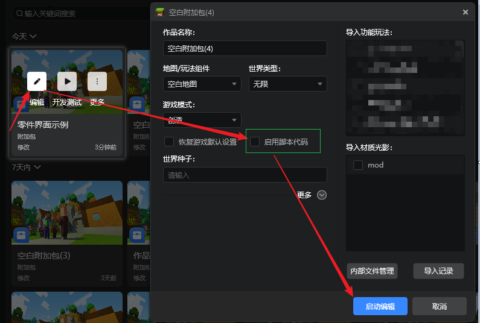

