# 2023.02.07 版本1.0.23

## 教程面板
编辑器新增教程面板，可通过工具栏的教程按钮打开，如图所示：

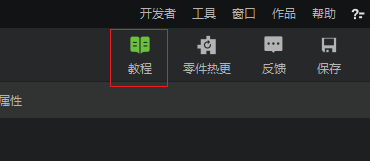

教程面板主要包含以下内容：
1. 当前编辑器：当前打开的子编辑器简要教程，可通过切换子编辑器进行教程的切换和阅读。

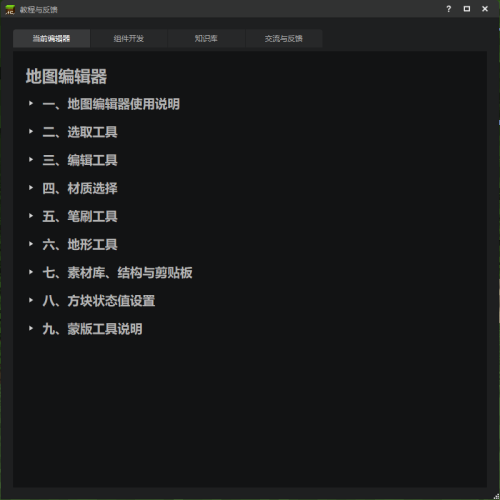

2. 组件开发：归纳整理了关于组件开发的全流程教程大纲，帮助新手快速定位需要了解的知识点。

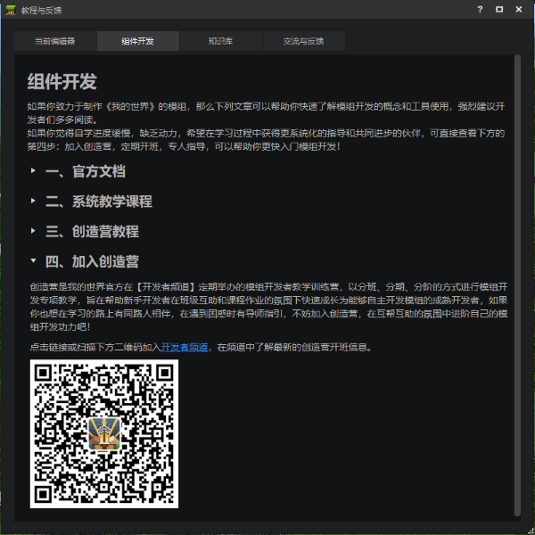

3. 知识库：收纳了来自开发者频道-知识库中由开发者分享的精华文章，包括【必看文章】和【优秀文章】两个系列。

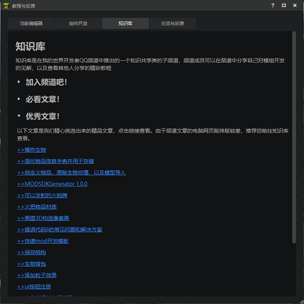

4. 反馈与交流：简要介绍了开发者最常用的交流和反馈渠道，包括开发者频道，官网，内容管理平台，B站，公众号等等。

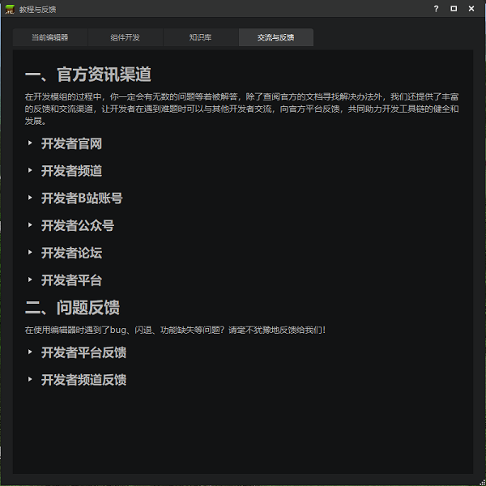

## 编辑器常用功能支持悬浮提示
对各个子编辑器内常用的功能面板和按钮的悬浮提示进行了优化，你可以将鼠标悬浮在功能按钮上触发提示，如图所示：

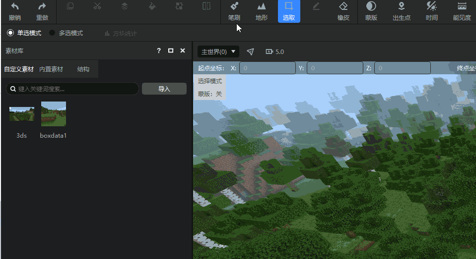

> 温馨提示：如果你已经熟练掌握编辑器的所有功能使用，希望关闭提示，可通过预览窗右上角【设置按钮】→【其他】关闭新版的悬浮提示，如图所示：

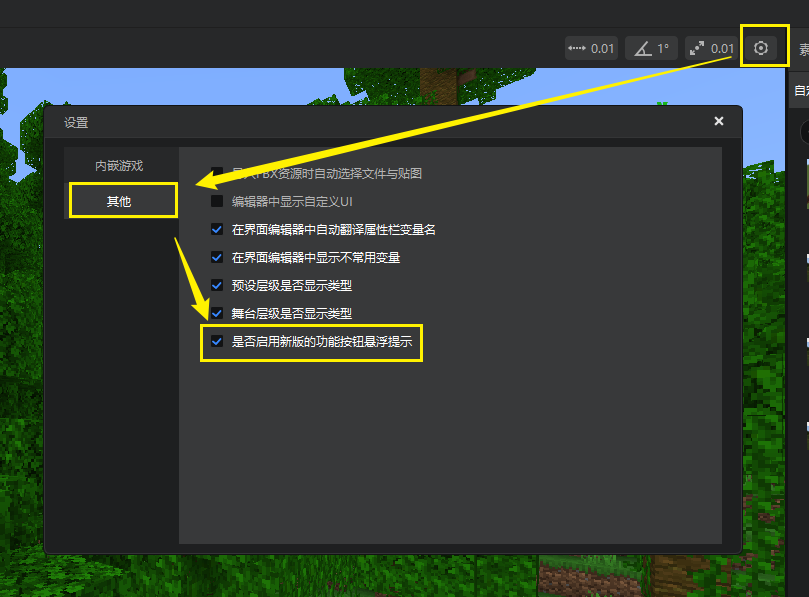

## 预览窗工具栏更新

本次更新，我们推出了**预览窗工具栏**功能。它位于编辑器预览窗的正上方，用于对编辑器内嵌游戏进行设置。不同编辑器下视口工具栏中可以使用的功能是不同的，具体请见[这篇文档](../../20-玩法开发/11-组装简单玩法/4-预览窗工具栏.md)

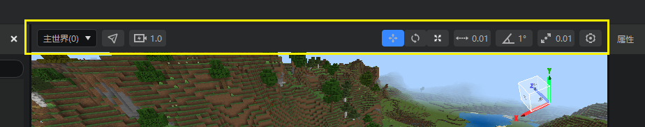

## 调试工具

### 1. 连接地址保存优化

为了解决开发者们反馈的同一设备连续多次连接会出现多条相同的连接地址记录问题，本次更新调整了保存连接信息的数据结构。

**本次更新后烦请开发者们重新输入IP地址，将移动端设备连接至调试工具。**

### 2. 日志界面展示PC端正在测试的存档名称

开发者在PC开发包测试组件时，日志界面调试窗口的左上角会展示当前正在测试的存档名称，方便开发者在多开状态下判断日志信息属于哪个进程。
> 未来我们也计划添加PE测试端存档名称显示的功能，敬请期待。

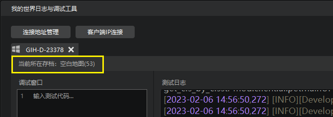

### 3. UI调试工具显示控件轮廓

在UI调试工具的面板中，开启显示控件轮廓后，可以对UI控件轮廓进行显示，辅助进行UI控件的点选。
详情参考[UI调试工具](../../30-测试/4-UI调试工具.md#游戏中定位控件)
> 目前仅支持PC端的调试，未来我们也计划添加PE端支持，敬请期待。

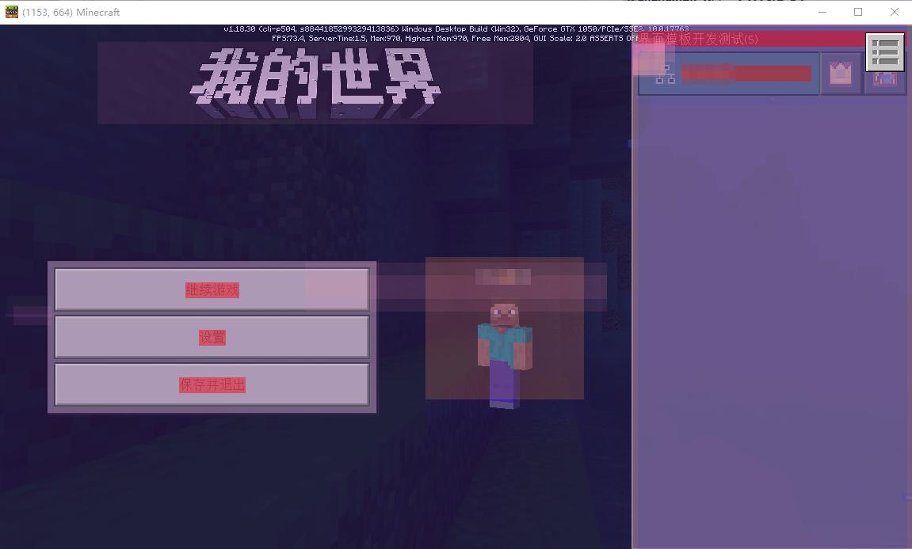

### 4. 其他调整

- 屏蔽了部分引擎侧日志信息，减少无效日志打印。

## 逻辑编辑器

### 1. 支持使用逻辑编辑器开发联机大厅作品

现在开发者们可以使用逻辑编辑器制作联机大厅作品了。

### 2. 可缺省参数标注

我们在节点的可缺省参数后添加了“（可选）”文字标注，方便开发者们按需填写。

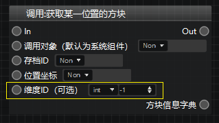

### 3. 基础运算（加减乘除）节点支持添加引脚

基础运算节点现在可以点击属性面板中的“+”按钮添加更多参数了，这样可以更快捷地进行连加、连乘等操作。

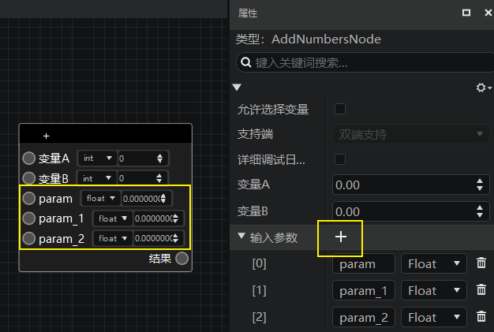

## 地图编辑器

### 1. 蒙版工具状态值选择支持选择全部状态值

- 勾选：代表选中当前方块的全部状态值。
- 取消勾选：代表只选中当前方块的一种状态值。取消勾选后左侧状态值下拉框可编辑。

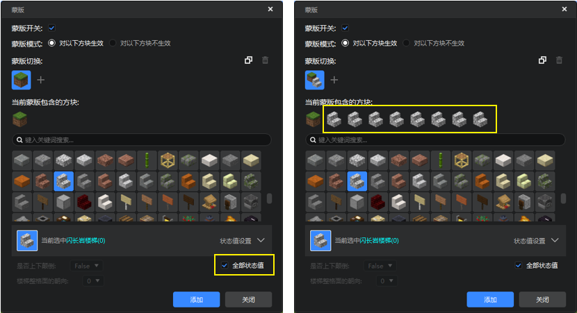

### 2. 其他调整

- 蒙版“更多设置”按钮位置调整到蒙版成分的左侧，以防蒙版成分方块较多时被遮挡。
- 调整了蒙版设置中，方块删除操作的交互体验。

## 特效编辑器

### 1. 原版粒子特效属性配置说明

为了方便开发者们直接在编辑器中创建和编辑原版粒子特效的属性信息，并实时预览，我们编写了[《原版特效属性详细说明》](../../16-美术/9-特效/21-原版特效属性详细说明.md)供大家参考。如有需要，可链接阅读。

### 2. 特效编辑器开发指南文档更新

我们整体翻新了开发指南中特效编辑器的说明文档，使文档内容与新版特效编辑器功能和交互保持一致。有需要的开发者可以[前往查看](../../16-美术/9-特效/00-特效编辑器简介.md)。

### 3. 其他调整

- 原版粒子配置涉及方向的参数标明XYZ轴向。

## 内容库与模板

1. 新建作品窗口新增了入门SDK脚本模板，用传统SDK的方式配置了最简单的脚本示例（行为包下的BlankScripts文件夹），注意与入门预设脚本模板区分，如图所示：

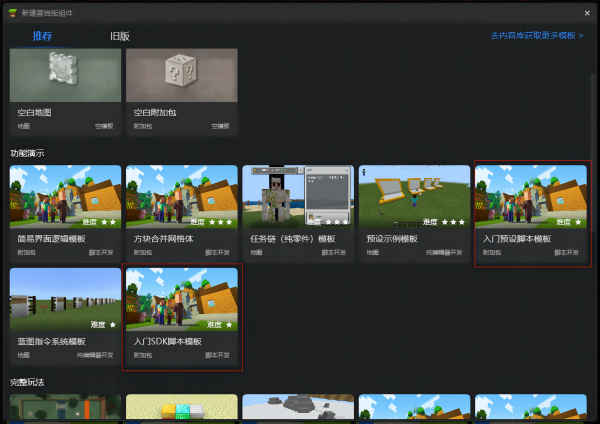

2. 内容库新增商人NPC零件，资源点零件以及部分官网教程的配套模板。

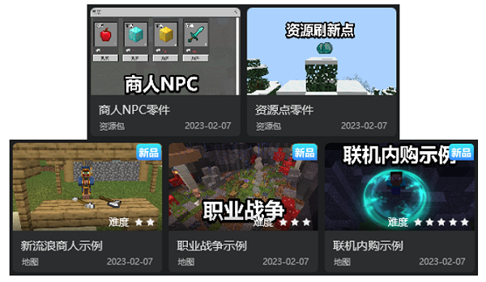

## 其他
1. 支持了新版空白地图和空白附加包模板的仅创建功能
2. 修改了新建文件向导中创建的代码文件内容，修改了导入（import）部分代码的格式，使其能够正常使用代码补全库。
