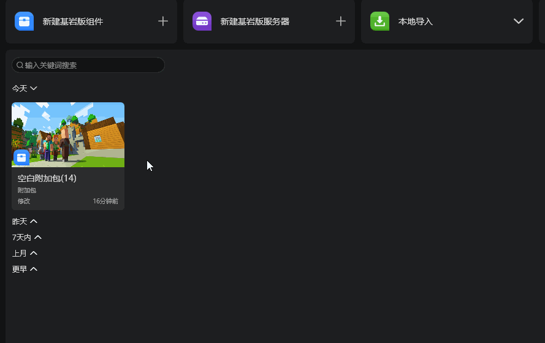
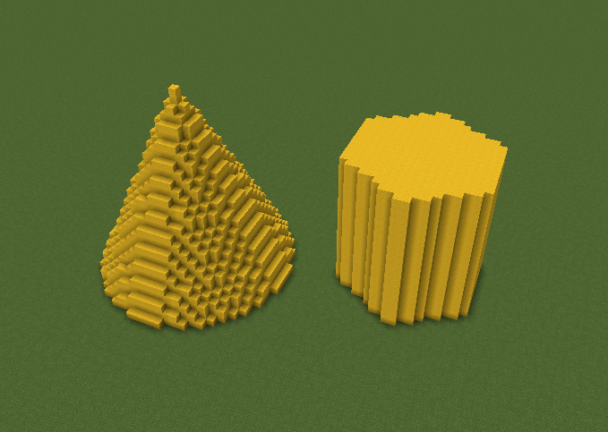
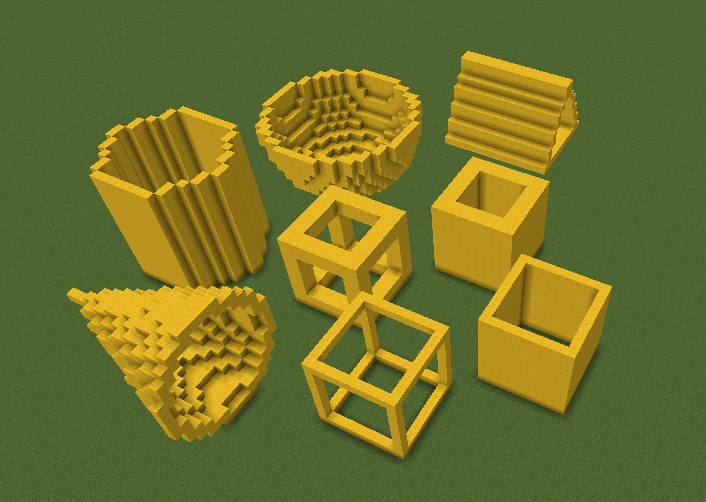
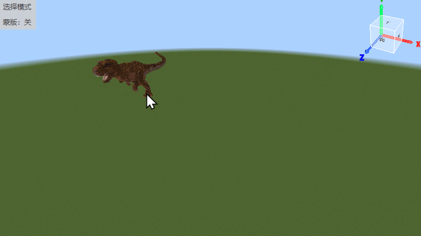
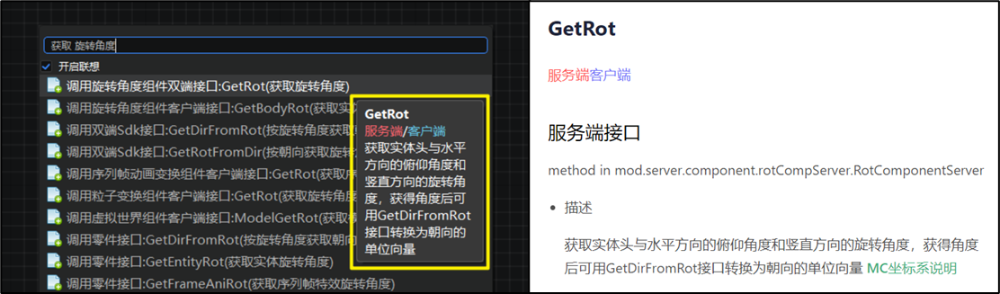
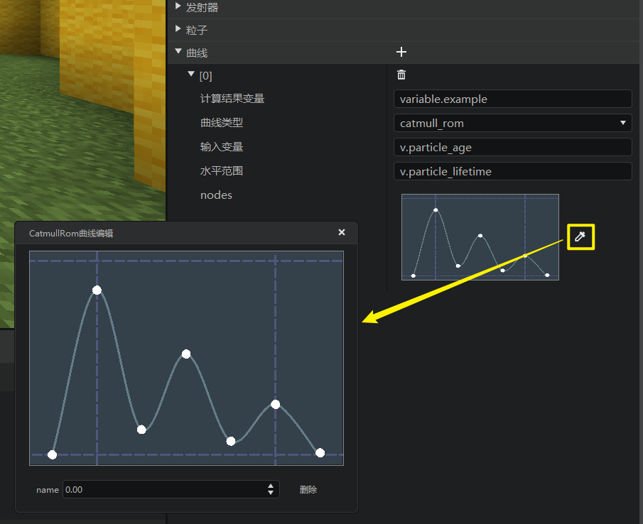

# 2023.01.11 版本1.0.22

## 启动器
启动器的作品更多菜单新增【复制】功能。

## 地图编辑器

### 1. 笔刷工具大更新

地图编辑器笔刷工具在这个版本进行了较大改动。主要更新内容如下：

- 新增**圆锥、多棱柱**笔刷形状。

  

- 部分笔刷形状支持了去除底面、仅框架的结构选项，并且可以调节厚度。

  

- 新增**素材笔刷**，支持直接应用素材库素材为笔刷形状。

  

### 2. 开发指南文档更新

[地图编辑器相关开发指南文档](../../14-地图制作/2-地图编辑器使用说明.md)更新，删除了过时的文档内容。

## 逻辑编辑器

### 1. 节点菜单鼠标悬停提示

逻辑编辑器右键节点菜单和节点搜索结果菜单都添加了鼠标悬停提示。当开发者将鼠标悬停在某个节点上时，将通过tips提示框展示更多节点信息，省去了开发者反复查看文档确认节点用途的时间。

显示的提示内容与API文档的节点描述相同。

### 2. 其他功能修改

- 枚举值节点名称格式修改为【英文名（中文翻译）】，方便开发者按英文名搜索相关文档。
- 对部分旧版节点名称做出了修改。

### 3. 开发指南文档更新

[新版逻辑编辑器使用说明](../../20-玩法开发/12-可视化编程/10-新版逻辑编辑器使用说明/01-什么是逻辑编辑器.md)更新，删除了过时的文档内容。

## 特效编辑器

### 1. 微软粒子配置支持曲线可视化编辑

现在可以在属性菜单的最下方找到【曲线】，点击【+】新增曲线，然后进行可视化编辑。

## 调试工具

### 1. 日志窗口行数限制修改

现在调试工具日志窗口的默认消息行数从1000改为5000，并且新增最大行数选项10000。

### 2. 游戏启动器侧日志屏蔽

默认屏蔽了游戏启动器侧发送的日志，这些日志通常在开发者的组件调试过程中是不需要查看的。

### 3. 客户端代码traceback打印

现在调试工具可以正常打印出客户端代码的traceback了。

### 4. UI调试工具的属性名称支持中英文切换

## 其他
1. MCResource自定义属性控件兼容非作品目录下的原生游戏路径，例如原版游戏的掉落表路径，贴图路径等，不再报错。
2. PDict 自定义属性控件新增fixlist属性，用于单独控制每个子属性的添加和移除权限，[自定义属性面板](../../20-玩法开发/14-预设玩法编程/12-深入理解零件/1-自定义属性面板.md)。
3. 调整了部分内容库资源的标签分类。

