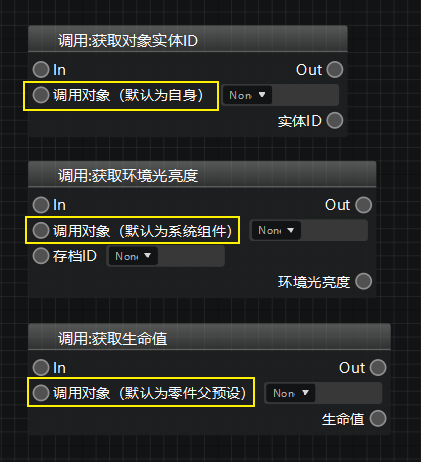
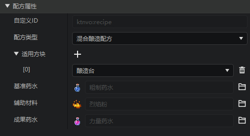
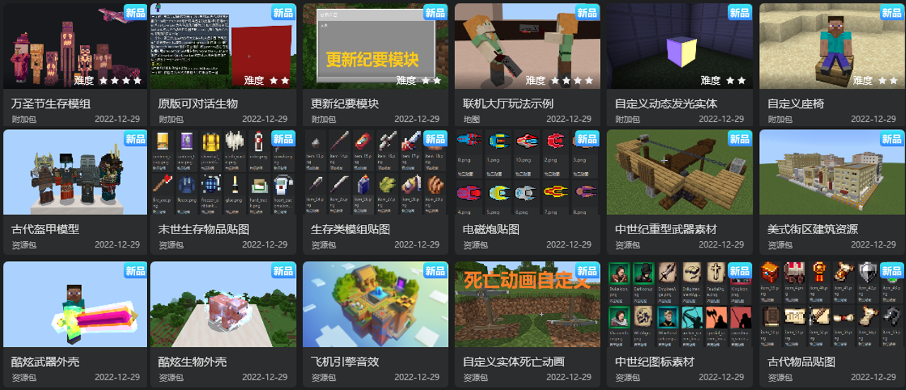
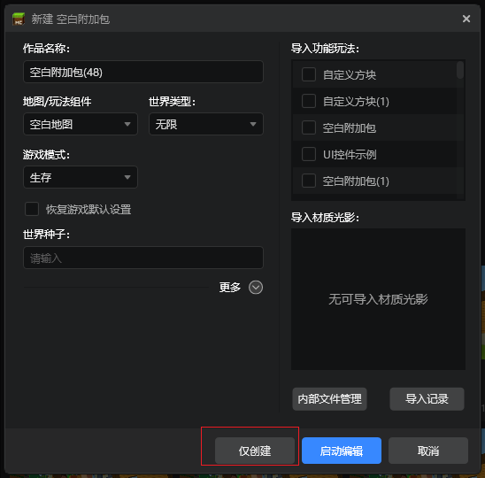
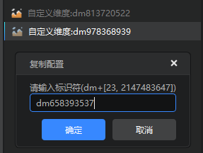

# 2022.12.29 版本1.0.19

## 逻辑编辑器

### 1. 调用对象参数引脚说明增加

为了让开发者们更清楚地了解各个节点的【调用对象】引脚应该传入什么，我们为该引脚添加了括号注释，开发者们按照注释内容进行连接即可。

## 配置

扩展[配方配置](../../20-玩法开发/15-自定义游戏内容/5-自定义配方.md)，补充支持了物品耐久度，多产物配方，酿造台配方等新字段。

## 内容库资源上新
新增内容征集活动第一期的获奖作品资源,可通过内容库中的“征集活动作品”标签快速筛选出所有的征集活动获奖作品。

## 其他

1. 新建作品支持**仅创建**选项，通过此选项创建作品不会强制启动编辑器编辑，而是跳转到创作页查看该作品。
> 创建**空白地图**时不支持该选项，必须启动一次编辑器生成地图存档。

2. 创建自定义维度配置时，自动随机生成带有随机数字的合法json命名，避免因错误命名导致维度无法正常访问，如下图。

3. UI调试工具的属性增加搜索功能