# 2022.12.15 版本1.0.18

## 编辑器新增反馈按钮

在使用编辑器时遇到了bug、闪退、功能缺失等问题？请毫不犹豫地反馈给我们！新版本编辑器顶部工具栏新增了反馈按钮，点击后会跳转至[开发者平台反馈网页](https://mcdev.webapp.163.com/#/feedbackModal?target=browser)。

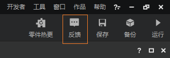

在填写反馈信息时，请开发者们尽可能提供：
- **开发者账号（邮箱）**
- **电脑系统信息、硬件配置**
- **问题的详细描述**
- **问题发生的时间和频率**

## 编辑器维度切换

### 1. 编辑器正式支持维度切换功能

长期以来编辑器都只支持对主世界场景进行编辑（或者通过复杂的指令跳转到其他维度进行操作）。从现在开始，编辑器将支持对内嵌游戏维度的快速切换，从而让开发者们能够快速便捷地前往下界、末地，或其他自定义维度。有了这个功能，你可以：

- [在关卡编辑器中搭建不同维度的游戏场景](../../20-玩法开发/11-组装简单玩法/0-关卡编辑器.md#关卡编辑器维度切换)
- [在地图编辑器中编辑不同维度的地图](../../14-地图制作/2-地图编辑器使用说明.md#维度切换)

## 逻辑编辑器

### 1. 节点目录重新整理

逻辑编辑器上线后，我们经常收到反馈说节点分类看不懂、各种名词难以理解的情况。

经过这个版本的调整，我们现在将逻辑编辑器的内置节点分类，调整为**与开发者官网API文档分类一致**。这样的分类更通俗易懂，也更符合MC开发者的命名习惯。

大家可以依据自己在API文档中的浏览顺序，在逻辑编辑器的节点菜单中查找节点。

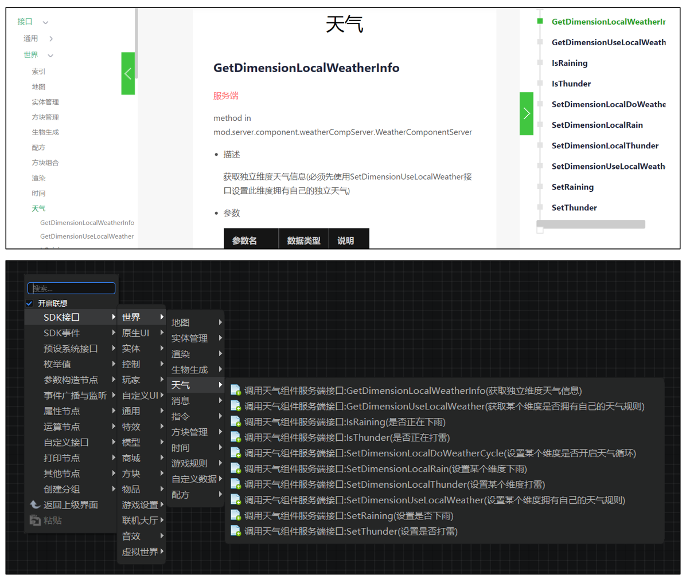

### 2. 广播、监听、取消监听事件节点

我们对事件广播、监听、取消监听的系列节点进行了整合。在之前的版本，开发者需要记住不同情况下使用的节点名称，并在海量的节点中搜索这些节点，导致很多新手用户反馈看不懂如何在蓝图中进行事件广播和监听。

现在，大家只需要在节点菜单中找到【事件广播与监听】目录，然后从中选择自己是需要【广播/通知事件】、【监听事件】，还是【取消监听事件】，即可创建对应类型的节点。

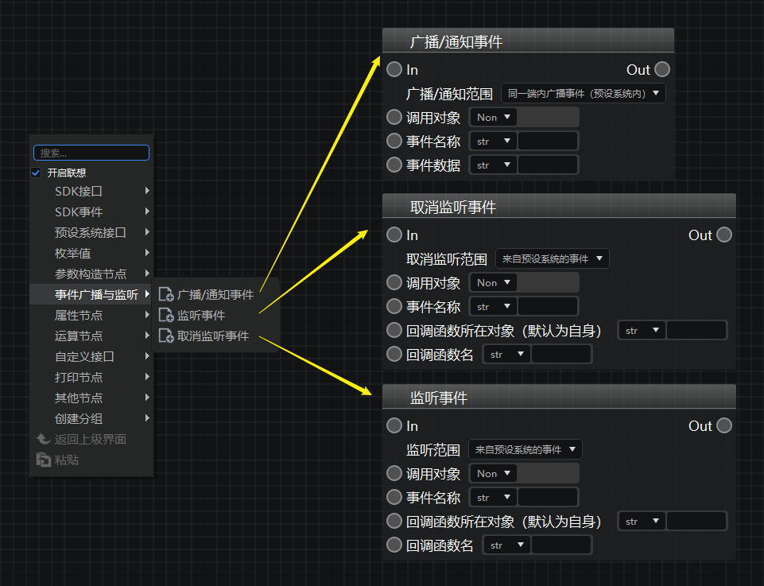

具体的广播、监听、取消监听范围，开发者可以通过范围选择下拉框进行指定。我们提供了hover文本提示，以帮助各位了解自己需要使用哪一种范围。

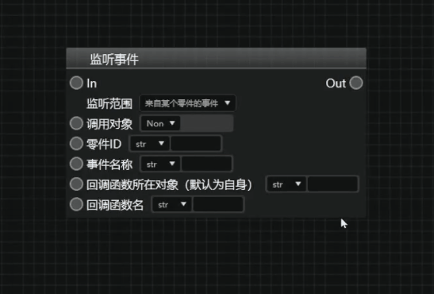

想查阅关于广播、监听、取消监听节点的更多使用指南，请看[这篇文档](../../20-玩法开发/12-可视化编程/10-新版逻辑编辑器使用说明/47-事件监听与广播.md#监听和广播自定义事件)。

### 3. 富文本分组框

我们在普通分组框的基础上新增了富文本分组框，以便让有需要的开发者能够直接进行富文本编辑，在分组框的展示文本中使用加粗、字体颜色、超链接等。

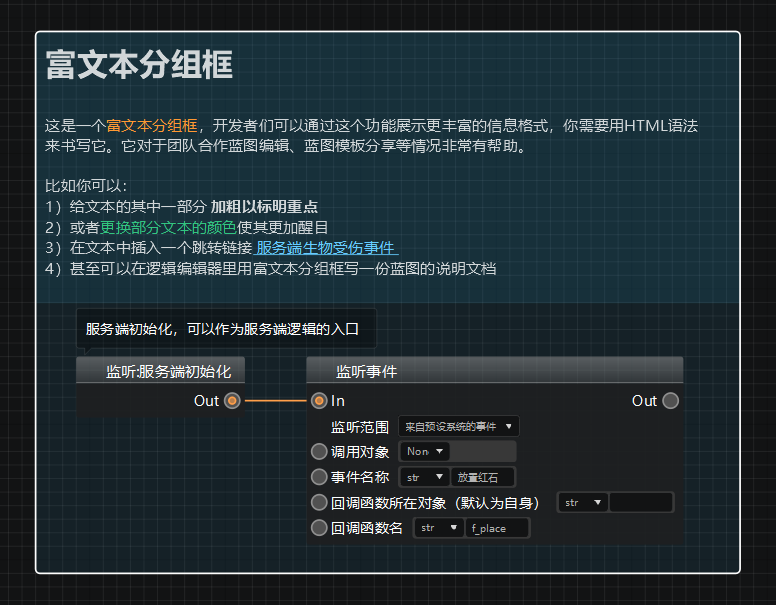

富文本分组框通过在蓝图右键菜单选择【创建分组】-【创建富文本分组】进行创建，编辑富文本时需要右键点击富文本分组框，选择【设置富文本内容】，然后在弹出的输入框内使用 **HTML语法** 编写。

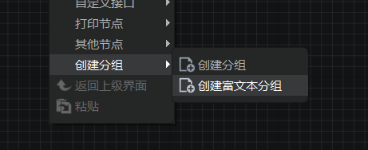

### 4. 巨量节点蓝图性能优化

我们优化了巨量节点蓝图的性能表现，解决了当一个蓝图存在数千个节点时可能出现的卡顿、崩溃问题。

我们为开发者丰富的创造力和持之以恒的创作而赞叹，感谢各位使用逻辑编辑器做出了丰富多彩的玩法组件。与此同时，我们也希望大家可以合理地将玩法逻辑分配到多个蓝图零件中，并使用事件通信将他们串联起来，避免在同一个蓝图中使用过多节点而造成不必要的性能损耗。

## 地图编辑器

### 1. 地形操作新增强度参数

对地形操作生效。即每秒进行的操作次数，取值范围为1~10之间的整数。

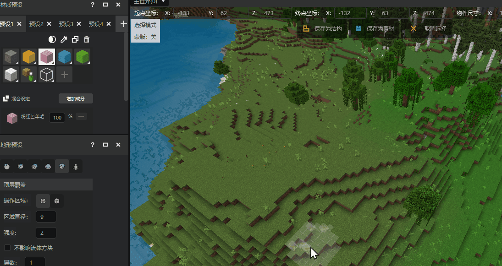

### 2. 地形操作新增凹陷工具

开发者们现在可以更方便地在平整的表面上挖洞了。

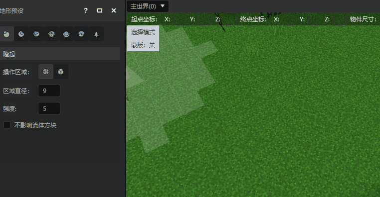

## 特效编辑器

### 1. 微软粒子编辑器内配置

从这个版本开始，特效编辑器将支持对微软原版粒子的配置编辑。在资源管理器选中微软粒子配置文件，或在挂接面板选中一个已挂接的微软粒子实例，即可在右侧属性窗口对其配置进行修改。

这个版本的配置编辑**暂不支持曲线的可视化编辑**，我们将在后续的版本补充这个功能。

需要注意的是，如果你需要修改微软粒子贴图，请先在资源管理器的【导入】按钮处使用【其他贴图】类别导入，然后拖动到属性窗口的顶部的【纹理】处。

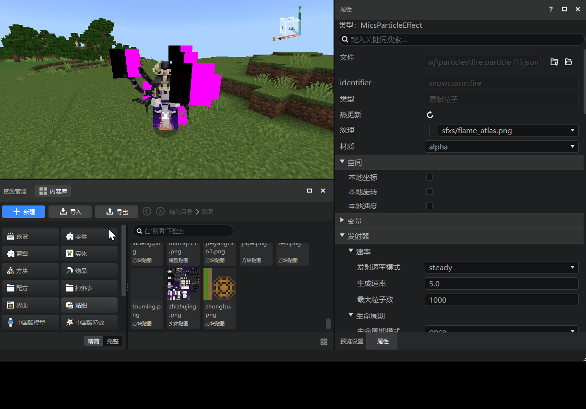

## 调试工具

### 1. 调试工具正式代替脚本测试日志

从这个版本开始，调试工具将正式取代脚本测试日志，作为开发测试日志查看的优先拉起工具。调试工具继承了脚本测试日志的全部功能，并新增了python指令调试、客户端组件管理、免机审组件同步、UI调试工具等高级功能。如果你还不了解调试工具，请阅读[这篇文档](../../30-测试/1-使用调试工具进行手机和电脑端调试.md)。

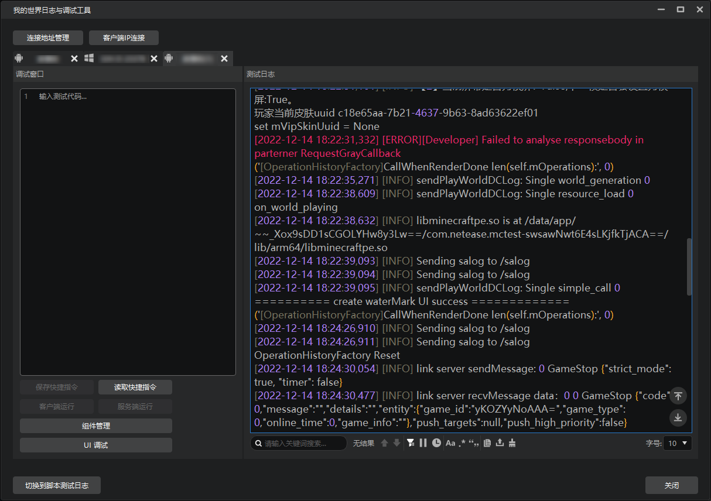

> 如果你仍希望继续使用旧版脚本测试日志，可以点击左下角的【切换到脚本测试日志】按钮。同样，在脚本测试日志窗口也可以切换使用调试工具。

### 2. 调试工具支持iOS测试服日志浏览和指令调试

是的，调试工具现在支持了iOS手机测试服了。开发者们可以像连接安卓测试服一样连接iOS测试服，并进行日志浏览、指令调试、组件同步等操作。

### 3. 组件同步自动扫盘获取对应组件

现在在进行组件同步时，有2种方式选择需要上传的组件文件：
**1）通过下拉框直接选择Studio作品库中的作品；**
2）像以前一样通过在资源管理器中浏览、定位文件夹的方式上传。

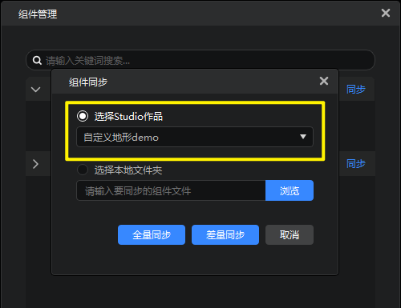

### 4. 新增UI调试工具

新增UI调试工具，用于在开发测试时对界面进行调试，包括原生界面。调试功能包括查看界面的控件结构，以及各控件的部分属性值。详情参考[UI调试工具](../../30-测试/4-UI调试工具.md)。

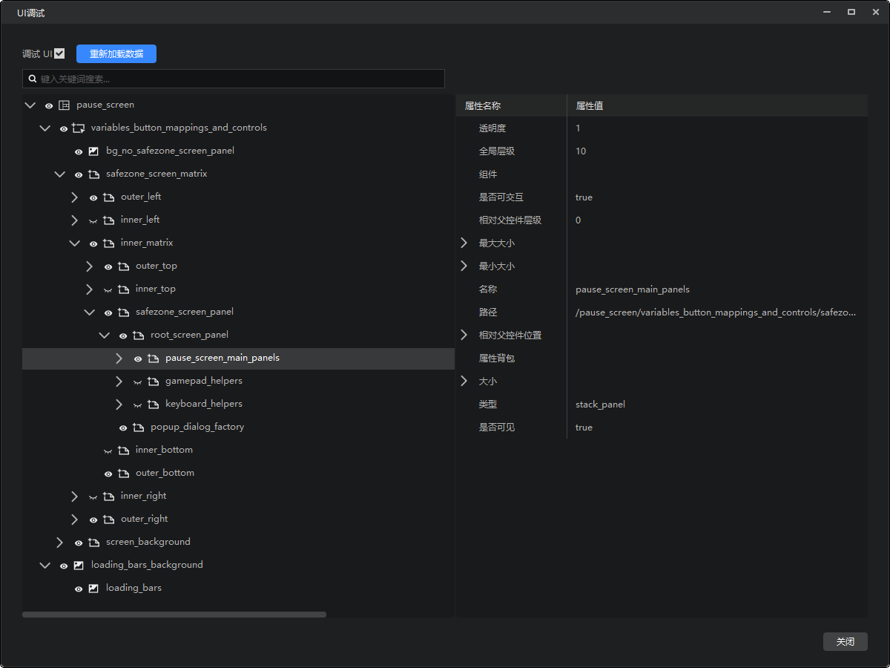

## 配置

1. 修改[方块配置](../../20-玩法开发/15-自定义游戏内容/2-自定义方块/0-自定义方块概述.md)，补充大量缺失的网易版字段，如红石，流体方块、重力方块等字段。
2. 修改[实体配置](../../20-玩法开发/15-自定义游戏内容/3-自定义生物/01-自定义基础生物.md)，补充支持了实体组件组、实体事件、实体资源包配置等字段。
3. 配置面板对任意配置右键可**复制配置**，帮助开发者快速创建大量配置副本。
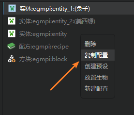

## 内容库资源上新
1. 新增幸运方块模板。
2. 新增3D盔甲模型、自定义箱子和箱子锁等官网文档中的示例资源。
3. 新增内容征集活动的部分获奖作品资源。
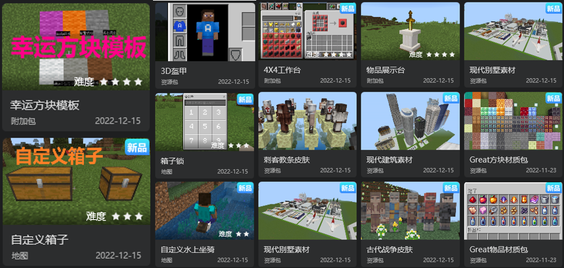

> 内容库资源征集活动的剩余获奖作品将在后续版本陆续放出，敬请期待。

## 其他优化和修复
1. 修复了启动器首页中的banner轮播方向错误的问题。
2. 修复了实体配置无法读取entities文件夹的子文件夹下的行为包Json的问题。
3. 修复了方块配置中无法读取texture/block的子文件夹下的图片的问题。
4. Apollo服务器配置的更多分页，增加允许PC用户进入的选项，如果你的服务器包含PC版本，需要勾选此项。