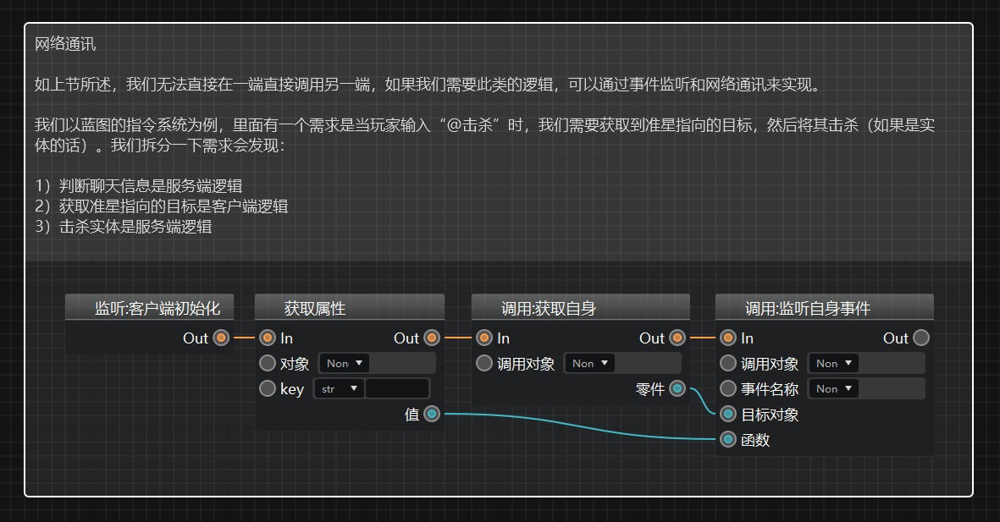
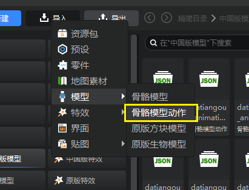
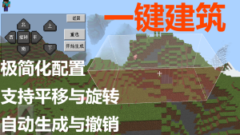
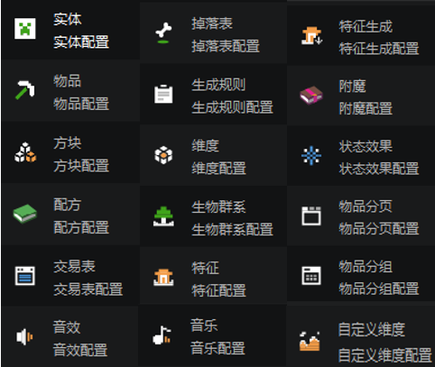
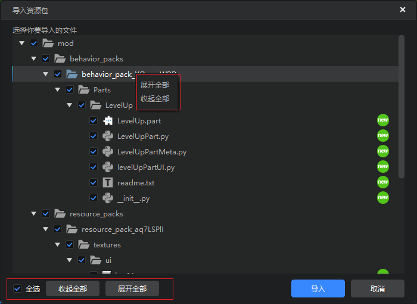
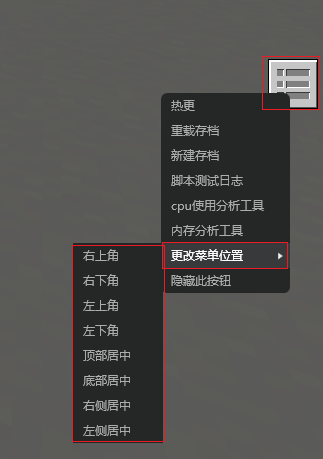
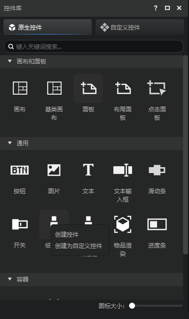

# 2022.11.15 版本1.0.17

## 逻辑编辑器

1. 蓝图分组框现在可以支持文本换行，方便开发者们对节点组合添加更多的备注信息。

2. 逻辑编辑器左侧【当前蓝图】窗口交互流畅度优化。

## 特效编辑器

1. 特效编辑器现在支持在不改变模型的情况下仅导入模型动作。

## 内容库

1. 内容库的资源卡片优化，新增新品标签及更新提示。
2. 新增生物警卫零件，挂载实体预设下，可驱动该实体守卫指定区域，并主动攻击入侵的敌对生物

3. 新增一键建筑零件，挂载空预设下，仅需简单配置建筑的名称描述和对应的结构文件，制作一键建筑类模组。

## 配置

1. 新增[自定义维度](../../20-玩法开发/15-自定义游戏内容/4-自定义维度/1-自定义维度.md)配置，用于配置每个自定义维度的属性，如世界类型，生成器，屏蔽原版特征等属性。
2. 为部分配置替换了独一无二的图标。

## 预设API更新
1. 新增获取预设零件所在维度的接口，部分已有接口增加维度参数（包括逻辑编辑器节点）。更多文档请参考<a href="../../20-玩法开发/14-预设玩法编程/13-PresetAPI/更新信息/2.4.0.html">2.4.0版本预设API更新说明</a>。

## 其他

1. 优化了调试工具代码调试窗口的输入体验。
2. 导入/导出资源包窗口新增全选、展开全部、收起全部按钮。

3. ModPC开发包的快捷菜单新增“更改菜单位置选项”
。
4. 原生控件支持拷贝为自定义控件。

5. 其他体验优化和问题修复。