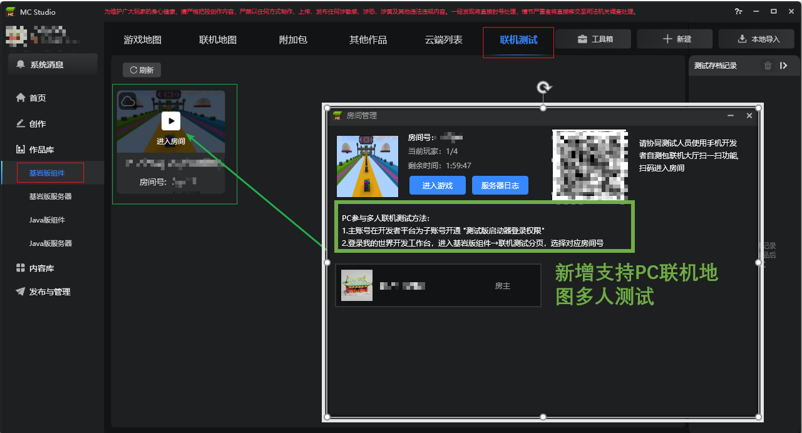
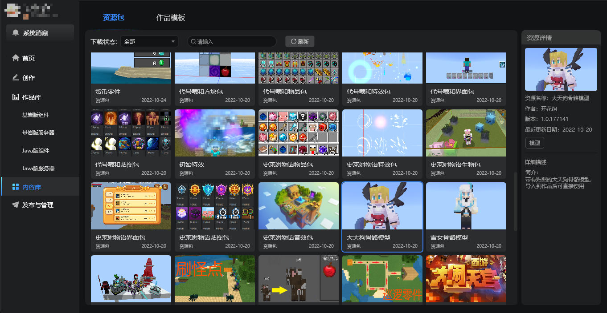
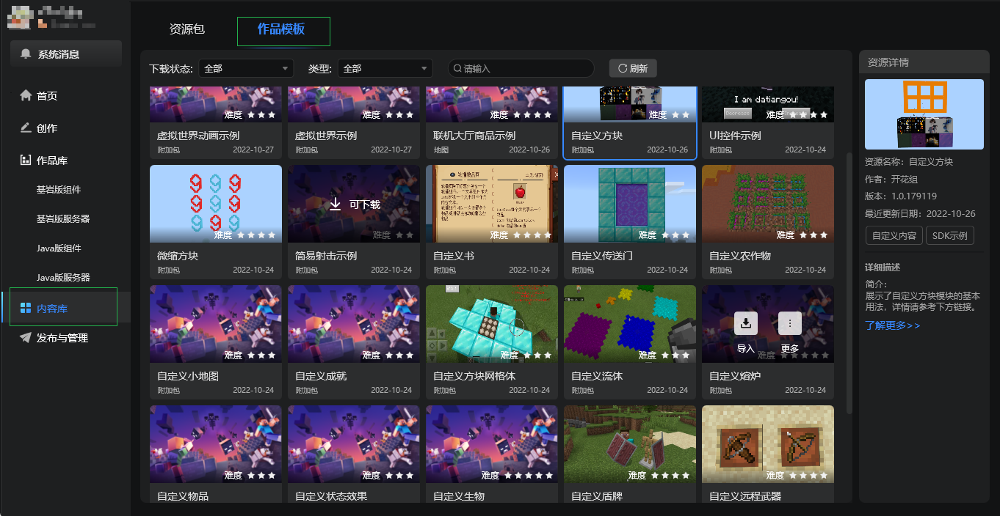
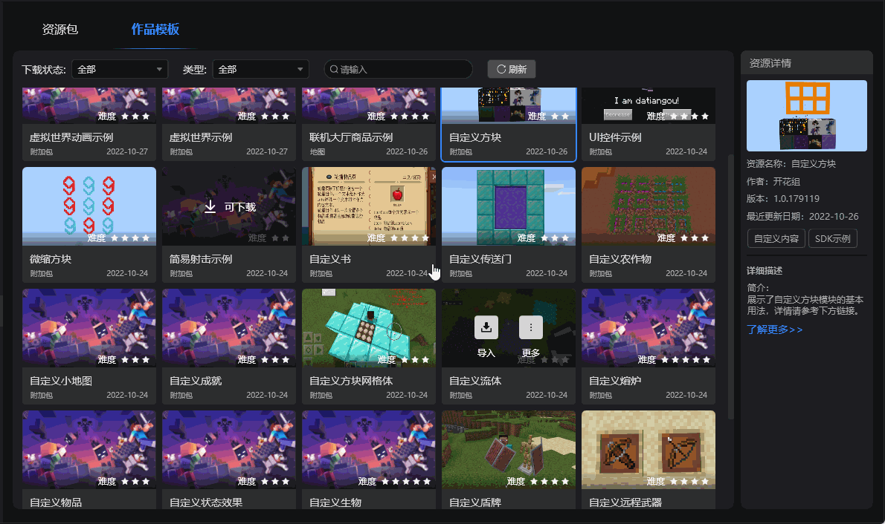
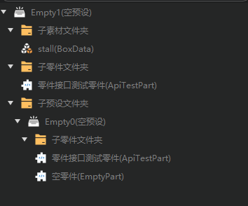

# 2022.11.1 版本1.0.16

## 旧版作品编辑提示

1. 在创建和编辑旧版作品时强化了升级提示。

2. **旧版编辑器后续将不再支持新功能，强烈建议开发者使用新版编辑器进行模组开发。**

## 界面编辑器

1. 自定义控件库扩展为控件库，分为原生控件和自定义控件2个页签。

2. 原生控件支持通过拖拽的方式创建到内嵌游戏中的指定位置，或者指定的控件结构层级。

3. 功能区仅保留对控件的操作按钮。

4. 新增滑动条控件

## 逻辑编辑器支持分词搜索

1. 在蓝图中搜索节点时，可以在多个关键词之间加入空格进行分词，来搜索名称中同时带有这些关键词的节点。此外，分词也支持直接输入拼音进行识别。

## 联机地图作品支持PC端多人测试

1. 无论是手机端还是电脑端的联机地图作品，都可在我的世界开发工作台中开启多人测试，且同时支持手机测试端和电脑测试端进入同一个房间。
详情请参考[联机大厅作品多人测试](../../26-联机大厅/20-联机大厅调试与多人测试文档.md)。

## 内容库新增作品模板分页

> 详情参考[内容库使用说明](../../15-资源管理/11-内容库.md)。

1. 原有资源归类到 **资源包** 分页，用于存放可直接导入到当前已有作品中的资源包文件（.mep后缀）。

2. 新增 **作品模板** 分页，用于存放需要创建为新作品的模板文件，类似与新建作品窗口的模板。

3. 将内容库原有资源中的示例移动至作品模板分页，开发者可直接创建为作品进行测试。

## 配置

1. 修改[物品配置](../../20-玩法开发/15-自定义游戏内容/1-自定义物品/1-自定义基础物品.md)配置，补充部分属性。
   
2. 修改[群系配置](../../20-玩法开发/15-自定义游戏内容/4-自定义维度/2-群系地貌.md)配置，补充部分属性。

## 其他

1. 舞台及预设层级的树状结构优化。

2. 调试工具指令调试窗口的右键菜单汉化完成。
   
3. 调试工具指令调试的代码补全提示按照字母a→z的顺序排列，方便开发者定位。

4. 其他体验优化和问题修复。