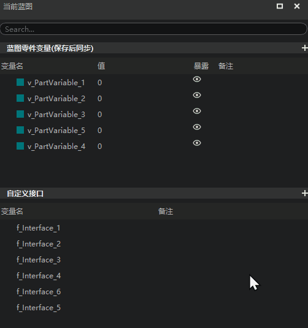
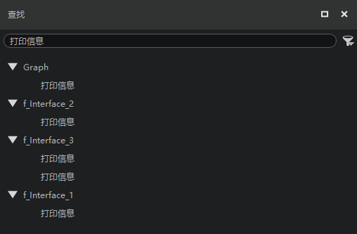
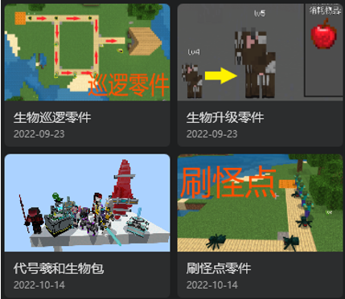
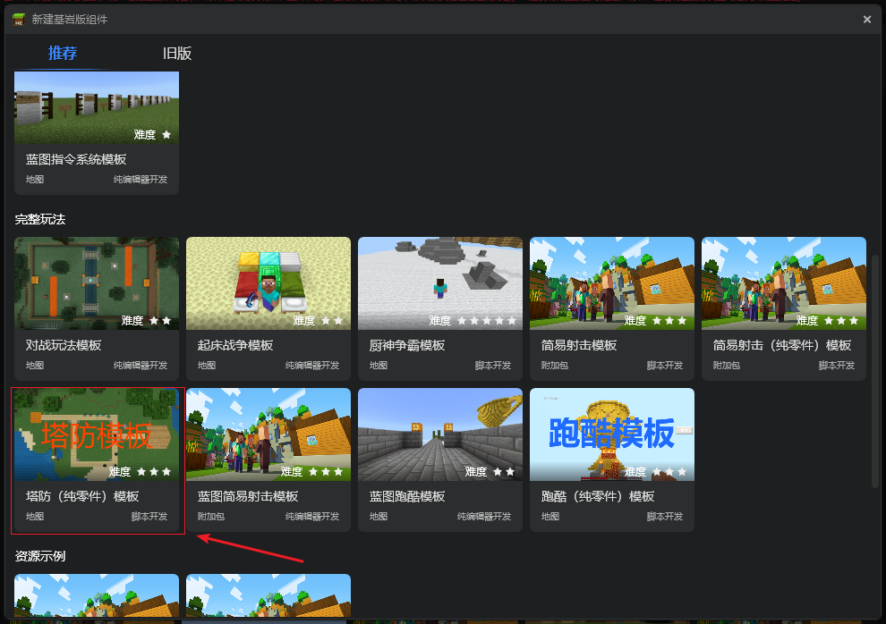
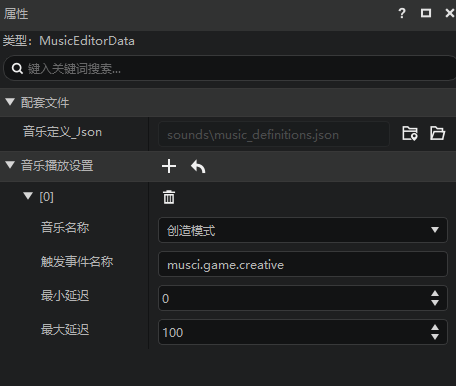
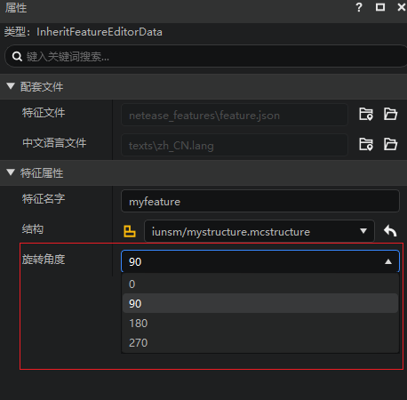

# 2022.10.18 版本1.0.15

## 开服工具2.0正式外放

1. 支持使用Spigot和模组SDK制作基岩版手游服务器，详情参考[开服工具2.0](../../27-网络游戏/课程10：使用Spigot开服/10-支持基岩版客户端的Java版网络游戏概述.md)

## 关卡编辑器支持放置生物

1. 支持放置非预设的生物，并在舞台中管理和修改生物的属性
2. 支持放置原版生物和自定义生物，详情参考[放置和管理生物](../../20-玩法开发/11-组装简单玩法/1-放置和管理生物.md)

## 逻辑编辑器

1. 蓝图零件变量、自定义接口、变量允许开发者拖动修改并保存列表顺序

2. 【查找】功能支持定位自定义接口图表里的节点

## 模板和内容库

1. 内容库新增刷怪点零件、生物升级零件、生物巡逻零件，修复代号羲和生物包详情页问题。

2. 新建作品推荐页增加塔防（纯零件）模板

## 配置

1. 新增[音乐](../../20-玩法开发/15-自定义游戏内容/8-自定义音乐.md)配置

2. [特征](../../20-玩法开发/15-自定义游戏内容/4-自定义维度/4-自定义特征.md)配置修改放置时的旋转角度

## 调试工具

1. 提供<a href="../../../mcguide/30-测试/1-使用调试工具进行手机和电脑端调试.html#_5-日志按标签过滤" rel="noopenner">日志标签筛选功能</a>，同时还支持开发者添加自定义日志标签

2. 支持仅显示日志窗口或仅显示调试窗口

3. 日志窗口不同类型字段的通过不同颜色的文字展示

## 其他

1. 其他体验优化和问题修复