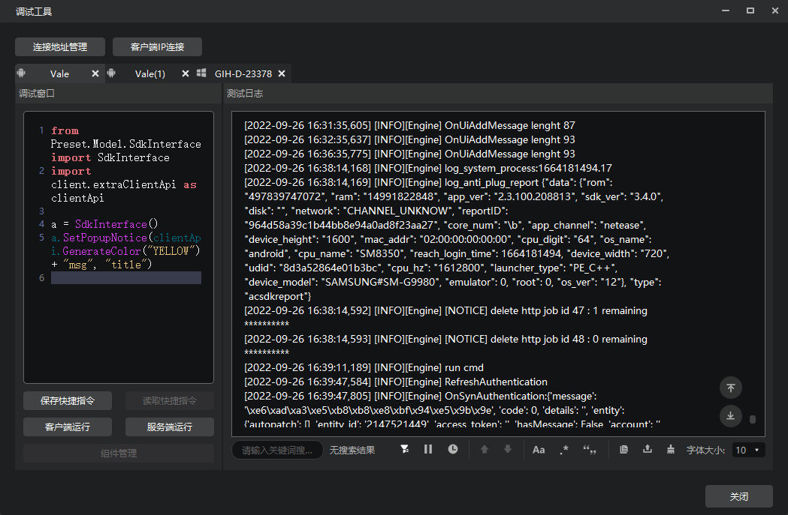
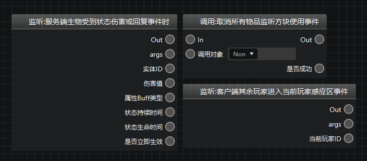
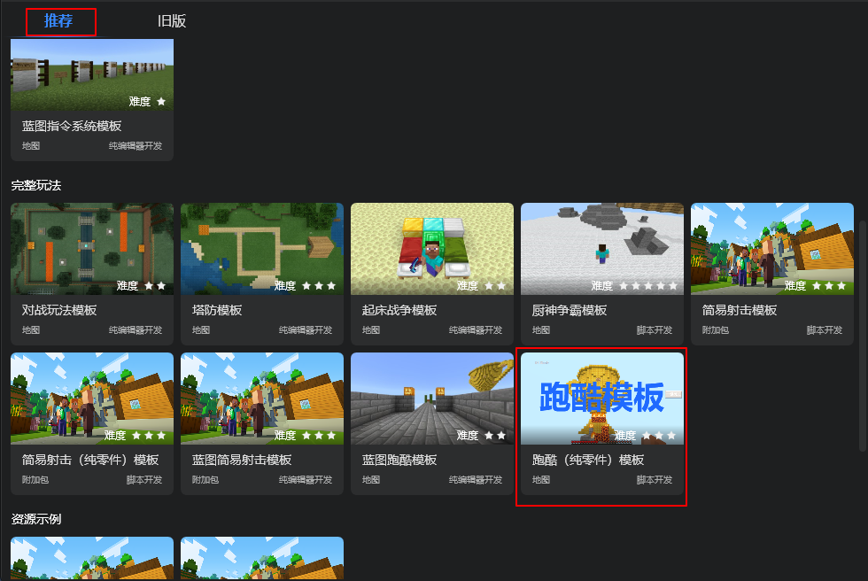
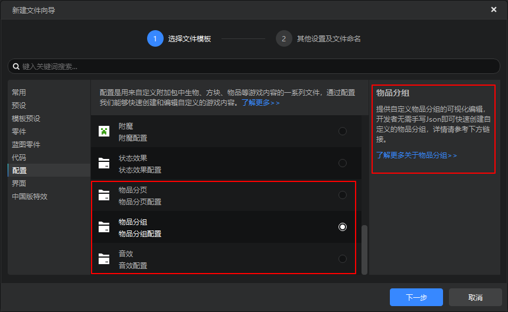
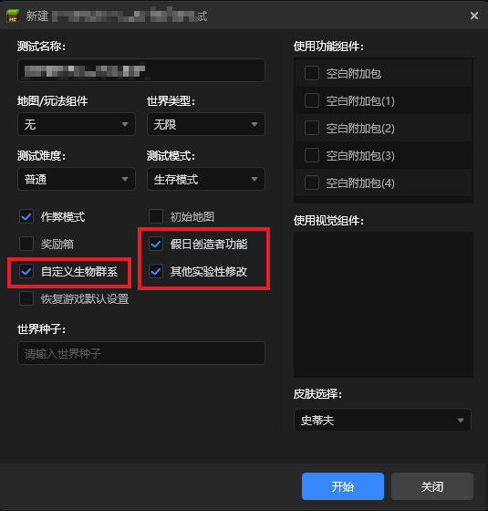

# 2022.9.28 版本1.0.14

## 调试工具

我们推出了调试工具的全面升级！新版调试工具提升了开发者在下列流程中的体验：

1. **组件同步**：自测组件时在PC端修改组件文件，直接同步到手机测试端，省去漫长的机审等待时间。
2. **多端日志**：在电脑上查看本机和其他设备上测试游戏的日志，包括手机测试客户端和其他PC开发包的测试日志。
3. **代码调试**：对正在进行中的游戏测试进程直接使用python代码进行调试，并且提供代码补全功能。另外开发者还能查看到调试代码的历史记录，并且可以将写好的代码保存为快捷指令，方便随时复用。

关于新版调试工具的更多详情，请看[这篇文档](../../30-测试/1-使用调试工具进行手机和电脑端调试.md)。

## 逻辑编辑器

1. 优化了节点宽度显示，现在名称较长的节点能够完整展示名称了
   

2. 允许开发者为自定义接口、自定义变量添加备注
   

## 地图编辑器

现在支持直接将剪贴板上的内容通过右键菜单添加至素材库了。
   

## 模板和内容库

1. 内容库新增季度模组西游-大闹天宫相关资源：实体物品方块配置、特效资源、结构资源、贴图资源、界面资源。

2. 新建作品推荐页增加跑酷（纯零件）模板

## 配置
新增[物品分页](../../20-玩法开发/15-自定义游戏内容/13-自定义物品分页.md)、[物品分组](../../20-玩法开发/15-自定义游戏内容/12-自定义物品分组.md)、[自定义音效](../../20-玩法开发/15-自定义游戏内容/8-自定义音乐.md)三种配置

## 其他

1. 开发测试界面支持部分实验性玩法选项

2. 实体预设整体模板的下拉框样式优化
3. 其他体验优化和问题修复