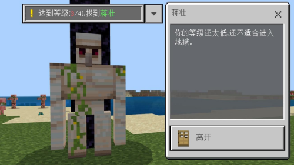

# 2022.8.31 版本1.0.12

## 预设/配置

1. 新增自定义状态效果配置

2. 实体数据有如下新增

| 特殊生物 | 末影龙，末影人，恶魂，史莱姆，岩浆怪，热带鱼，凋零 |
| --- | --- |
| 特殊非生物 | tnt，末影水晶，区域效果云，潜影贝 |
| 坐骑 | 马，僵尸马，骷髅马，骡，驴，羊驼 |
| 矿车 | 矿车，漏斗矿车，运输矿车，命令方块矿车 |
3. 实体配置的资源包模型可以选择所有的原生模型了
4. 支持放置方块时自动生成方块预设（在2.3版本正式生效，目前可在modpc包上测试）
5. UI预设增加常加载选项

## 启动器

1. 删除正在编辑的作品时，会提示作品占用
2. 启动ModPC包测试弹窗增加beta版链接

## 地图编辑器

现在地图编辑器的笔刷材质、填充、替换等工具都支持选择使用方块的状态值了！详情可参考[这篇文档](../../14-地图制作/91-方块状态值设置说明.md)。

打开对应的窗口，如果选择的是可以修改状态值的方块，则在选中后右下角会有【状态值设置】选项，点击即可展开状态值选项。通过下拉框调整好状态值后，就会将该状态值的方块应用到你使用的工具上。

> 注：部分方块的一些特殊状态值在wiki上可以查到，但在放置方块时由于原本方块逻辑并不能生效，故我们屏蔽了这部分的状态值，它们不会显示在状态值设置的选项里。

## 特效编辑器

### 特效编辑器时间轴更新

我们更新了特效编辑器的时间轴，除了其本身的外观更新外，本次更新主要包括下列几点功能：

1. 优化了时间轴对中国版特效播放延迟的直接控制。
- 现在开发者可以将同一个特效文件挂接到不同挂点，并在时间轴上分别拖动修改每个挂点下特定特效的延迟。

> 注：现在时间轴上调整过的延迟会记录在特效bind文件中，并覆盖原本特效文件中的延迟。如果你希望继续使用特效文件中配置的延迟，请直接在属性面板中调整，而不要调整时间轴上的拖柄。
> 如果你希望将时间轴上的延迟数据同步到特效文件本身，请点击轨道属性窗口的【同步文件】按钮，这样就会将时间轴上的延迟数据写入特效文件配置中。
> 

2. 特效时间轴窗口左半部分改为【挂点名称+特效文件名】的形式，让特效之前的区分更清晰。

3. 骨骼模型动作支持挂接音效。

> 注：当前版本仅支持原版音效，暂不支持手动添加的音效。

### 其他修改：
- 对blockbench模型锚点的偏移、旋转调整支持按步骤撤销

## UI编辑器

1. 刷新属性面板时保持属性的分组和滚动条位置不变
2. 控件结构的右键菜单中新增添加动画和播放动画的选项
3. ui json文件现在只保存不等于默认值的属性
4. 属性值类型错误时，显示一个红色的错误标记
5. 优化图片控件的“默认图片”样式

## 模板和内容库

1. 内容库新增官方模组《三打白骨精》、任务链、跑酷相关资源共12个；
2. 内容库更新《代号：羲和》与《史莱姆物语》相关资源的使用说明。

3. 新建作品推荐页增加任务链（纯零件）模板

## 其他

1. 导入导出资源包弹窗支持展开和收起全部

2. 其他性能和体验优化，问题修复，文档更新