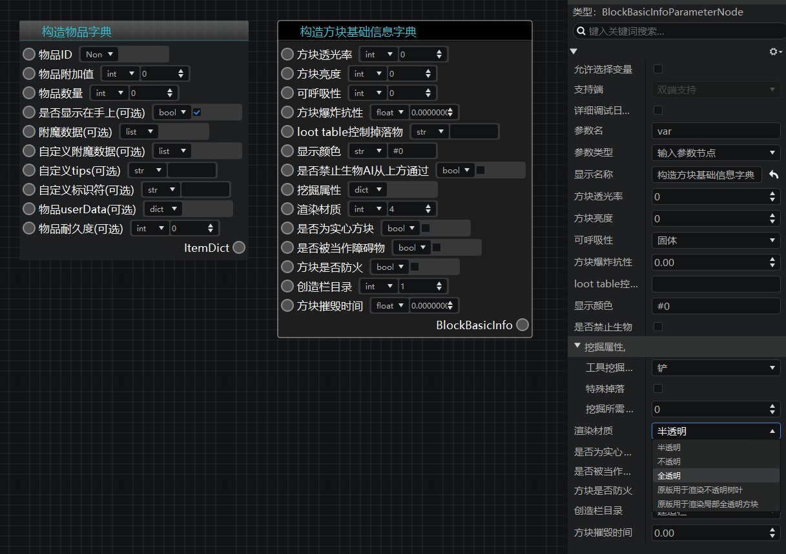

# 2022.8.2 版本1.0.11

## 安装器优化

- 交互和视觉优化

## 逻辑编辑器

- 新建蓝图默认左侧窗口改为“当前蓝图”
- 新增构造物品字典，方块基础信息字典两个节点，简单应用不再需要查询文档
- **【请注意】构造物品字典、构造方块基础信息字典节点在2.3整包上线后才会正式生效，不可用于2.2版本组件。目前仅可在modpc包上测试。**

## 特效编辑器

- 现可撤销对骨骼模型挂点的偏移、旋转等操作。
- 基岩版模型动作支持音效挂接。**目前仅支持游戏内置的部分音效**，可在音效轨道属性菜单的【音效】下拉框中选择。

## 预设、配置

- 实体配置的资源包现在会自动补充render_controllers和materials
- 禁止新建实体配置/预设时大写字母
- 添加《洞穴与山崖》版本的实体

## 地图编辑器

- 支持在地图中直接摆放结构。作品中保存的结构会直接显示在【素材库】窗口的【结构】分页中，开发者可以直接像摆放素材一样，通过鼠标点击将结构摆放至场景中。
- **需注意的是，【结构】分页仅会显示当前作品中的结构文件，并不会像素材一样可以跨作品使用。**

## 调试工具优化

- 日志字体大小设置
- 高级搜索功能，包含正则表达式匹配，大小写敏感，全字匹配等
- 回车搜索和高亮搜索文本
- PC端使用调试工具支持断线重连

## 内容库
- 史莱姆物语方块包
- 自定义生物示例包
- 史莱姆物语结构包
- 代号羲和结构素材包

## 其他更新

- 资源包导入导致的玩家预设合并，现在也会合并玩家预设的属性了
- 导入资源包菜单优化
- 网络服Mod选择按照字母排序
- 其他性能和体验优化，问题修复，文档更新
