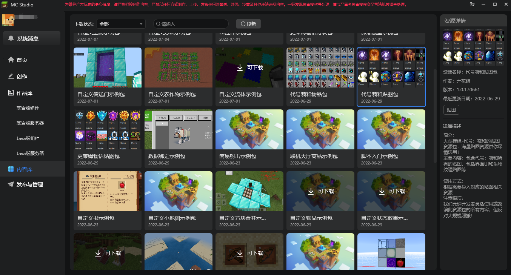
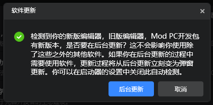
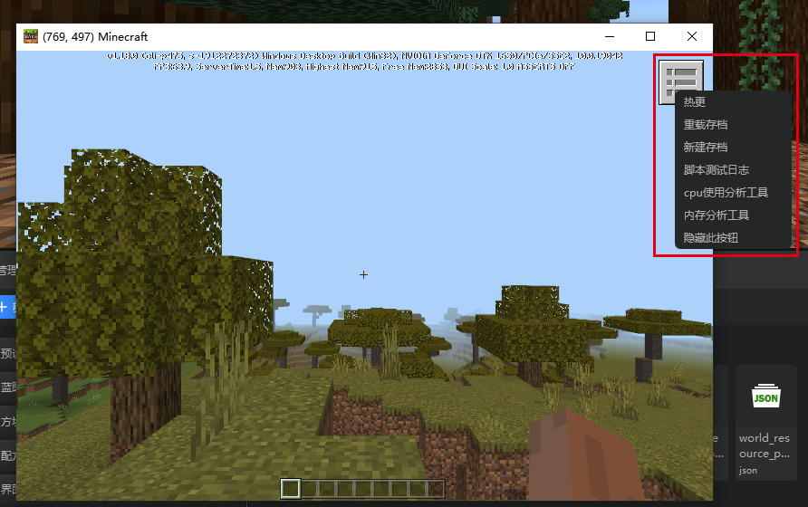
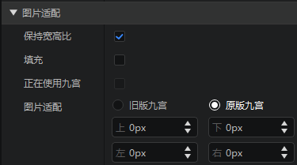

# 2022.7.7 版本1.0.9

## 工作台

### 内容库

- 启动器新增“内容库”分页，使用说明见[内容库](../../15-资源管理/11-内容库.md)
- 以自定义资源包的形式为开发者提供了大量配置、预设零件、特效贴图等开发过程中所需要的游戏资源
- 支持一键下载并导入到当前作品，助力开发者创作更丰富有趣的作品！

### 启动器增加后台更新的功能

- 打开启动器后，如果我们检测到了编辑器或者Mod PC开发包有更新，将直接弹出提示
- 后台更新时可以进行其他操作

### Mod PC开发包新增快捷操作
详情请见[ModPC开发包开发者菜单](../../30-测试/00-ModPC开发包介绍.md#二、开发者菜单)
- Mod PC包右上角新增一个快捷操作按钮
- 功能包括热更，重载，新建存档并测试等
- 可以缩短测试过程中的等待时间

### 原版模型粒子更多支持

- 现在可以像调整FBX模型一样调整基岩版模型的挂接的相对位置和旋转了
- 通过时间轴控制原版粒子暂停和继续播放

### 界面编辑器优化

- 删除界面文件时提示将要被删除的自定义控件
- 变量区图片控件图片路径只显示图片名称
- 九宫属性恢复旧版的样式
- 创建界面的时候新增“是否启用基类画布”的选项
- 拖曳资源进图片控件时不会再自动设置uv_size

### 其他更新

- 修复部分SDK接口没有对应蓝图节点的问题
- 新增构造Transform的蓝图节点
- 启动器新建地图废弃“传统”地图类型
- 编辑器设置项中添加内嵌游戏的MSAA
- 配方配置的配方属性增加“应用”按钮
- 云端列表样式更新
- 内置零件可以通过新建文件向导创建了
- 账号异常退出时提醒保存编辑器数据
- 其他性能和体验优化，问题修复