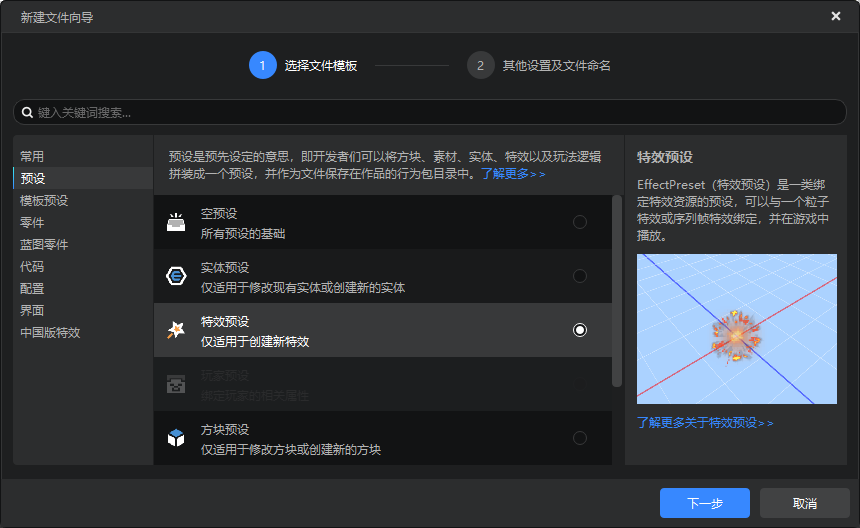
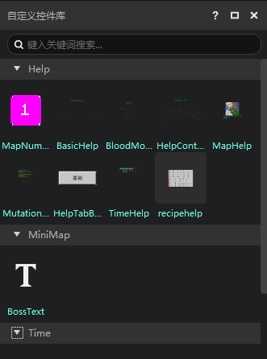
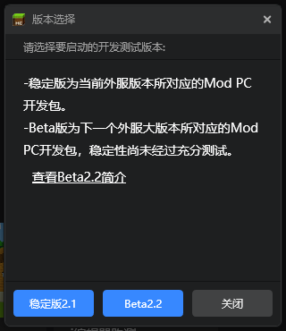

---
front:
hard: 入门
time: 10分钟
selection: 3
---

# 2022.6.7 版本1.0.8

## 工作台

### 新建文件向导优化

- 增加当前选中项的简略文档，点击可跳转至官网文档
- 搜索不再区分大小写
- 命名框规则优化

### 界面编辑器优化

- 读取界面文件时增加loading状态
- 错误操作增加弹窗提示
- 自定义控件库增加分组，现在会按照自定义控件归属的界面文件进行分组
- 界面文件简化，不再保存默认值
- 变量删除增加删除并解引

### 其他更新

- 启动器工具箱增加脚本测试日志，不小心关闭之后，可以在这里再次拉起
- 编辑器随机命名空间时避开敏感词
- 带搜索栏的下拉框优化
- 其他问题修复，体验和性能优化，文档更新

## 模组SDK

- 更新2.2开发包beta版，可以在开发包中的版本选择中选2.2beta来体验。
- 更多文档请参考<a href="../../../mcdocs/1-ModAPI/更新信息/2.2.html">2.2版本ModAPI更新说明</a>。

