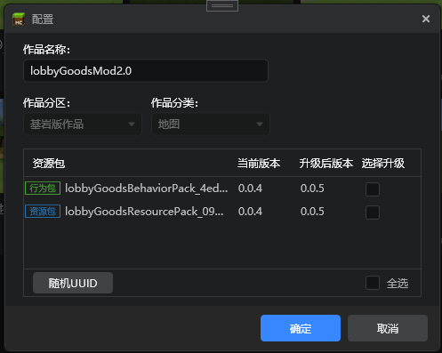

# 2022.5.24 版本1.0.7

## 工作台

### 组件打包发布优化

- 在作品的“更多”菜单中新增随机生成组件UUID，提升组件版本号的功能
- 在作品的“更多”菜单中新增将AddOn转换为地图的功能
- 详见[组件打包发布](../../30-测试/3-组件打包发布.md)。

### 界面编辑器优化

- 图片控件统一
- 管理变量时自动选中变量
- 自定义的变量名不做翻译
- 自定义控件支持复制
- 可以撤销导致控件破损的操作了
- 新增同名控件破损状态，不再会导致编辑器内嵌游戏崩溃
- 万用控件下不再允许添加子控件

### 其他更新

- 实体零件支持存档
- 微软粒子支持热刷新，不再需要重新导入特效或者重启编辑器
- 优化接口测试零件，模板零件补充更多注释
- 舞台各实例的展开情况会在关闭编辑器时保存
- 资源管理器导入菜单增加“贴图”
- 启动器支持Java 1.18
- 内置零件名称改为中文
- 其他问题修复，体验和性能优化，文档更新

