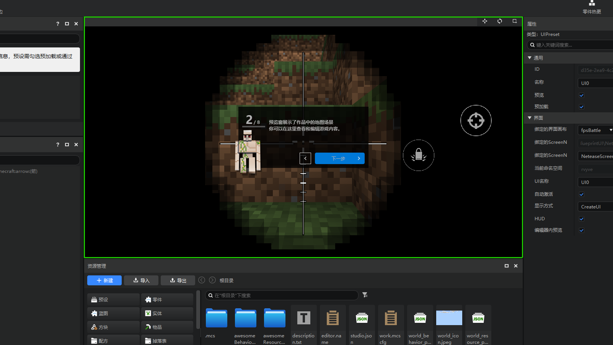

# 2022.5.10 版本1.0.6

## 工作台

### 编辑器界面更新！

- 我们优化了界面的视觉风格，黑曜石般的界面带来更沉浸式的体验。
- 大幅提高了文字和背景的对比度，可以降低长时间使用带来的视觉疲劳。

- 优化了文字和背景的层级，适当使用的圆角卡片，界面各元素之间的关系更加明晰，使用起来一目了然。

### 资源管理器全新升级

- 资源管理器的更新内容较多，详情可以参考[资源管理器（新版）](../../15-资源管理/2.5-资源管理器.md)。
- 【前进】，【后退】和【面包屑导航】功能，让你可以快速的在父子目录之间跳转

- 新增【精简模式】，为不完全熟悉我的世界附加包文件结构的开发者提供一个比较简单明了的资源分类方式。

- 优化了搜索规则，并新增了【筛选】功能。搜索功能支持对所选目录的各级子文件夹进行穿透搜索。

### 界面编辑器重构

- 资源管理器的更新内容较多，详情可以参考[界面编辑器改版说明](../../18-界面与交互/0-界面编辑器改版说明.md)。
- 界面Json文件的【解析】能力和【兼容性】提高。可以解析几乎所有合法的界面Json，即使无法解析也不会强制修改你的界面文件。

- 所有继承控件在编辑器内都可以展开显示【完整的控件结构】，例如下图是编辑器内置的“开关”控件，你现在可以展开这个控件，学习它的构造。

- 移除旧版的继承控件功能，替换为【继承原版控件】。

- 新增【自定义控件】功能。你可以将某个控件（和子控件）添加至控件库，并通过简单的拖拽从控件库里复用你的自定义控件。

- 新增【变量】、【属性引用】和【万用控件引用】功能，可以在某个控件中修改其他控件的属性值。

### 新手教程

在第一次打开每个编辑器的时候，会弹出新手教程，指引各窗口的作用。

### 其他更新

- 联机大厅地图测试时，增加服务端日志功能，详见[联机大厅测试服务端日志](../../26-联机大厅/20-联机大厅调试与多人测试文档.md)。
- 关卡编辑器的配置面板增加新建按钮，默认布局会显示配置面板
- 新建文件向导支持新建特效文件
- 蓝图零件变量新增开放到零件属性面板的功能，可以在预设编辑器、关卡编辑器的零件属性面板直接进行修改
- 网络游戏配置的服务器设置中增加重置功能，可以自动添加已有的机器IP
- 后处理零件支持在编辑器内实时生效
- 配方的选择框支持自定义方块
- 预设预加载机制修改，现在会固定出生在（0,100,0），并且修复存档点距离过远导致无法加载预加载预设的问题
- 其他问题修复，体验和性能优化

