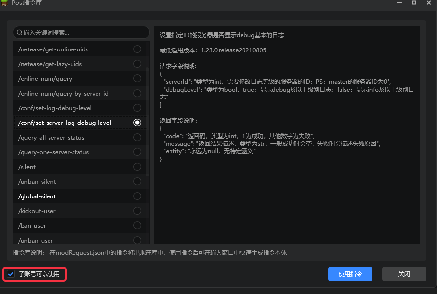

# 2022.4.12 版本1.0.5

## 工作台

### 模板更新

- 新增方块合并网格体模板
- 新增自定义盾牌模板，详情请见[自定义盾牌](../../20-玩法开发/15-自定义游戏内容/1-自定义物品/8-自定义盾牌.md)
- 更新蓝图简易射击模板，详情请见[更新（勘误）](../../20-玩法开发/12-可视化编程/30-新版示例教程（视频）/07-制作简易射击附加包（视频）/00.md)

### 新建服务器插件

- 工作台新建基岩版服务器的弹窗中，新增了一个空白插件，可以用来新建插件，详情请见[使用工作台新建插件](../../27-网络游戏/课程5：插件教学/第0节：使用工作台新建插件.md)
- 新建插件支持分开创建大厅服Mod和游戏服Mod
- 插件导入的界面同样得到了更新

### 子账号部署功能扩展

- 可以在开发者平台赋予子账号更高权限
- 如果子账号被赋予了开发及审核阶段的部署权限：那么子账号拥有除了删除之外的所有权限
- 如果子账号被赋予了上线阶段的调试权限：那么子账号拥有调试和查看日志的权限
- 详情请见[子账号部署和控制台调试功能](../../27-网络游戏/课程7：开发技巧/第4节：子账号部署和控制台调试功能.md)

### 运营指令权限管理

- 主账号可以在工作台中指定每个运营指令是否允许子账号操作
- 当复制服务器到审核阶段，上线阶段时，运营指令的设置也会被继承

### 其他更新

- 逻辑编辑器接入模组SDK 2.1的新接口，打开蓝图时自动恢复上次关闭时的位置和缩放
- 附加包类型的作品，关卡编辑器的舞台会显示预加载提示
- 蓝图零件变量支持双端同步
- 实体预设属性面板优化，属性增加鼠标悬浮提示，可以查看相关的api
- 其他问题修复，体验和性能优化

## 模组SDK

- 模组SDK2.1稳定版更新。如下图，可以在开发测试时使用2.1稳定版进行测试。
- 详情参考<a href="../../../mcdocs/1-ModAPI/更新信息/2.1.html" rel="noopenner">ModAPI更新信息</a>。

## 基岩版开服工具

- 详情参考<a href="../../../mcdocs/2-Apollo/0-Apollo更新信息.html" rel="noopenner">Apollo更新信息</a>。

