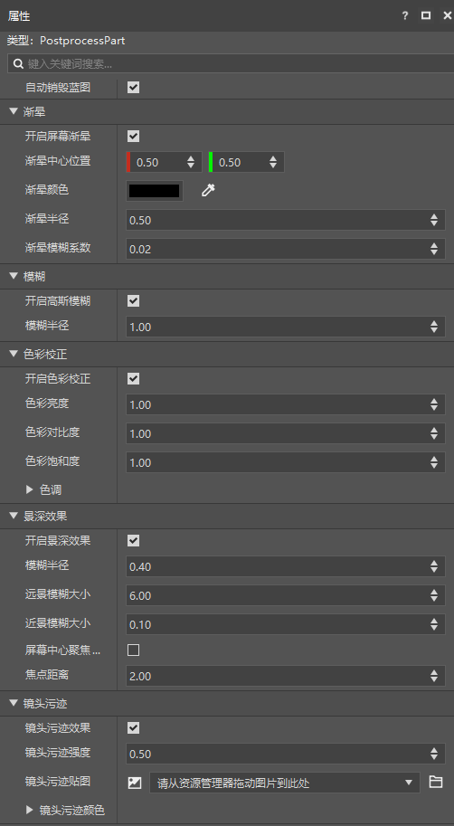
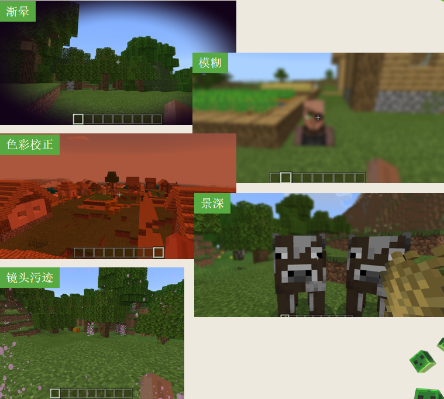
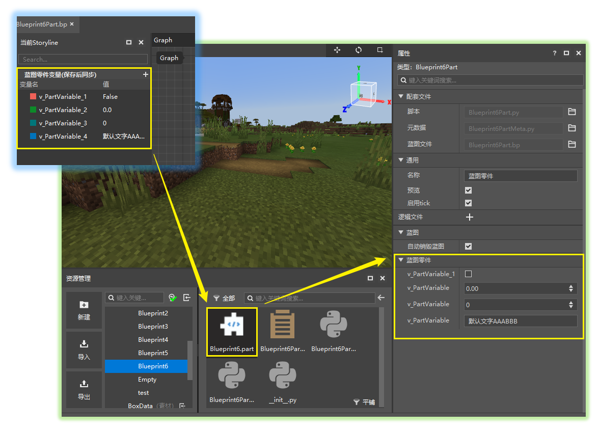

# 2022.3.29 版本1.0.4

## 工作台

### 新增后处理零件

- 用于快速设置并在游戏中使用渐晕、镜头污渍、模糊等后处理效果，详情请见[后处理零件](../../20-玩法开发/14-预设玩法编程/0-理解预设系统/11-内置零件/06-后处理零件.md)
- 后处理零件属性如图

- 各种后处理的效果如下

### 蓝图变量开放到零件的属性面板

- 逻辑编辑器中新增了【蓝图零件变量】元素类型，详情请见[蓝图零件变量](../../20-玩法开发/12-可视化编程/10-新版逻辑编辑器使用说明/40-事件、接口、变量.md#变量)
- 该类变量可以直接同步到.part文件的属性面板中，并支持在关闭蓝图文件的情况下直接通过属性面板修改蓝图零件变量的默认值
- 另外也支持自定义变量在蓝图零件属性面板中的显示名称和分组。

### 其他更新

- 启动器的创作页中增加了工具箱按钮
- 启动器推荐模板中增加了一些旧版的模板
- 大部分模板得到了更新，不再使用已废弃的接口
- 网络服分页适配Apollo PC服
- 逻辑编辑器Id相关的节点参数优化
- 编辑器添加更多《洞穴与山崖》版本的物品
- 其他问题修复，性能优化

## 模组SDK Beta

- 模组SDK2.1第二个beta包更新。如下图，可以在开发测试时使用Beta2.1进行测试。
- 详情参考<a href="../../../mcdocs/1-ModAPI/更新信息/2.1.html" rel="noopenner">ModAPI更新信息</a>。

## 基岩版开服工具

- 详情参考<a href="../../../mcdocs/2-Apollo/0-Apollo更新信息.html" rel="noopenner">Apollo更新信息</a>。

