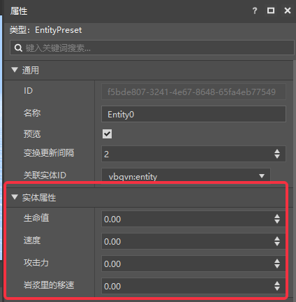
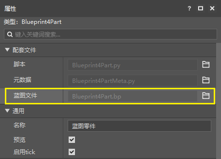
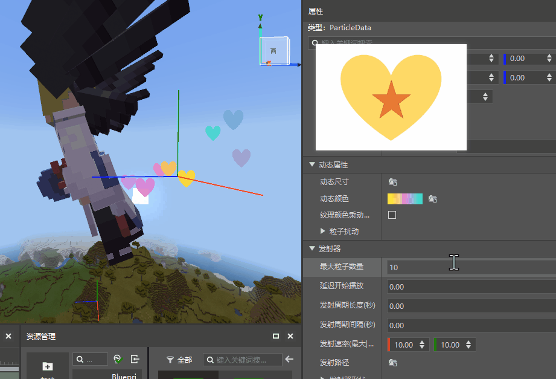
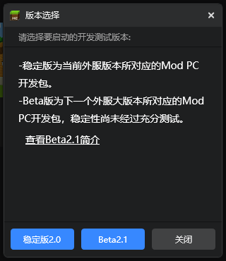

# 2022.3.15 版本1.0.3

## 工作台

### 新增文字面板预设

- 文字面板预设可以在编辑器内快速实现实体名称，地图文字标识牌的自定义，详情请见[文字面板预设](../../20-玩法开发/14-预设玩法编程/0-理解预设系统/10-预设/6-文字面板预设.md)

- 文字面板预设属性如图

  

- 文字面板游戏内效果如图

  

> 目前仅在开发测试中生效，正式服预计在2.2版本上线，请开发者合理安排开发节奏。

### 实体预设增加属性

- 增加了生命值、速度、攻击力、岩浆里的移速四个属性，详情请见[实体预设](../../20-玩法开发/14-预设玩法编程/0-理解预设系统/10-预设/1-实体预设.md)

  

> 目前仅在开发测试中生效，正式服预计在2.1版本上线，请开发者合理安排开发节奏。

### 零件属性面板增加蓝图零件

蓝图零件属性现在会展示对应的蓝图文件了，点击右侧打开按钮可直接打开该蓝图。

### 新蓝图节点类型：枚举节点

蓝图节点类型的新成员“[枚举节点](../../20-玩法开发/12-可视化编程/10-新版逻辑编辑器使用说明/72-常用节点.md#枚举节点)”，可以帮助你更快捷地传入需要的枚举值。

### 粒子动态颜色叠加

现在可以选择让粒子的动态颜色与粒子贴图原本的颜色叠加显示，而非直接覆盖

### 其他更新

- 文件夹中有多个bb模型时支持选择具体模型json文件导入
- 服务器modrequest.json支持不在插件目录的mod
- 启动器增加开发者B站和QQ群的图标，欢迎大家关注和加群
- 云端列表作品补充修改时间操作
- 其他体验优化

## 模组SDK Beta

- 本次更新包含模组SDK的2.1 beta包更新。如下图，可以在开发测试时使用Beta2.1进行测试。
- 详情参考<a href="../../../mcdocs/1-ModAPI/更新信息/2.1.html" rel="noopenner">ModAPI更新信息</a>。

## 基岩版开服工具

- 详情参考<a href="../../../mcdocs/2-Apollo/0-Apollo更新信息.html" rel="noopenner">Apollo更新信息</a>。

