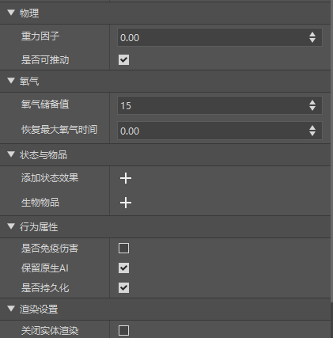
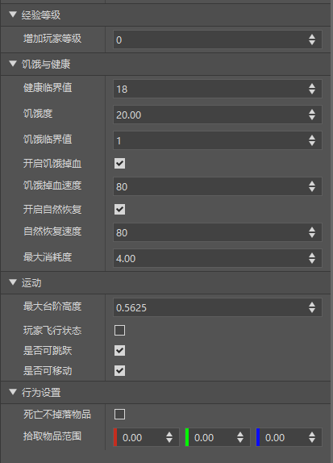
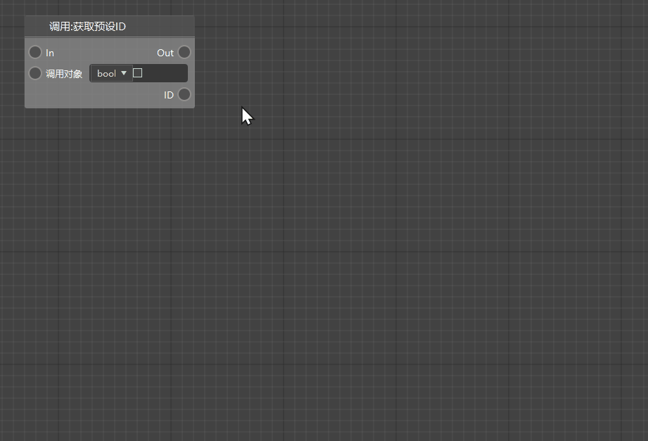

# 2022.3.1 版本1.0.2

### 预设支持更多属性
- 玩家预设和实体预设新增多种设置属性分栏，开发者可在属性面板快速进行属性的设置，详见 [实体预设](../../20-玩法开发/14-预设玩法编程/0-理解预设系统/10-预设/1-实体预设.md#设置属性)和[玩家预设](../../20-玩法开发/14-预设玩法编程/0-理解预设系统/10-预设/2-玩家预设.md#设置属性)
- 实体设置属性如图
- 玩家设置属性如图

> 目前仅在开发测试中生效，在中国版2.1版本正式生效

### 蓝图支持节点智能联想

- 自动检测节点的端口类型，将不可直接相连的节点隐藏，并且与搜索功能兼容，帮助开发者更快地寻找到所需的节点。
- 可在节点列表顶部的“开启联想”选框处选择是否开启节点联想功能。

### 其他编辑器更新

- 编辑器支持《洞穴与山崖》版本的方块
- 减少了部分蓝图节点冗余的参数输入框，并进一步降低了蓝图文件加载时的性能消耗，提升了加载速度。
- 其他体验优化，问题修复和性能提升

### Apollo
- 详情参考<a href="../../../mcdocs/2-Apollo/0-Apollo更新信息.html" rel="noopenner">Apollo更新信息</a>。

