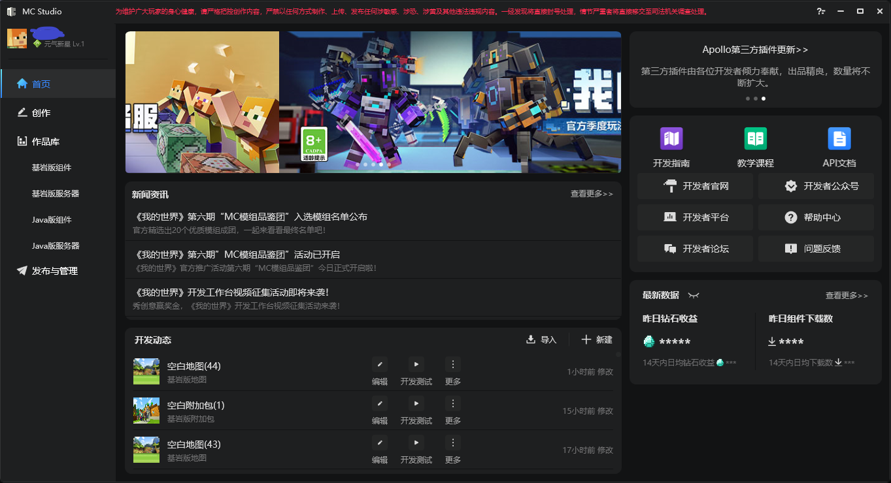
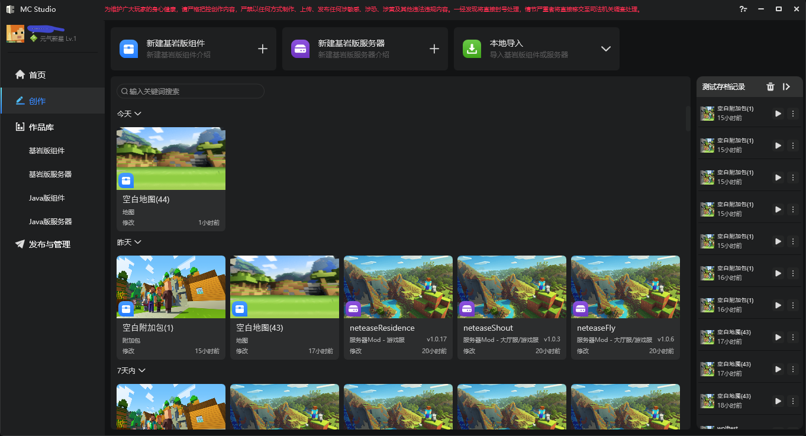
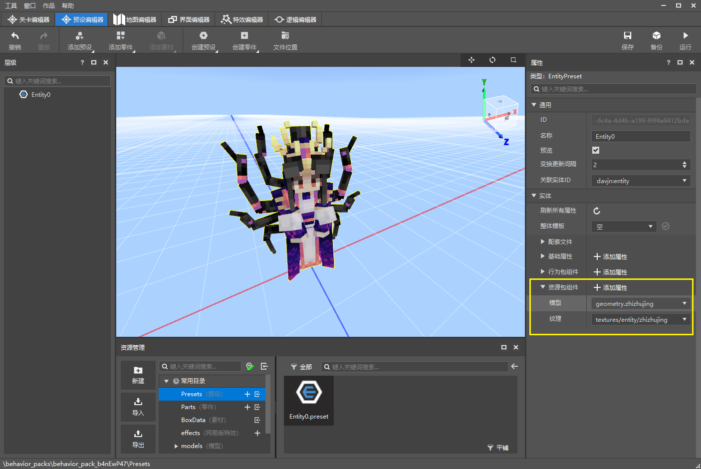

# 2022.1.20 版本1.0.0

预祝各位开发者新年快乐！！

### 启动器改版

- 整体视觉升级和交互优化
- 新增首页：为您提供与开发者息息相关的信息，如新闻资讯、更新信息、常用功能跳转入口、作品最新数据、近期开发动态等等，如图所示。

- 最近页升级为创作分页：集成了作品的新建、导入与导出、启动编辑、开发测试、跳转发布等模组创作相关的功能，另外还提供了作品的时间流，开发者可以在创作分页管理自己的工作流。

### 特效编辑器支持原版模型粒子优化

- 被选中的基岩版模型group、锚点可以在预览窗中高亮，方便开发者定位
- 微软粒子特效挂接到模型后不需要重启内嵌游戏，可直接播放
- 配置好的基岩版模型现在可以直接应用于实体预设

### 其他更新

- Apollo完成配置时加入更多检查
- Apollo开发阶段热更优化，服务器热更提示优化
- 从windows打开当前编辑的作品目录后，可以批量拖拽特效文件到骨骼进行挂接
- 测试Java模组时，不再可以选择java版本（统一使用java8）
- 其他易用性优化，性能优化和稳定性提高
