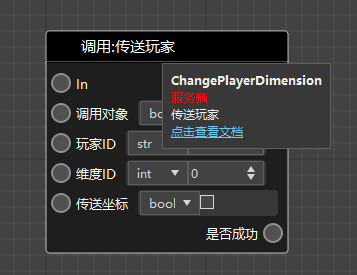
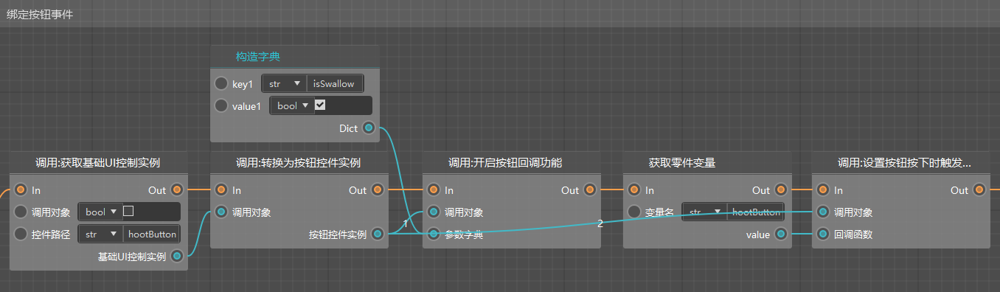

# 2022.1.6 版本0.17.7

此次更新只包含新版编辑器，旧版编辑器的更新需要等待之后的版本。

### 逻辑编辑器集中优化

- 默认布局优化
- 节点的鼠标悬停提示中增加了更详细的说明和跳转链接（见下图1）
- 删除了节点返回值的输入框，返回值补充了类型与翻译（见下图1）
- 补充了当前缺失的节点（例如UI控件的接口）（见下图2，在蓝图简易模板中）
- 屏蔽了大量不应该修改的参数
- 屏蔽了已经废弃的接口
- 更新了studio内置的蓝图模板
- 客户端、服务端同名同功能接口合并为一个节点

### 特效编辑器支持微软粒子

- 导入微软粒子：相关json及贴图导入工作目录
- 基岩版模型节点绑定微软粒子 ：包括新增，删除，撤销，复制，黏贴操作
- 播放基岩版模型动作的同时播放微软粒子
- （如果你的基岩版模型的动作全部由大写字母组成，将被自动转为小写）

### 其他更新

- Apollo网络服开放上线阶段热更，可将服务器热更到当前版本的下一个免审版本
- 序列帧特效的代码得到了重构
- 更新Java客户端，修复log4j2
- 其他易用性优化，性能优化和稳定性提高

