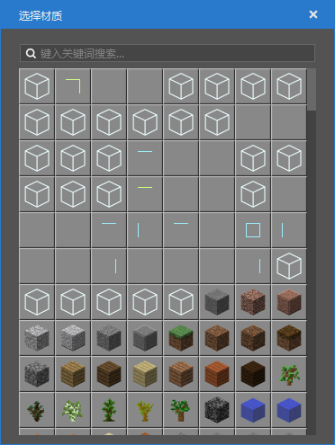

# 2021.12.23 版本0.17.5

此次更新只包含新版编辑器，旧版编辑器的更新需要等待之后的版本。

### 地图编辑器支持自定义方块

地图编辑器的选择材质和编辑功能增加了对自定义方块的支持，你的自定义方块会显示在材质列表的最前面。

### 特效编辑器支持基岩版模型

当前已支持导入基岩版模型，预览，动作列表显示和动作播放。

### 新建文件向导集中优化

- 新增模板预设分页
- 新增零件分页，包含零件和模板零件
- 界面预设和ScreenNode脚本总是相伴相成的，对于蓝图开发者更是这样，我们简化了通过界面预设使用界面的步骤，现在在新建界面预设的时候，可以选择同时创建并绑定ScreenNode脚本。

### 其他更新

- 可以通过资源管理器的右键菜单创建预设和零件的副本
- 预设保存优化
- 舞台会记录实例条目的展开折叠情况
- 实体预设性能优化，零件tick性能优化
- 其他性能优化和稳定性提高

