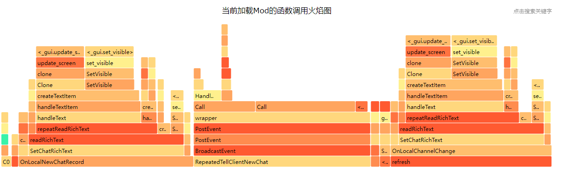
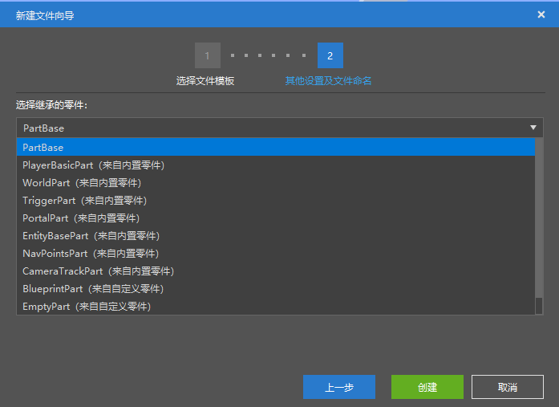
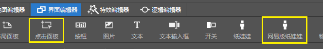
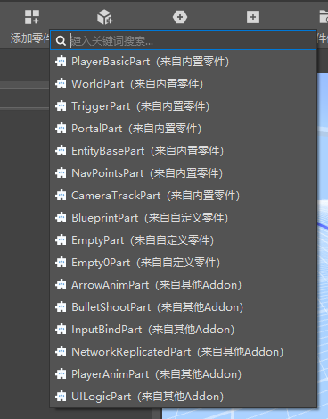

# 2021.12.9 版本0.17.4

### Apollo性能优化工具

我们为各位服务器开发者提供了脚本性能的监测工具，你可以选择要监测的服务器，并在监测一段时间后，获取到这段时间内的脚本函数调用的火焰图，并根据火焰图进行代码优化，详见[性能优化小贴士](../../27-网络游戏/课程8：性能优化/第6节：性能优化小贴士.md)。

### 创建零件时选择继承

创建零件时，可以选择继承内置零件，或者自定义的其他零件。

继承是面向对象的内容，使用继承后，除了零件代码得到继承后，零件的属性面板的信息也会被继承。

### 界面编辑器增加新控件

新增如下控件

- 点击面板，响应鼠标事件，比如制作可拖拽的面板
- 网易版纸娃娃

### 编辑器支持挂接其他AddOn的预设零件

如下图，在编辑作品时，勾上想要的附加包，然后你就可以在组装预设时使用来自其他AddOn的预设和零件。

其他的资源，例如图片，素材等，在编辑器中仍然不支持，但是在实际游戏中是生效的。

### 特效编辑器

- 重新加入了导出特效和显示骨骼的功能
- 增加了冻结史蒂夫姿势的选项
- 现在可以撤回对特效的修改，在模型挂接面板删除挂点/特效/骨骼也支持了

### 其他更新

- 选择素材时记录打开的目录
- Apollo脚本测试支持\n转义符
- 网络服Mod配置优化
- 逻辑编辑器屏蔽了不支持的零件事件节点（使用同功能的服务端/客户端事件替代）
- 导入资源包时，默认取消勾选同名文件
- 其他性能优化和稳定性提高

