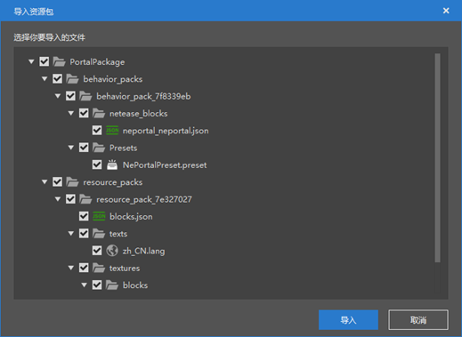
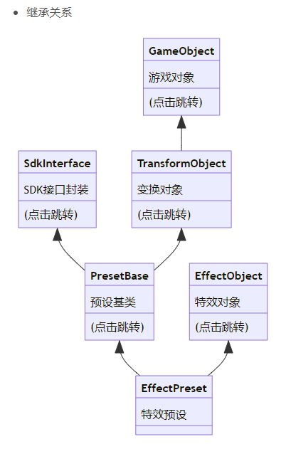
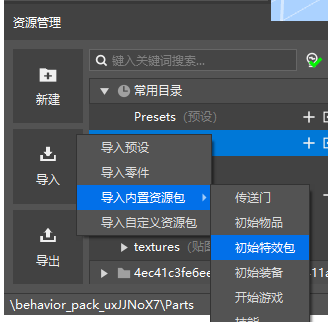
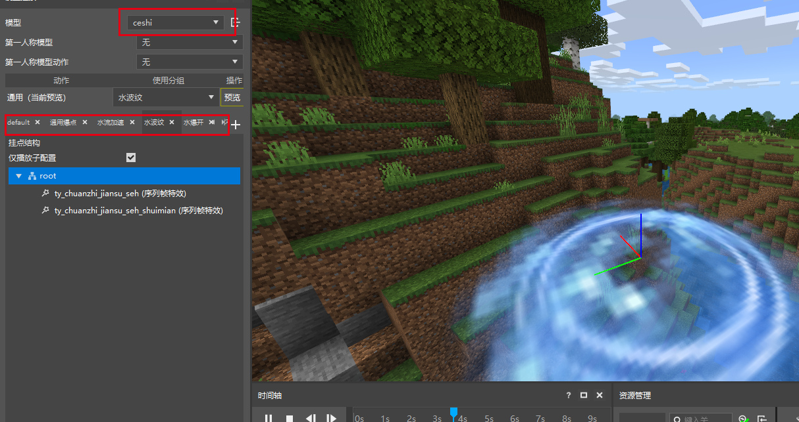
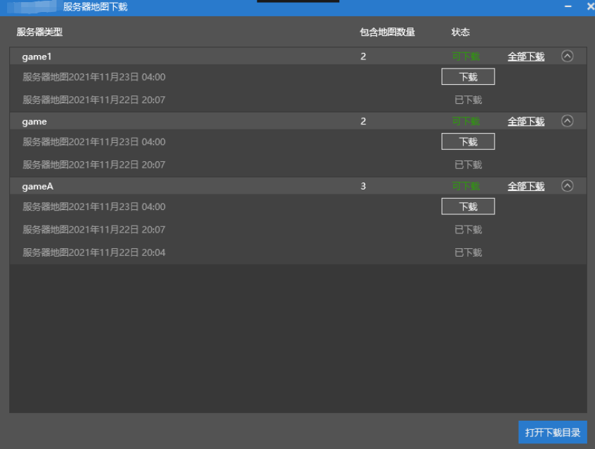

# 2021.11.25 版本0.17.3

### 资源包支持AddOn

资源包以前只支持地图，现在支持AddOn了，导入资源包的时候再也不用看类型了。

### 资源包导入时显示更多内容

导入资源包时，直接显示资源包里的内容，并且可以只勾选其中的部分内容。

### Preset API的继承关系使用图的形式表示

如下图，点击类可以跳转到他的api文档，例如<a href="../../../mcguide/20-玩法开发/14-预设玩法编程/13-PresetAPI/预设对象/通用/变换对象TransformObject.html" rel="noopenner"> 变换对象TransformObject </a>。

### 初始特效包

我们将官方制作的一些特效加入了新版编辑器的内置资源包中，你可以在下图的位置通过这种方式导入。

打开特效编辑器，切换模型为ceshi，他的不同分组里绑定了不同的特效。

### 网络服地图下载功能

新增Apollo服务器地图下载功能，可选择服务器——更多——下载服务器地图进行下载。
只有勾选了“是否保存地图”的游戏服，才能进行上述下载操作。

### 其他更新

- 已注册，但未认证的开发者也可以使用Studio了！（你仍然需要认证才可以使用更多功能）
- 网络服功能菜单优化
- 其他问题修复和性能优化
- 预设编辑器的层级菜单允许拖动对象改变位置了
- 预设编辑器的层级菜单里，不同种类的对象将被归类（素材，预设，零件），注意，预设的父子关系不会受影响
