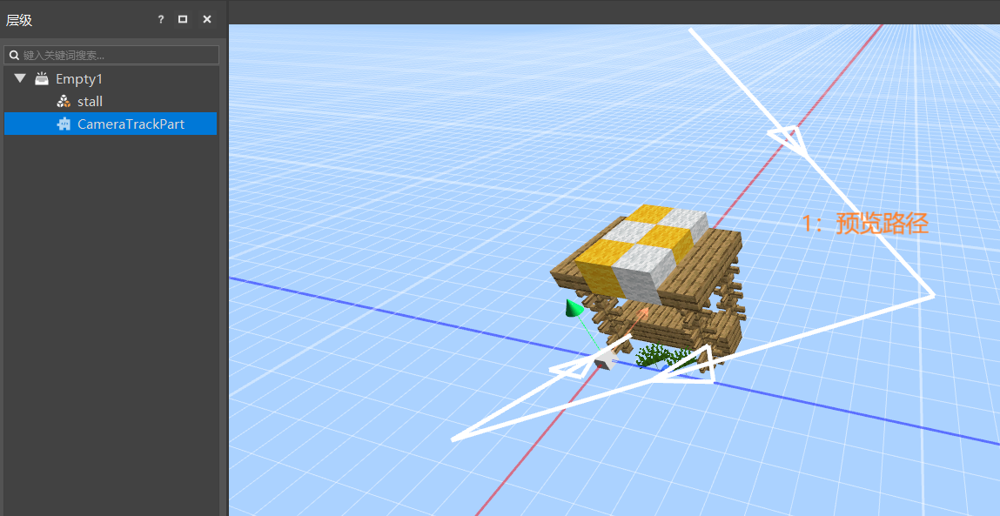

# 2021.11.11 版本0.17.2

### 逻辑编辑器重做

在长时间的等待之后，我们为大家带来了完全重做的逻辑编辑器。

新版的逻辑编辑器已经在新版编辑器中替代了现有的逻辑编辑器，你可以通过这个视频快速了解：[第一个蓝图模组（视频）](../../20-玩法开发/12-可视化编程/00-第一个蓝图Mod/00-教程视频.md)。

与原来的逻辑编辑器相比，新版的逻辑编辑器的主要变化如下：

- 图标的组织形式更新为节点式
- 使用方式从挂接ets文件到世界组件等变为使用蓝图零件
- 提供了模组SDK的所有接口，以及大幅扩展了对python原生接口的支持
- 支持编写客户端逻辑（特效，音效，模型，动画等）
- 独立的变量管理
- 更多的起始事件，完整的事件系统支持
- 支持编写UI蓝图

具体可以参考新版逻辑编辑器的系列文档：[逻辑编辑器重做概述](../../20-玩法开发/12-可视化编程/10-新版逻辑编辑器使用说明/01-什么是逻辑编辑器.md)。

目前，新版逻辑编辑器理论上已经支持了制作模组的绝大多数功能，欢迎大家尝试使用。

### 实体零件

新的内置零件，可以挂接在其他预设下，并用于刷怪等需求，详见[实体零件](../../20-玩法开发/14-预设玩法编程/0-理解预设系统/11-内置零件/04-实体零件.md)

### 相机轨迹零件

新的内置零件，可以用于编辑相机轨迹，并在游戏中控制相机实时播放，可以用于地图展示类的过场动画，详见[相机轨迹零件](../../20-玩法开发/14-预设玩法编程/0-理解预设系统/11-内置零件/03-相机轨迹CameraTrackPart.md)。

## 路径点零件

新的内置零件，用于可视化的编辑一系列路径点，详情可以参考[导航路径零件](../../20-玩法开发/14-预设玩法编程/0-理解预设系统/11-内置零件/05-导航路径零件.md)。

### 其他更新

- 编辑器的预览窗上方增加了视口工具栏
- 复制预设功能
- 精确调整开发包的分辨率
- 支持1.12.0原版模型格式
- 特效编辑器支持预览动画时调整速度
- 特效挂接支持复制分组
- 性能优化，体验优化和稳定性提高
