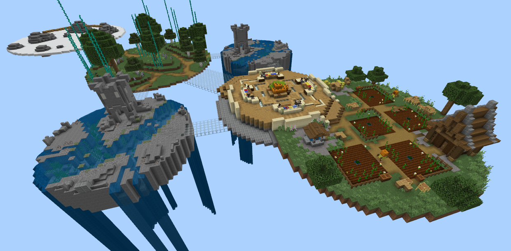
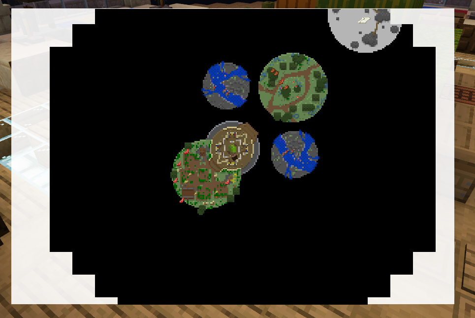
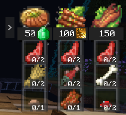
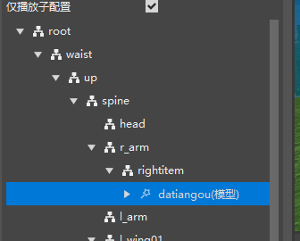
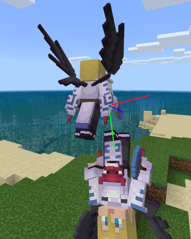
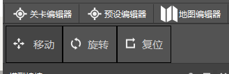

# 2021.10.14 版本0.17.1

### 新模板：厨神争霸

这是一个完整游戏的玩法地图模板，有一定体量，包含各种系统的综合应用，推荐学习完简易射击模板后再学习这个模板。目前推荐使用旧版编辑器打开这个模板进行学习和测试。

厨神争霸是一个比分制的做饭游戏。比赛的地图包含准备区域，中央厨房，和数个资源区域。
比赛开始后，玩家需要在资源区域击杀怪物收集资源，并且将资源带回到中央厨房合成美食获得分数。
美食的合成是通过自定义配方实现的，并且拥有常驻的UI提示。
厨神争霸还包含一些技能和道具。
资源区域会自动的按规则刷新怪物等资源，距离最远的资源区域的方块，如果玩家踩上去，会在几秒内消失。
此模板还包含一个常驻的小地图，可以实时显示各种玩家和各种生物的位置，小地图还具有展开功能。

厨神争霸使用了Mod SDK的小地图，可以合成美食的资源均可以在小地图中显示，点击小地图可以放大。

这里是菜谱，菜谱显示当前回合可以合成的食物。

注意：请不要将厨神争霸模板直接上架或者略微加工就上架到资源中心。

### 特效编辑器支持挂接骨骼模型

在骨骼模型的骨骼节点右键可以添加骨骼模型。

如下图，目前已支持挂接和编辑器内预览功能，根据挂接文件在游戏中实际挂接的接口会在之后放出。

### 挂点的移动和旋转拖柄优化

挂点的拖柄现在在特效编辑器的左上角统一调整，并且保证当前显示的拖柄始终为当前选中的挂点的。

### 其他更新

- 配置面板显示中文名称
- 零件热更优化
- 零件属性面板属性使用正则优化
- 配置的添加特性界面可以复选了，现在可以一次性添加多个特性
- 生物生成，自定义特征分布规则已加入配置
