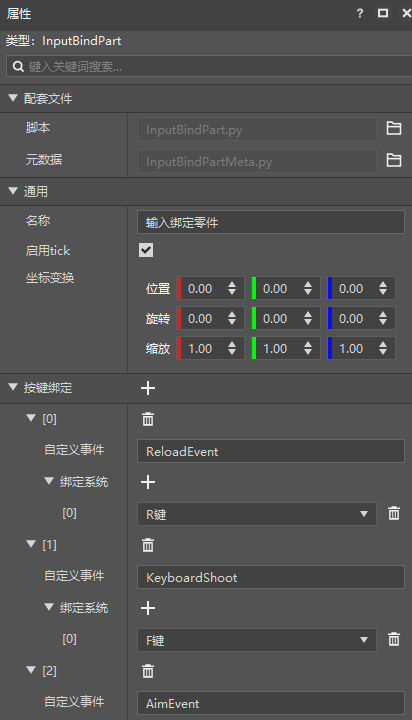
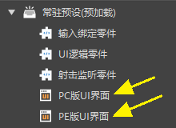

# 2021.9.24 版本0.17.0

### 手机端Mod适配电脑端优化（新版）

新版编辑器新增按键绑定零件，你可以通过这个零件将键盘的按键与自定义的事件绑定起来。

新版简易射击模板已更新，通过使用按键绑定组件进行了电脑端适配。如下图可以看到常驻预设下有两个UI预设，分别是PC和PE界面，根据不同的平台使用不同的预设，详细关于如何适配请移步[适配PC文档](../../20-玩法开发/19-手机电脑适配/1-PE模组适配PC.md)。

### 新版简易射击模板纯零件版

现在Studio中有3个版本的简易射击模板了，他们分别使用不同的代码架构，可以根据自己的需求查看不同的模板

- 旧版：纯Mod SDK架构
- 新版：抛射物部分使用实体预设，部分玩家相关逻辑使用玩家预设，其余使用Mod SDK架构
- 新版纯零件版：纯预设架构

### 其他更新

- 触发器零件新增获取当前区域所有实体的api
- Apollo热更优化
- 队伍组件转化为零件
- 使用新建文件向导新建ScreenNode时，可以选择放置在Mod或者零件目录中
- 一批新的预设API，详情参考<a href="../../../mcdocs/3-PresetAPI/更新信息/1.24.0.html" rel="noopenner"> 预设API更新信息 </a>
- 预设架构整体优化
- 性能优化和问题修复
