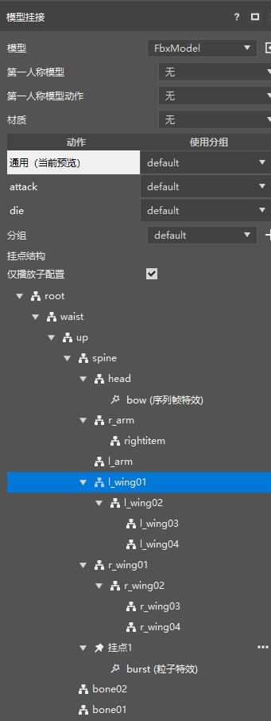
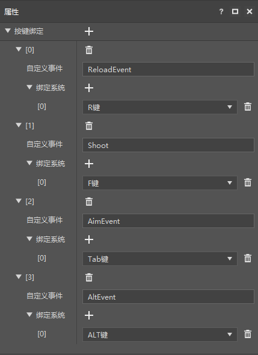
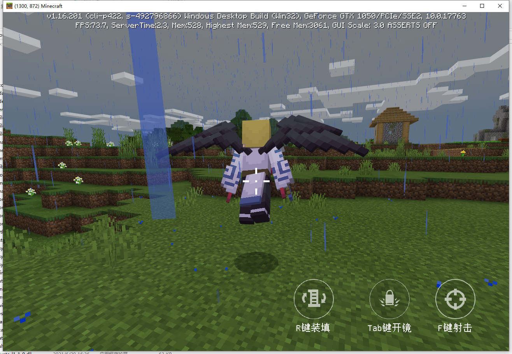

# 2021.9.9 版本0.16.19

### 特效挂接重做

特效挂接现在可以常驻显示所有的动作和骨骼结构。

特效现在可以直接挂在骨骼下了（你仍然可以继续在骨骼上右键创建挂点，并将特效挂在挂点下）。

新版编辑器和旧版编辑器都获得了此次更新。

### 预加载预设优化

勾上预加载的预设，和玩家预设现在将自动显示在舞台上。

并且舞台上的预加载预设的实例，和玩家预设的实例不再显示坐标变换属性和变换拖柄。

你可以使用预加载预设来制作Add On，相关的文档[在这里](../../20-玩法开发/14-预设玩法编程/9-第一个预设Mod/7-使用预设制作AddOn.md)。

### 手机端Mod适配电脑端优化

旧版编辑器新增按键绑定组件，你可以通过这个组件将键盘的按键与自定义的事件绑定起来。

简易射击模板已更新，通过使用按键绑定组件进行了电脑端适配，效果如下图。

关于如何适配请移步[适配PC文档](../../20-玩法开发/19-手机电脑适配/1-PE模组适配PC.md)。新版编辑器的适配将在后续更新。

将Mod从手机端适配到电脑端的成本并不高，但是可以增加开发者的收入，欢迎大家积极适配并将自己的手机端组件同步上架到电脑端。

### 其他更新

- 可以在关卡编辑器中开关特效预设描边了
- 预设API文档优化
- 导入资源包时，自动对玩家预设和绑定同一实体的实体预设进行合并
- 新建零件时加入一些注释
- 现在支持导入不带动画的FBX模型文件了
- 其他问题修复和稳定性优化
