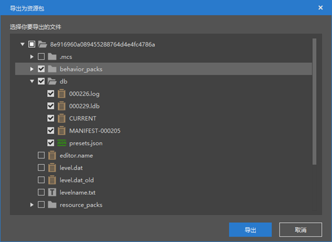
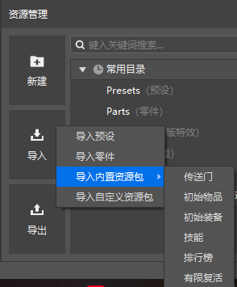
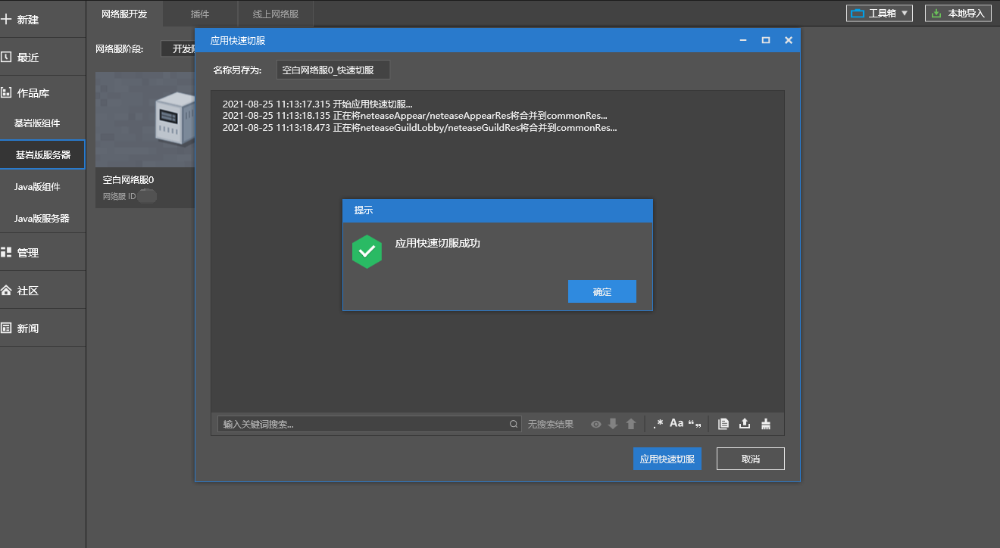
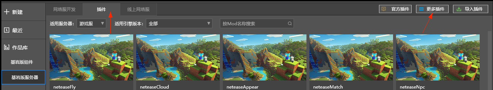
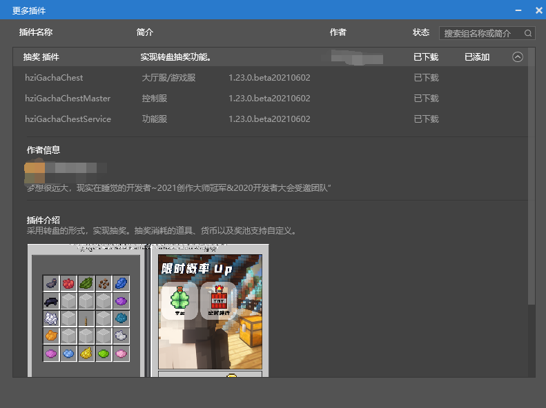

# 2021.8.26 版本0.16.16

### 导入、导出资源包

我们在上个版本中增加了内置资源包这一结构，在这个版本中，你可以导出/导入自己的资源包了。详情请参考[资源包](../../15-资源管理/10-资源包.md)文档。



### 玩家相关零件回归

旧版关卡编辑器的玩家相关组件已通过零件的方式回归，你可以通过资源管理器的导入内置资源包的功能添加他们。

回归的模块如下：

- 初始物品
- 初始装备
- 技能
- 排行榜
- 有限复活



### 零件代码优化

零件语法现在只需要支持python2，例如下面这些写法都不会再产生错误了

```python
for i in xrange(1, 5):
   print(i)
   print i
   print 1 <> 2
   print `1+2`
```

大部分情况下可以在零件的文件头部import了，import不再限于函数内

```python
from Preset.Model.PartBase import PartBase
import random
from Preset.Model.GameObject import registerGenericClass
from Config import A, B	#Config.py为同目录下的文件，A、B是Config.py里的函数/类
from mod import client
from mod.client import extraClientApi
from mod.server import extraServerApi
```

### Apollo快速切服

对于需要频繁切服的游戏类型（例如小游戏），我们提供了快速切服的功能，详情请参考[快速切服](../../27-网络游戏/课程8：性能优化/第3节：快速切服.md)文档。



### Apollo第三方插件

新增“更多插件”分页，可查看并下载官方收集的第三方插件。





### 其他更新

- 优化Unicode编码问题
- 新建零件优化
- 零件语法错误提示优化
- 一批新的预设API，详情参考<a href="../../20-玩法开发/14-预设玩法编程/13-PresetAPI/更新信息/1.23.3.html" rel="noopenner"> 预设API更新信息 </a>
- 问题修复和稳定性优化
