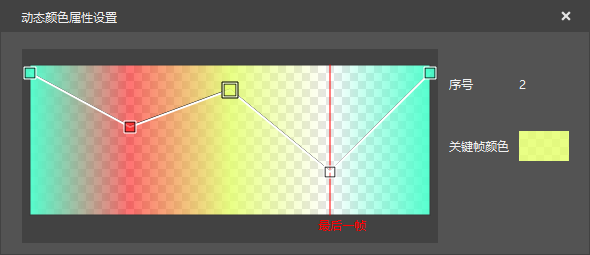
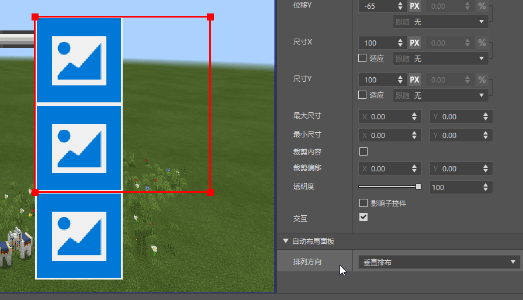
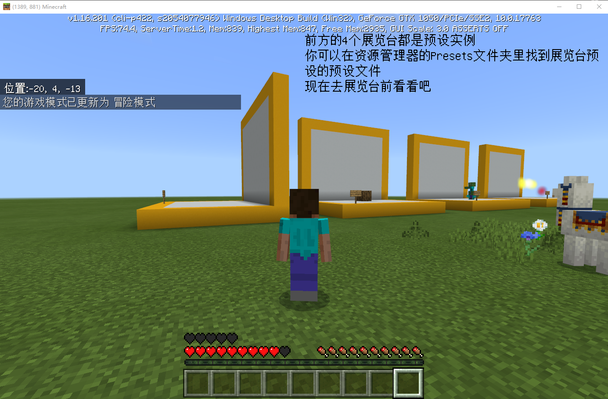
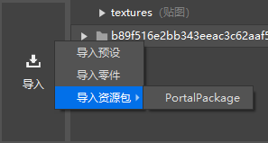
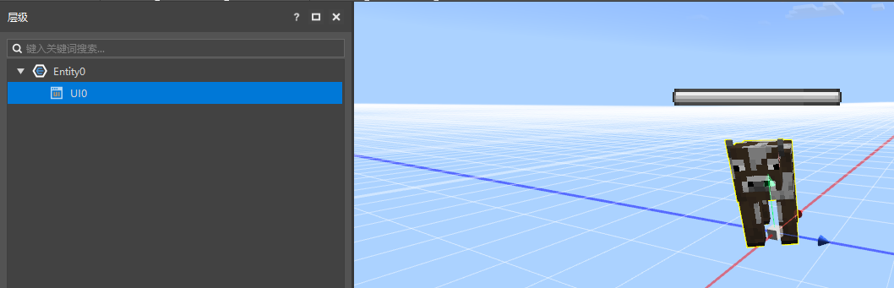
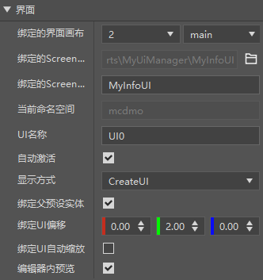
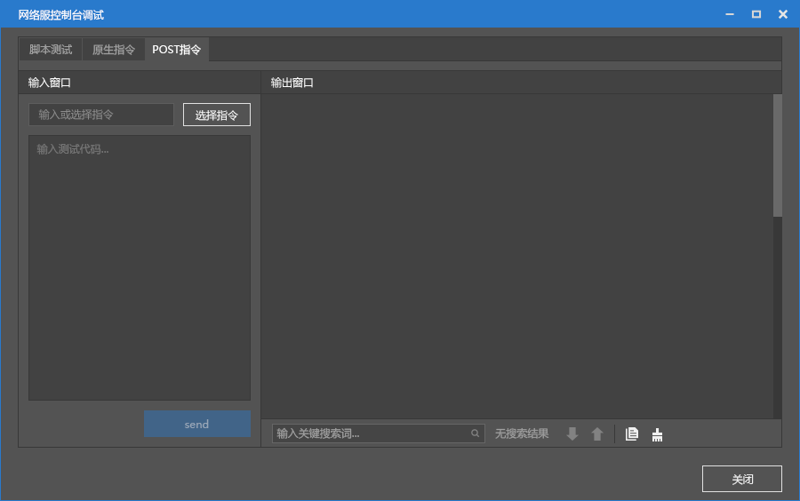

# 2021.8.12 版本0.16.15

### 序列帧支持动态颜色

序列帧特效现在支持调节每一帧的颜色了。

### 布局面板

界面编辑器新增布局面板控件。

挂在这个面板控件下的控件可以自动排列，并且有水平和垂直两种排列方式可以选择。

### 开发包支持素材的旋转，缩放

现在在mod pc包可以正常的预览经过旋转和缩放的素材了。

方块预设可以旋转，但是无法缩放。

注意：想要在移动端上生效仍需等到我的世界中国版1.24版本

### 传送门预设

使用新版编辑器的资源管理器导入资源包功能来导入传送门预设。

导入的资源包括NePortalPreset（预设），和neportal:neportal（方块配置）。

此功能与旧版编辑器-关卡编辑器的传送门组件功能相同。

### 界面预设

预设架构新增了一种新的预设，界面预设。

你可以创建UI预设并将其放置在场景中，或者挂在现有的预设下。

如下图，在实体预设（牛）下面挂了一个进度条UI。

界面预设提供了一系列的参数。详细介绍请参考[界面预设](../../20-玩法开发/14-预设玩法编程/0-理解预设系统/10-预设/5-界面预设.md)的文档。

界面预设在编辑器和Mod PC开发包可用，需要等到我的世界中国版1.24版本才可以在移动端使用。

### Apollo调试工具优化

升级Apollo控制台调试功能，优化脚本测试、原生指令、POST指令的输入以及输出显示方式。

### 其他更新

- 预设API文档优化
- 交易表配置优化
- 一些新的<a href="../../20-玩法开发/14-预设玩法编程/13-PresetAPI/更新信息/1.23.2.html" rel="noopenner"> 预设API </a>
- 预设API（1.23.1和1.23.2）加入补全库
- 问题修复和稳定性优化
