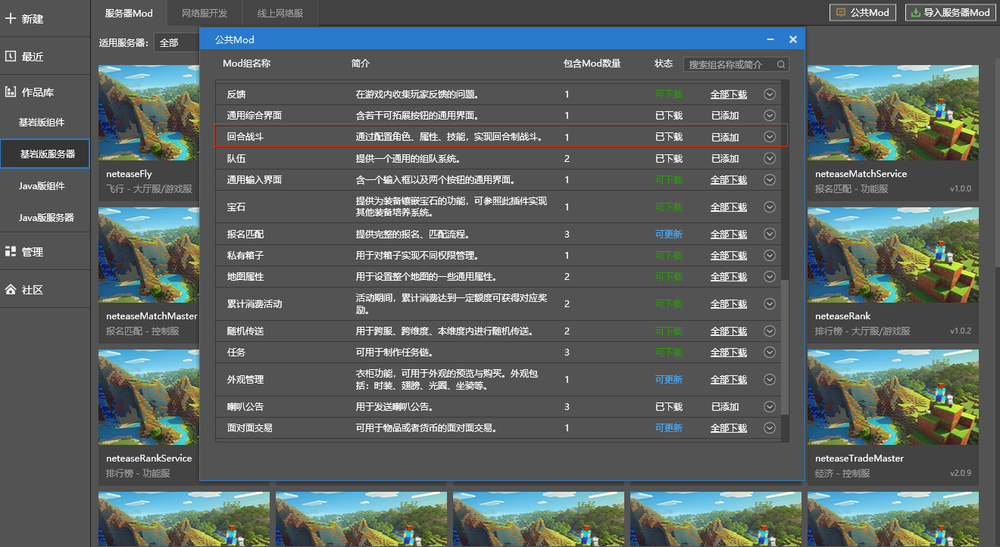

---
front:
hard: 入门
time: 分钟
---

# 1.23版本

## 简介

视频包含了1.22以及1.23版本的重大功能，介绍了全新的维度模板：下界、末地、超平坦世界、超平坦下界如何创建；展示了虚拟场景的游戏效果；展示微缩方块效果及其创建方式；展示骨骼模型的动作融合以及半透明材质效果。

<iframe src="https://cc.163.com/act/m/daily/iframeplayer/?id=60ed3d3048e27490891c6702" height="600" width="800" allow="fullscreen" />

## 视频对应demo

下载地址或出处如下：

### 1、自定义维度模板

​		[下载地址](https://g79.gdl.netease.com/9d3b837a96af41958526f8e1ce373eae.zip)

### 2、虚拟场景

​		详见“基岩版服务器——服务器Mod——公共Mod——回合战斗”		

### 3、微缩方块

​		[下载地址](https://g79.gdl.netease.com/micro_block_zhanshi.zip)

### 4、骨骼模型支持动作融合、半透明材质

​		[下载地址](https://g79.gdl.netease.com/AnimRemixMod.zip)