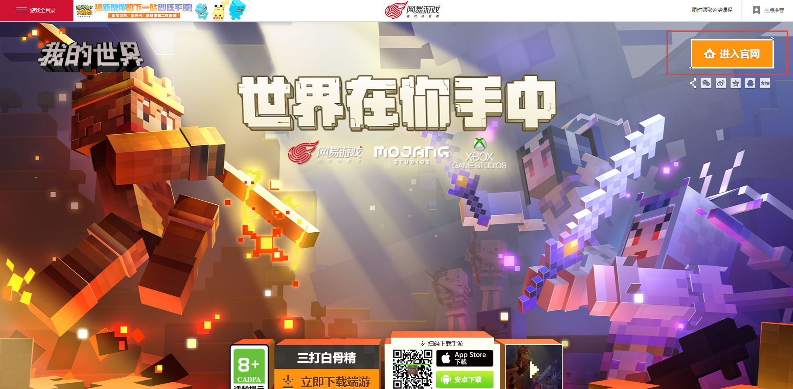
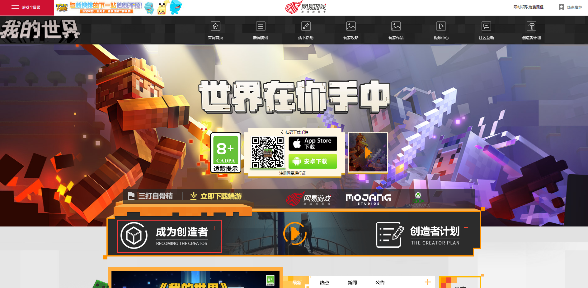
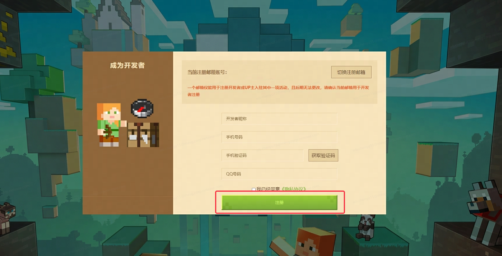
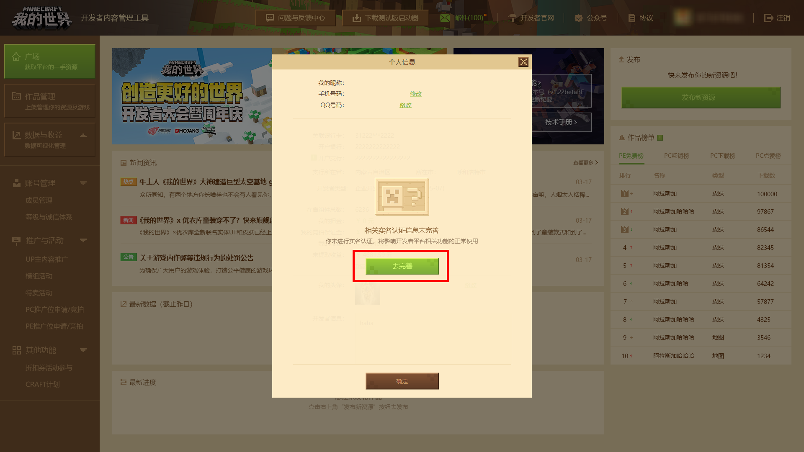
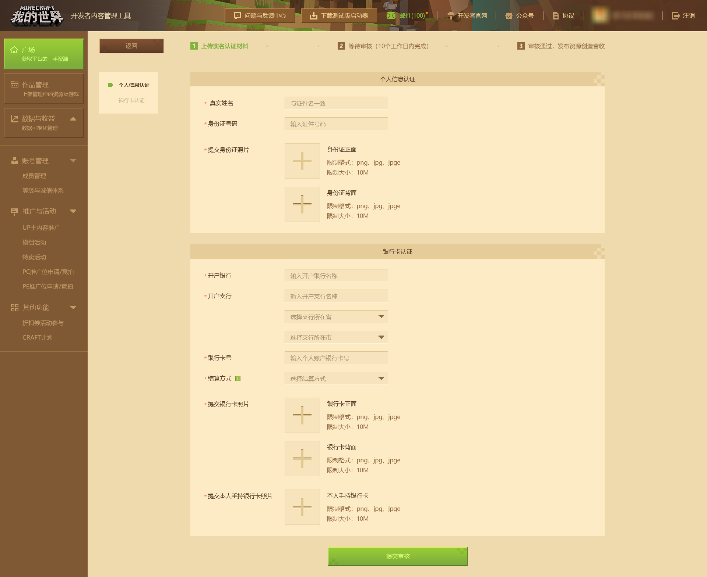
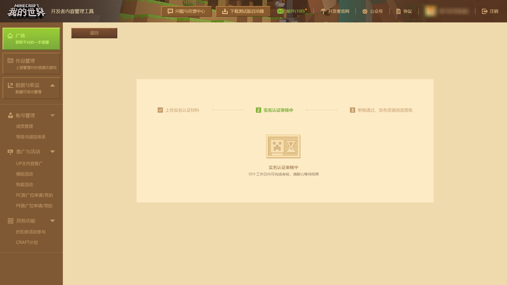

# 如何注册开发者

首先，在 **官网** 中找到注册页面（[或点击此处直接进入网址](https://mcdev.webapp.163.com/#/login) ）

1 - 在搜索引擎中，搜索“我的世界”找到[官网](http://mc.163.com/)，点击右上角 **【进入官网】** 按钮

2 - 在[新的网页](http://mc.163.com/index.html )中，点击 **【成为创造者】** 按钮，前往开发者平台注册页面

3 - 跳转至新的页面，根据提示填入信息，并勾选同意《隐私协议》，点击 **【注册】** 按钮（注意：开发者昵称注册后不可修改）。

4 - 成功入驻后，需要进行实名认证，填写真实姓名、身份证、银行卡等信息，点击 **【去完善】** 跳转至实名认证界面。

如实完成以上信息的正确填写并提交后，随后等待 **实名认证审核** 即可，通过后就可以发布作品啦！

## 开发者注册常见问题答疑

### 账号审核时间

开发者账号审核通过一般在 **7 天工作日。**

开发者账号催审请通过发送邮件至 **minecraftstarter@163.com** 与官方取得联系。

邮件标题为：【开发者信息审核催审】+ 开发者昵称 + 开发者账号

邮件内容为：

> 开发者账号：xxxx@xxx.com
>
> 开发者昵称：xxx
>
> 真实姓名：xxx
>
> 手机号：xxx
>
> 联系QQ：xxx
>
> 身份证号：xxx
>
> 提交时间：xxx

### 选择符合自身实际情况的结算方式

在注册开发者时，需要选择 **结算方式** （指通过《我的世界》中国版投稿付费钻石组件后获得的收益结算），开发者应当选择 **符合自身实际情况** 的结算方式，共两种：

1. 代扣代缴：由我司代为扣缴，请注意此选项仅针对非公司性质的个人开发者
2. 自备税票：自行开票或者请税局代为开票

建议个人开发者或小规模团队选择“代扣代缴”的结算方式，公司类型的开发者及个体工商户选择“自备税票”的结算方式。

### 如何更换开发者平台的结算信息（如换绑银行卡、改结算方式等）

**个人身份开发者：**

1. 点击开发者平台右上角的头像，点击“修改结算信息”提交新的银行信息或结算方式。
2. 提交内容前，请确保申请的信息与账号实名信息相符。更改结算信息后，还需等待审核通过方能生效。
3. 变更成功后90天内将不可再次发起银行卡及结算类型信息修改申请。无论通过与否，平台都会通过开发者平台邮件和短信告知审核结果。

**企业身份开发者** ：

1. 非特殊情况不支持更改，若有特殊情况请联系《我的世界》开发者频道管理staff。

### 若在规定期限内结算收益，但在打款时未拿到款项

在通常情况下，在结算收益后会在30个工作日左右收到款项。如果超出正常结算周期仍然没收到款 项，请检查您的资料信息是否有误。

1. 若出现银行卡信息错误导致收益无法收到的，官方会为账号打开 **“更新结算信息”** 入口，请尽快点击开发者平台右上方头像，在个人信息窗口找到 **"更换结算信息"** 入口，上传正确的结算资料等待审核。打款失败的款目会在审核通过后的下一周到账。如无及时更改将会影响后续的正常结算的流程，敬请了解。
2. 若出现过去可以正常收款，但在之后出现超出结算周期未收到款项。可以在  **【开发者平台】**  -  **【开发者常见问题答疑】**  -  **【反馈其他问题】**  与我们取得联系，填写表单时，请记得写好 **联系方式** 。在通常情况下，官方人员会通过留下的联系方式与您取得联系。
3. 若结算开放后超过5天才点击结算，结算信息将会顺延至下个月打款。

### 想要注销开发者/UP主，请问要怎么做呢？

进入开发者平台后，点击右上角的个人昵称呼出 **个人信息窗口** ，点击 **申请注销账号** 按钮，并等待审核通过即可。注销申请提出后不可撤回， **且同个身份证、银行卡信息和手机号只允许注册一个开发者或一个UP主账号。当开发者或UP主账号被注册或注销时，所使用过的个人信息将不再支持作为第二次注册开发者/UP主账号时的凭证资料，请慎重操作。**

**温馨提示：由于平台系统功能优化，从2023年5月16日起，平台已对up主带货系统进行逐步关停处理，因此原平台不再开放up主身份进行注册。**