# 认识开发者平台

***最后一次更新于：2022/10/8，更换部分功能图片以适配新页面，新增多个新模块功能的介绍。***

在注册开发者成功以后，使用开发者账号即可登录到开发者平台。广场、作品管理、收益等功能都在这里，活用开发者平台是成为开发者的第一步。

在本教程中，您将学习以下内容：

- 了解 **[开发者平台首页及工具栏](#开发者平台首页及工具栏)。**
- 熟悉 **[作品管理模块](#作品管理模块)。**
- 接触 **[推广与活动](#推广与活动)。**

## 开发者平台首页及工具栏

### 我的世界开发者协议

在开发者平台的上方右侧位置，点击 **【协议】** 按钮，即可查看开发者协议内容。

《我的世界》中国版推出的《开发者协议》，旨在为开发者创造良性发展的市场环境。帮助开发者展现创意、获取收益。一同打造一个优质、公平、健康、高效的内容创作平台。

### 广场模块

打开开发者平台默认显示的就是广场模块，在广场中，你可以看到很多有用的内容。从左至右分别为：

- 技术支持：开发相关的知识和技巧都可以在这里找到。
- 新闻资讯：第一时间了解官方最新的活动及新闻资讯。
- 最新数据：以最直观、简洁的方式看到账号下的作品收益。
- 发布：快速跳转作品管理页并发布作品。
- 作品榜单：了解时下最受目标欢迎的玩法题材。

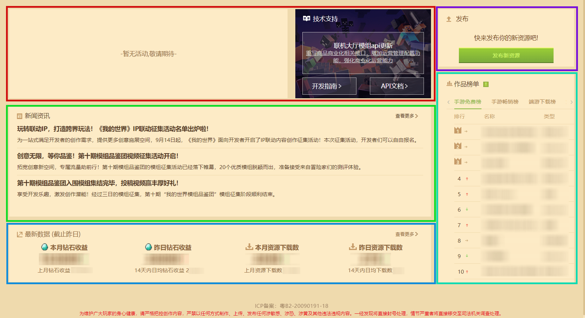

### 问题与反馈中心

在开发者平台上方中间位置，点击 **【问题与反馈中心】** 按钮，即可查看。

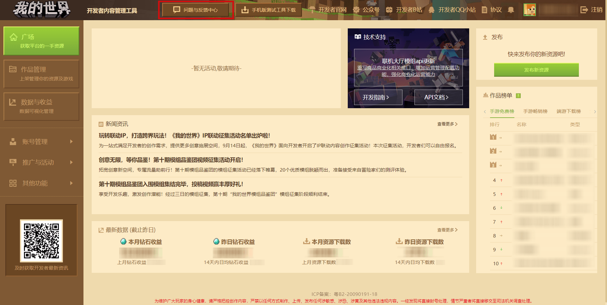

这里有很多常见的问题，如：什么是开发者等级？、组件审核需要多久时间？等。选择相关的问题就可以看到官方给出的解答！

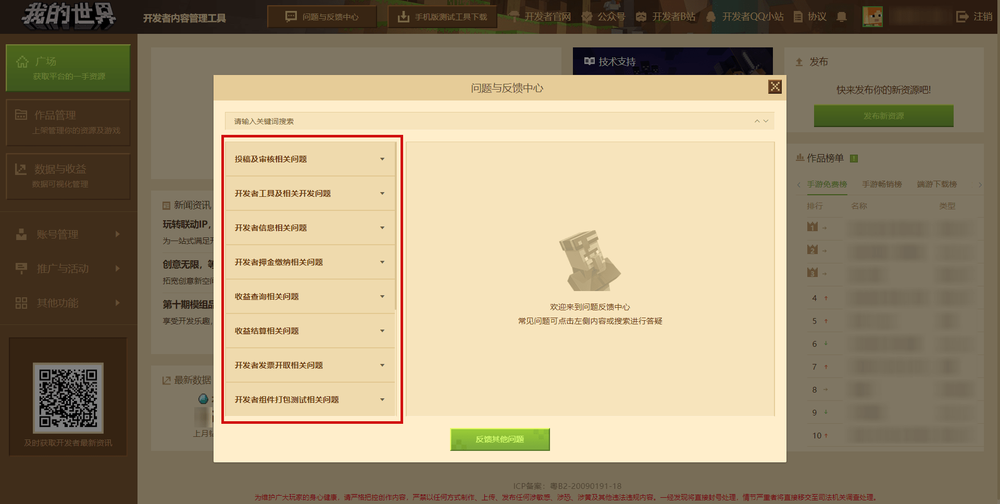

### 测试版启动器

为了方便开发者们测试自己的手机版组件，可以使用手机版测试工具，供大家在测试环境查看组件表现。

在开发者平台的上方中间位置，找到 **【手机版测试工具下载】** 按钮，点击后会弹出手机版测试工具的下载二维码及按钮，根据自身手机的情况选择不同的二维码下载即可。

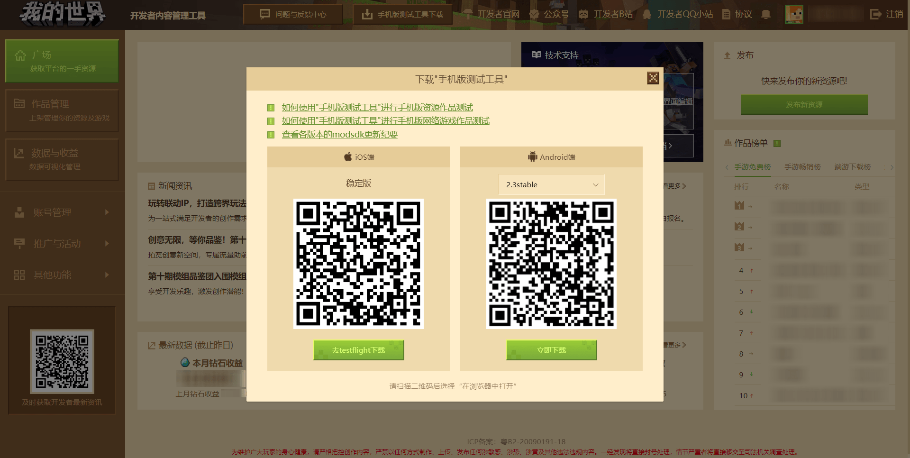

### 开发者平台邮件

官方会通过平台站内邮件的方式提供最新资讯，如：新的开发者平台、游戏客户端内、模组开发工具包、我的世界开发者工具台更新等信息，以及各类扶持计划或开发者活动。

点击上方工具栏中的 **【邮件】** 按钮，即可打开邮箱，查看收到的邮件。通常会使用开发者平台的邮件通知开发者，记得时常查看邮件并定期清理已读邮件哦。

### 查看、认证与修改开发者信息

点击右上角的头像和开发者昵称可以打开个人信息，在这里可以查看开发者账号的相关信息：真实姓名、开户银行、头像等。 **开发者平台账号和密码等信息请勿轻易透露。**

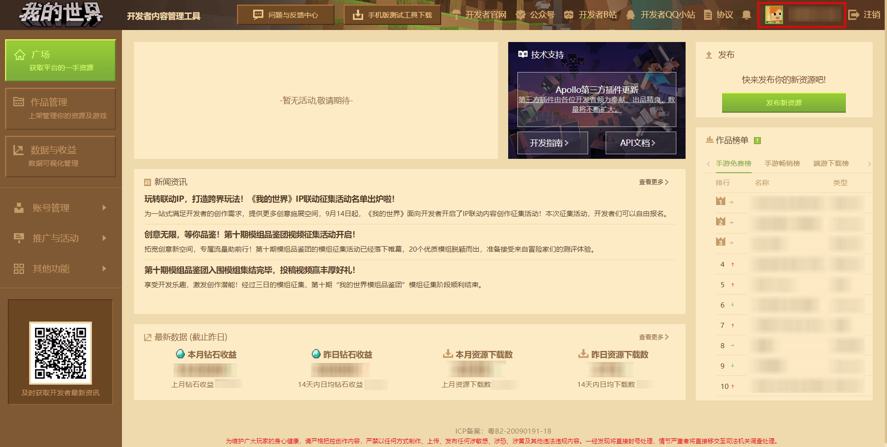

你可以在这里添加联系方式（手机、QQ号码），申请企业开发者认证、注销账号、修改头像、添加开发者信息，或是更改符合规范的结算信息等。

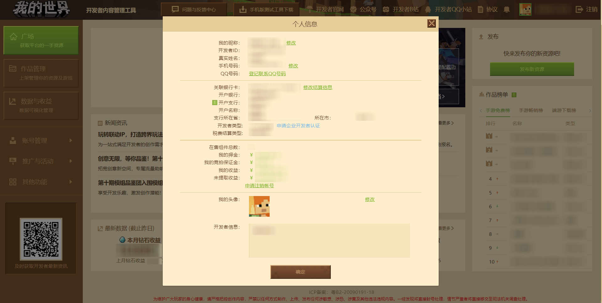

### 加入开发者QQ小站讨论频道

在开发者平台右上角有 **开发者QQ小站** 申请入口，点击进入扫码即可申请，请在申请信息内填写自己的开发者邮箱和开发者昵称。频道汇聚了五湖四海的开发者，可以学习开发知识、参与频道或官方活动、向官方提出反馈意见等。

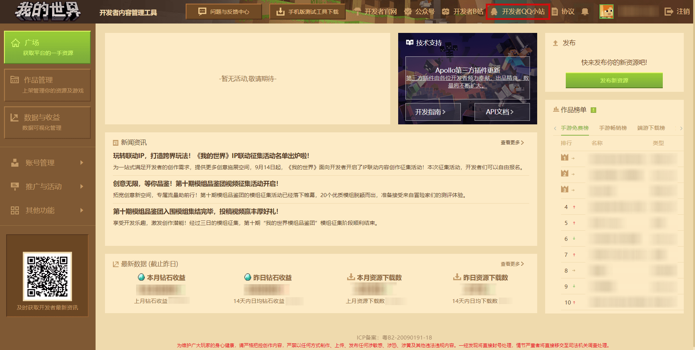

### 关注我的世界公众号获取最新资讯

在开发者平台左下角有 **我的世界Minecraft开发者** 公众号二维码，扫码即可关注，第一时间获取开发圈最新资讯以及开发技巧！

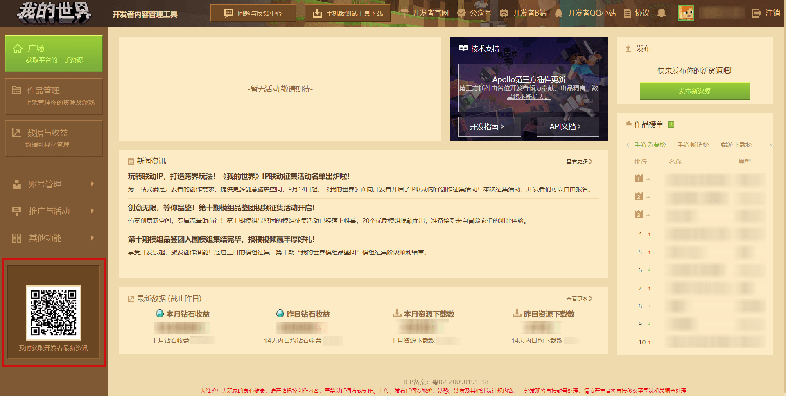

### 订阅开发者B站号观看开发教程视频

在开发者平台右上角有 **开发者B站号** 跳转入口，点击即可进入，第一时间收看开发圈最新的教程视频。

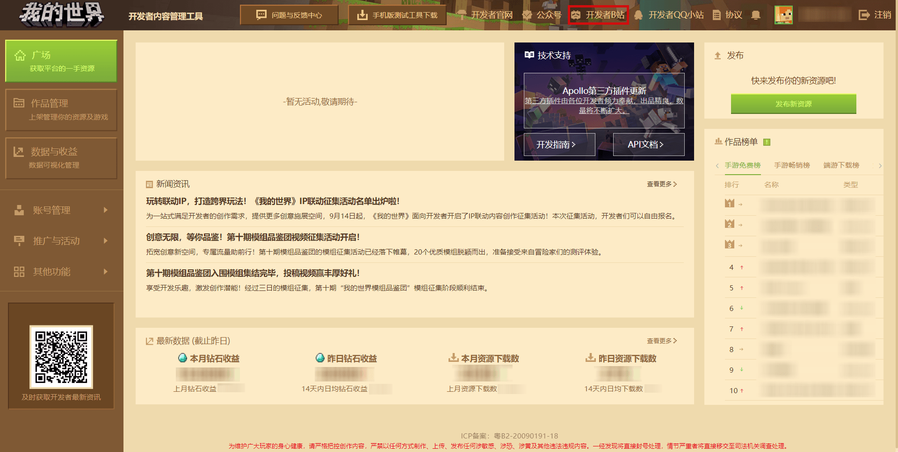

## 开发者平台主要功能

开发者平台有很多关键性功能，其中包括发布作品、收益查看、推广等，下面将简单介绍一些主要的功能，后面的章节会展开并详细介绍。

## [作品管理模块](../35-上架与入驻/课程04-认识作品管理模块.html)

点击开发者平台左侧的 **【作品管理】** 按钮，作品发布、更新等都将在这里操作。

### [上传资源](../35-上架与入驻/课程05-正确上传作品的方式及途径.html)

在作品管理中，可以发布手机版或电脑版的新资源，在左上角选择版本然后点击右侧的 **【发布新资源】** 按钮。

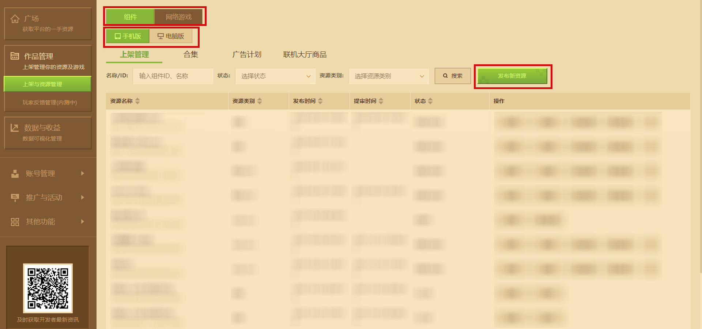

不同版本也有不同类型，如组件、网络游戏和联机大厅商品，要注意区分。

### 玩家反馈管理

使用 **玩家反馈管理功能** ，可以处理玩家在游戏客户端内对自己基岩版作品的反馈。功能提供多种搜素条件，并支持将反馈记录导出成表格至本地。点击回复即可回复玩家反馈，反馈得到再次回复时，将会与原先反馈内容一起组成邮件发至开发者邮箱。

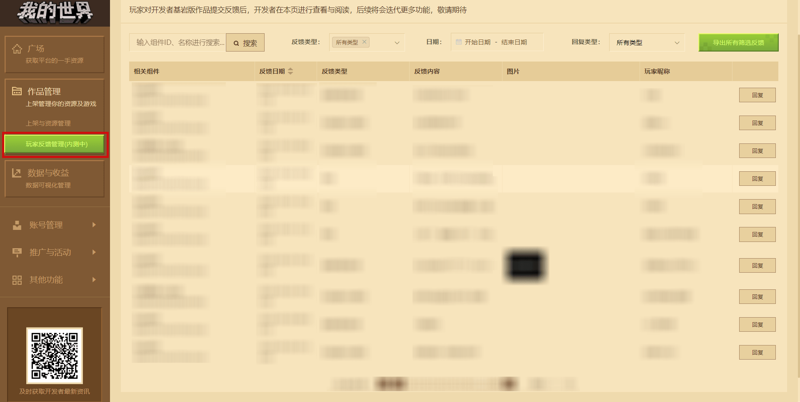

### [数据分析](../40-活动、推广与收益/课程06-使用数据分析统计资源消费者行为.html)

在开发者平台左侧的数据与收益中点击 **【数据分析】** 按钮打开，数据分析页面有很多功能和实时数据提供给开发者，使开发者灵活统计资源消费者的行为。

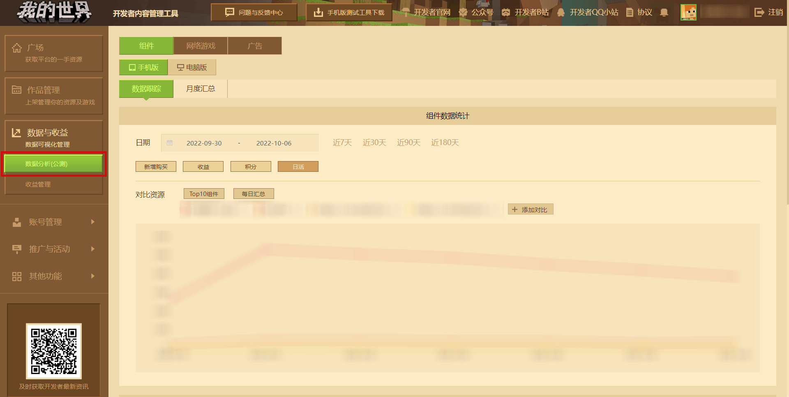

### [收益查看和结算](../40-活动、推广与收益/课程07-收益查看及结算.html)

与数据分析类似，在开发者平台左侧的数据与收益中点击 **【收益查看】** ，页面上方可以修改不同的收益类型，在最右侧可以查看某个资源组件的收益。

收益结算则有每个月的钻石收益，可以在这里结算收益。

### [成员管理模块](../32-开发者账号与团队/课程15-使用成员管理模块实现多账号协作.html)

在 **【账号管理】** 下点击成员管理，可以在这里添加开发者账号的成员，并且调整账号的权限与发起实名认证，协同开发网络游戏、使用手机端测试资源功能等。

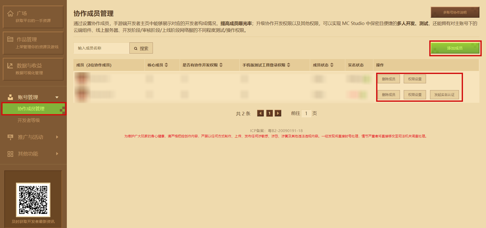

### [开发者等级](../32-开发者账号与团队/课程14-开发者等级.html)

在 **【账号管理】** 下点击开发者等级，了解账号的基础等级、月度贡献能力与信用分。

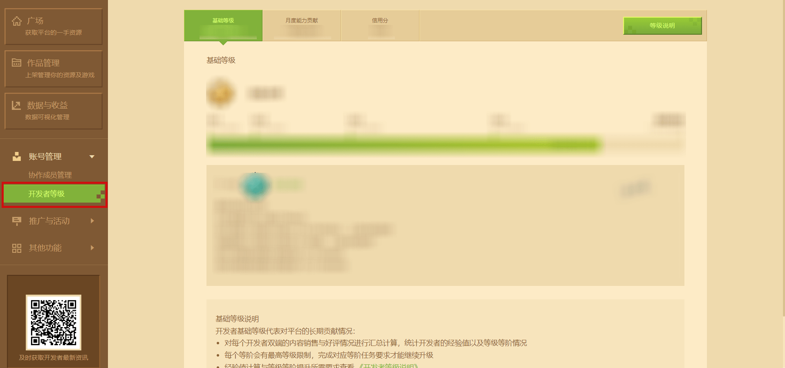

## [推广与活动](../40-活动、推广与收益/课程08-对作品进行推广与活动.html)

为了帮助开发者更好地推广资源，通过 **【推广与活动】** 功能组合多项推广渠道，帮助自身提高资源曝光率与获客量，间接提升转化率。

### 活动参与

当官方有特殊活动时，可以在 **【活动参加】** 页面选择自己的作品并提交审核参与活动。

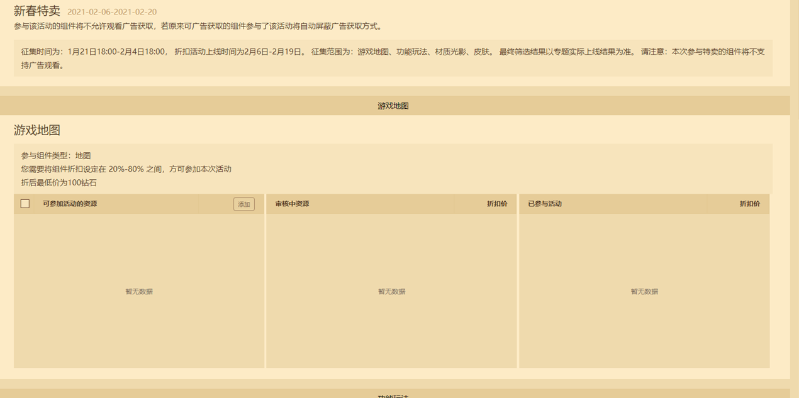

### 内容推广

内容推广是以收益分成的方式通过主播带货获得组件的曝光机会。在左侧推广与活动下的内容推广页面即可发布悬赏任务。

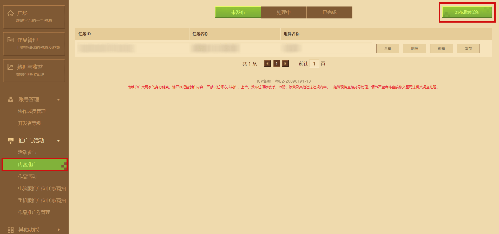

### 作品活动

作品活动功能会不定期发布官方性质的作品征集与推广渠道活动。请开发者在报名前仔细阅读活动公示，选择符合活动条件与自己满意的作品资源，将有机会入选并获得游戏内外的曝光资源，为作品收益提供助力。

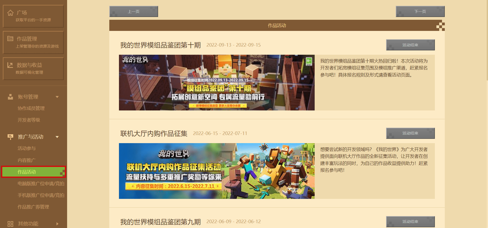

### [推广位申请与竞拍](../40-活动、推广与收益/课程16-推广位申请与竞拍试运行指南.html)

手机版与电脑版客户端内的推广位入口已整合为 **推广位申请与竞拍** 功能纳入 **【推广与活动】** 模块。结合自助式申请流程，开发者可以更加清楚、便利和及时地收到推广位申请与竞拍的结果。

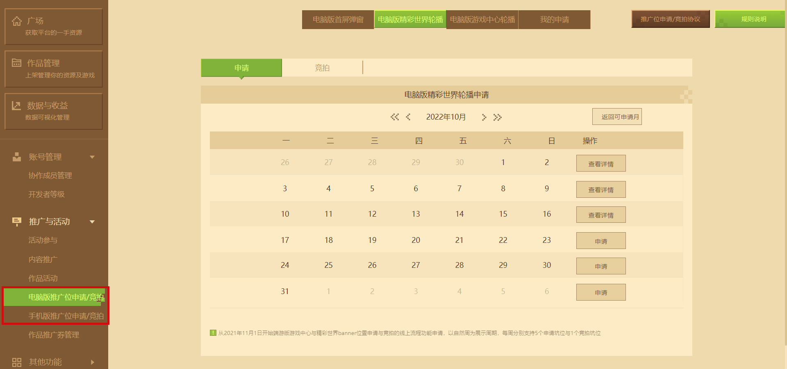

### [作品推广券管理](../40-活动、推广与收益/课程17-开发者作品推广券使用指南.html)

利用 **作品推广券管理** 功能搭配 **开发者作品推广券** ，开发者可以对想要推广的作品资源随时随地想推就推。实现热门档期的 **精准投放** ，争取获得最佳的曝光效果。目前已获取的 **开发者作品推广券** 时间向后推3个月为每张的到期日期。请尽快在到期日期前使用。

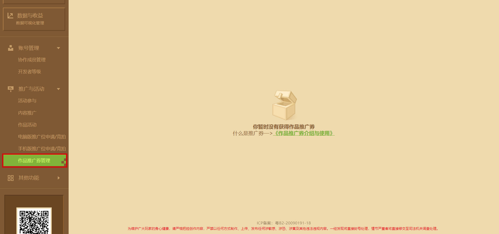