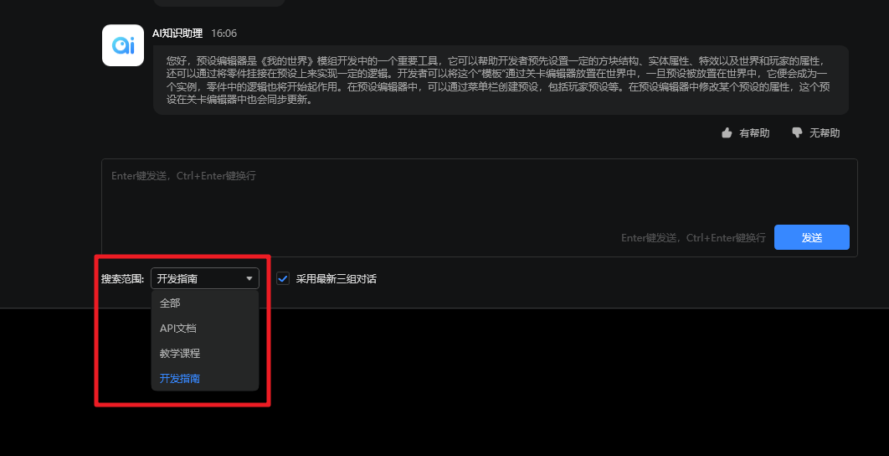

# AI知识助理

## 什么是AI知识助理？

AI知识助理是我的世界开发工作台全新推出的生成式AI问答助手，它熟知开发者官网内的所有文档，你可以向它询问任意模组开发的问题，它会竭尽所能为你一一解答，并附上它引用和参考的文档链接，以便你前往相关文档了解更多细节。

## 如何使用AI知识助理？

1. 打开我的世界工作台，进入AI知识助理页面，如下图：

2. 你可以在底部的输入框输入自己的问题，点击发送进行提问，另外，您也可以通过点击预设好的问题进行快速提问，如下图：

3. 对于正在解答的问题，你还可以点击下图中的【取消生成】中断本次回答。

4. 对于已经发送的问题，你可以点击消息气泡右侧的按钮进行删除和再次编辑，如下图：

5. 对于AI知识助理的回答，你可以点击消息气泡右侧的按钮进行删除，复制和重新生成，如下图：

6. 你还可以在每段回答的右下角对该答案的质量进行评价，每个回答只能评价一次。

7. 当您进行了多次对话后，可以通过右上角的清理对话删除历史记录。

## 进阶用法
### 指定搜索范围
您可以选择输入框左侧的下拉列表，选择您需要搜索的范围，则AI知识助理只会在指定的搜索范围内进行查找和组织回复。

### 采用近期对话连续问答
您可以勾选输入框下方的【采用近3次对话】选项，则AI知识助理在回答时，会参考近3次对话内容，以此给您提供更连续和精准的结果。

### 复制代码块内容
对于回答中有json和python代码时，将会被自动渲染为代码块，您可以点击代码块区域右上角的复制按钮一键获取响应的代码内容。

## 注意事项：

AI知识助理目前处于**beta测试阶段**，功能仍在持续优化中，欢迎所有开发者踊跃向我们反馈问题与建议：

1. 若您对知识助理的回答不满意，您可以通过点击回答右下角的【无帮助】按钮进行反馈。
2. 若您对AI知识助理的功能上有任何建议和意见，可以通过开发者平台进行提单反馈：[开发者平台问题与反馈中心](https://mcdev.webapp.163.com/#/feedbackModal?target=browser) 。
