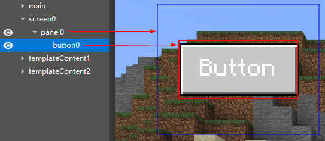

# 学习路线导览

## 欢迎制作我的世界中国版模组

如果你致力于制作我的世界的模组，我们为你提供了一系列的工具，这些工具将显著的降低模组的开发难度，并且可以大大加速模组开发的过程。

在使用这些工具前，你需要先注册成为开发者。

[注册成为开发者](./10-注册成为开发者.html)

## 什么是模组

我的世界是一个广受欢迎的游戏，并且有着大量可爱且宽容并包的玩家。我们在我的世界（原版游戏）的基础上进行一些修改，给玩家带来不同的体验，这些修改就是模组。

模组通常比原版游戏小得多，制作也更为简单，在进行过一系列的学习之后，相信你也可以做出自己的模组。

## 模组开发流程

不同种类的模组的开发流程可能截然不同，我们以比较复杂的角色扮演玩法地图为例，可以按下图分为大致5个阶段。

除了“模组内容设计”之外，你均可以使用中国版提供的工具或第三方工具来辅助你的工作。接下来我们会针对模组开发可能遇到的每一个环节进行阐述。

## 中国版提供的开发工具集

中国版为上述环节提供了数个有效的工具，他们主要被集成与我的世界开发工作台（MC Studio），你可以在这里下载它。

[下载开发工具](https://mc.163.com/dev/process.html#xz)

目前中国版总共提供了4个大工具，见下图左侧部分，其中MC Studio里又包含了下图右侧部分的另一些工具。

## 第一个作品（模组）

我的世界的一个个模组被我们称呼为作品，你的所有作品都展示在开发工具台（MC Studio）中，你也可以通过工具台来新建和管理作品。除此之外，工作台还有许多其他的作用。

[我的世界开发工作台使用说明](./20-MC%20Studio使用说明.html)

工作台目前仅支持创建基岩版作品，如果你有创作好的Java版模组，可以使用工作台的导入功能。

你可以通过一些简单的操作来完成你的第一个模组，现在就试试吧！

[制作第一个附加包](../20-玩法开发/13-模组SDK编程/1-Mod开发简介/2-制作第一个Mod.html)

## 地图、建筑制作

如果你打算制作

- 一张漂亮的地图
- 一个建筑
- 玩法模组里的一些局部地图

你可以使用地图编辑器。地图编辑器是我的世界编辑器（MC Editor）的一部分，编辑器集成在开发工作台（MC Studio）中。

[地图编辑器使用说明](../14-地图制作/2-地图编辑器使用说明.html)

<a href="../../mconline/100-历史归档教程/40-美术教程/2.建筑教程/01.建筑搭建的思路及基本方法.html" rel="noopenner"> 建筑搭建的思路及基本方法 </a>

制作局部地图主要使用结构功能，你可以将部分地图保存为结构，并且在你的玩法模组中使用。要做到这点，除了地图编辑器之外，还需要使用模组SDK进行编程等其他工具辅助。

## 模型和动作

如果你希望在模组中引入全新的生物形象，或者外形千奇百怪的方块，那么你需要制作自己制作模型，如果你需要让你的模型动起来，你还需要为模型制作动画。

我的世界中国版基岩版支持两种模型。一种是原生模型，我的世界中的大部分模型采用的都是这种模型。使用block bench可以很方便的制作原版模型，贴图和动画。

[原版模型制作指南](../16-美术/6-模型和动作/01-原版模型制作指南.html)

<a href="../../mconline/100-历史归档教程/40-美术教程/6.模型和模型动作/04.BLOCKBENCH教学.产出模型案例.html" rel="noopenner"> BLOCKBENCH教学 </a>

另一种是骨骼模型，骨骼模型被广泛应用于影视游戏行业的模型和动画制作，上手门槛较高，但是能提供比基岩版更好的效果。blender是一个免费且强大的软件，可以用于骨骼模型的制作。

[骨骼模型制作指南（Blender）](../16-美术/6-模型和动作/03-骨骼模型制作指南（Blender）.html)

将制作好的原版模型或者骨骼模型实际应用到模组中需要后续的其他知识。

## 制作光影或者特殊的美术效果

如果你想要制作精美的光影，或者为你的模型制作自定义的材质，来达到特殊的美术效果，你需要使用材质和着色器（Shader）。

[Shader使用简介](../16-美术/7-材质与着色器/1-材质介绍与着色器入门.html)

需要注意的是，Shader的学习门槛非常高，相对应中国版的模组市场中光影的数量也非常之少，如果可以做出炫酷的光影，相信一定可以获得玩家的青睐！

## 视觉特效

黎明时燃烧的僵尸的火焰，野外的降雨，都属于视觉特效（visual effect）。

我的世界中国版为你提供了两种制作和使用特效的方法，一种是原版特效，一种是中国版特效。

你可以使用第三方软件Snow Storm，或者直接写Json来制作原版特效，并通过附加包来配置特效最终应用在模组中。

<a href="../../mconline/100-历史归档教程/10-addon教程/第17章：原版粒子和特效粒子/课程10.简易教学.html" rel="noopenner"> 原版特效示例教学 </a>

除了原版特效外，我们专门为中国版特效提供了制作工具——特效编辑器。

[特效编辑器基本介绍](../16-美术/9-特效/00-特效编辑器简介.md)

注意：原版特效可以被挂接到原版模型上，与其共同使用；中国版特效则可以被挂接到骨骼模型上。两种技术方案不能混用。当然你可以在一种方块中使用原版模型和原版特效，在另一个生物中使用骨骼模型和中国版特效。

## 界面与交互

电子游戏（video game），当然也包括模组，与电影，漫画，小说等等最重要的不同就是，游戏是需要玩家参与的，而这种参与中很大的一部分就是交互，即玩家的操作可以影响游戏。

实体按键和触摸界面都是交互的形式，对于移动端来说，界面交互的使用场景显然更多。

中国版工具的界面编辑器为你提供了图形化操作制作界面的功能，以及可以在制作过程中对界面进行实时预览。

[界面编辑器使用说明](../18-界面与交互/1-界面编辑器使用说明.html)

<a href="../../mconline/100-历史归档教程/10-addon教程/第16章：创建界面/课程01.认识界面控件.html" rel="noopenner"> 认识界面控件 </a>

## 玩法

想让你的自定义生物可以在水中遨游，给方块更换模型，或者让你的史蒂夫可以打出帅气的连招，都需要进行玩法开发。

对此，你有两种有力的武器可以使用，分别是附加包编辑和Python编程。

附加包（Add On）是微软提供的一系列Json配置文件，你可以通过新增Json文件来修改游戏的方方面面。

模组SDK（Mod SDK）是一套以事件为核心的中国版模组开发的Python编程工具，除了直接写代码之外，还可以使用预设架构结合编辑器一起使用，提高某些场景下的开发效率。

在了解玩法开发之前，你可能需要了解一些我的世界的基本概念。

[我的世界基础概念](../20-玩法开发/10-基本概念/1-我的世界基础概念.html)

<a href="../../mconline/100-历史归档教程/10-addon教程/第02章：认识Minecraft世界/课程01.认识Minecraft世界.html" rel="noopenner"> 认识Minecraft世界 </a>

## 组装简单玩法

编辑器提供了一些内置的玩法模块，供开发者直接使用而无需编程，例如内置的预设和零件。

[关卡编辑器使用说明](../20-玩法开发/11-组装简单玩法/0-关卡编辑器.md)

内置资源包

## 可视化编程（蓝图）

编辑器内置的玩法模块可能不能满足你的野心，如果你需要更加特殊的玩法，就要开始接触编程了。目前我们为大家提供了一套全面的可视化编程工具，你可以通过连接节点的方式实现更加定制化的需求。这套工具内置在新版编辑器的逻辑编辑器中，目前可以几乎所有模组SDK编程能实现的需求。

[新版逻辑编辑器概述](../20-玩法开发/12-可视化编程/10-新版逻辑编辑器使用说明/01-什么是逻辑编辑器.html)

推荐大家观看下面的视频进行初步的学习：

- [第一个蓝图Mod](../20-玩法开发/12-可视化编程/00-第一个蓝图Mod/00-教程视频.html)
- [制作跑酷地图](../20-玩法开发/12-可视化编程/30-新版示例教程（视频）/05-制作跑酷地图（视频）.md)
- [制作简易射击附加包](../20-玩法开发/12-可视化编程/30-新版示例教程（视频）/07-制作简易射击附加包（视频）/01.md)

## Python编程

目前，一些较为复杂的玩法逻辑只能通过Python编程来实现。我们提供了强大的模组SDK（Mod SDK）供各位开发者使用。使用好这一工具需要一些Python编程的基础知识作为前置，你可以在[这个网站](https://www.liaoxuefeng.com/wiki/1016959663602400)进行学习。

[脚本开发入门](../20-玩法开发/13-模组SDK编程/2-Python脚本开发/0-脚本开发入门.html)

<a href="../../mconline/100-历史归档教程/10-addon教程/第10章：你的第一个MOD/课程01.认识MODSDK.html" rel="noopenner"> 认识MODSDK </a>

编程离不开接口的使用，除了Python自带的接口之外，你还需要使用模组SDK提供的一系列接口（API），这些接口的文档在技术手册中，在编程的过程中你可能需要实时查阅。

<a href="../../mcdocs/1-ModAPI/接口/通用/索引.html" rel="noopenner"> Mod API - 通用接口 - 索引 </a>

最近，我们推出了新的完全面向对象的预设架构，对于玩法地图，自定义生物/实体等等的制作带来了显著的效率提升。编辑器对预设架构进行了完整的支持，你可以很方便的新建、预览和编辑相关文件。

[第一个预设Mod](../20-玩法开发/14-预设玩法编程/9-第一个预设Mod/)

预设架构的具有一定的难度，我们为各位开发者提供了一段视频，推荐大家进行学习

- [第一个预设模组（视频）](../20-玩法开发/14-预设玩法编程/10-第一个预设模组（视频）/01.html)

预设架构同样提供了一系列的API供查阅。

<a href="../../mcdocs/3-PresetAPI/预设管理/PresetApi.html" rel="noopenner"> 预设管理 API </a>

## 自定义游戏内容

大部分情况下，想要修改或者新增方块，实体等等原版游戏包含的内容，都需要使用附加包（Add On）。附加包里玩法相关的部分主要是Json文件，你可以在开发工作台（MC Studio）的下载目录中找到我的世界自带的附加包，分为行为包和资源包：

- 行为包：\MCStudioDownload\game\MinecraftPE_Netease\（版本号）\data\behavior_packs\vanilla
- 资源包：\MCStudioDownload\game\MinecraftPE_Netease\（版本号）\data\resource_packs\vanilla

编辑器对附加包的修改提供了全中文和界面化支持，可以免于手动编辑Json文件，目前对于行为包的支持已经比较完善，并且支持部分资源包的编辑，我们会在后续对所有附加包内容提供编辑器支持。

[配置](../20-玩法开发/15-自定义游戏内容/0-配置.html)

对于编辑器目前不支持的附加包编辑功能，你可以直接编辑Json文件实现。

除了修改属性之外，通过附加包还可以编辑生物的AI，为实体和方块等指定模型，贴图，动画（包括动画逻辑），材质和特效（包括特效的播放逻辑）等等。

[自定义基础物品](../20-玩法开发/15-自定义游戏内容/1-自定义物品/1-自定义基础物品.html)

<a href="../../mconline/100-历史归档教程/10-addon教程/第06章：认识Addon/课程01.认识Add-on.html" rel="noopenner"> 认识Add-on </a>

## 手机电脑适配

将你做好的组件上架到中国版手机端（PE）是一个好主意。但是我的世界本身就提供了跨平台的功能，我们也贴心的为你提供了组件适配的教程，你可以花费非常小的工作量，将你精美优秀的组件同步上架到电脑端（PC），为你带来更多的粉丝和收入。

何乐而不为！

[PE模组适配PC](../20-玩法开发/19-手机电脑适配/1-PE模组适配PC.html)

## 网络游戏

网络服开服工具（Apollo）是用于开发和部署我的世界PE版网络游戏服务器集群的工具。集成插件、负载均衡、集群管理、运营指令等功能于一体。开发者只需专注于MOD业务逻辑，便可开发更多玩法组件，为我的世界网络服的创新拓展带来更多可能。

网络服开发者简称“服主”，服主在申请成为开发者之后，还需要申请测试机器，用于网络服的部署开发。开发完成后，需要进行提审，申请正式机器，用于最终上线。

测试机器申请可查看教程：<a href="../../mcguide/27-网络游戏/课程1：成为Apollo服主及相关准备/第3节：入驻申请.html">入驻申请</a>。

获得测试机器之后，需要连接开发机，可查看课程：<a href="../../mcguide/27-网络游戏/课程1：成为Apollo服主及相关准备/第5节：连接开发机.html">连接开发机</a>。

机器连接成功之后，可以按照指引视频，完成一系列的基本操作。可查看课程：<a href="../../mcguide/27-网络游戏/课程3：简易网络服模板部署与常见操作/第1节：简易网络服视频教程.html">简易网络服视频教程</a>。

其余的教学内容简介详见官网——教学中心——网络游戏以及官网——在线课程——网络服插件教程。

## 测试

制作游戏通常是在编辑器中，或者使用第三方的软件，但是在开发的过程中，你通常需要频繁的检测自己写的逻辑，或者制作/导入的资源是否可以在真正的游戏中正常运行。

这时，你就需要用到我们提供的测试工具了。开发工作台提供了数种测试方法，包括在编辑器内点击运行，点击作品的开发测试，以及通过存档进行开发测试。

开发测试使用的工具主要是基岩版开发板（Mod PC开发包），这个是专门用于测试的开发版本的我的世界。在测试中，你可以查看游戏运行时实时发送的日志，管理模组文件，使用调试代码。除了单人测试之外，我们还支持了联机测试和手机端测试。

[用 Mod PC 开发包进行局域网多人测试](../30-测试/0-ModPC开发包多人测试.html)

[使用调试工具进行手机和电脑端调试](../30-测试/1-使用调试工具进行手机和电脑端调试.html)

## 上传你的作品

在辛苦的完成你的模组，并且测试完毕，没有错误（bug）之后，你就可以上传你的作品到中国版的资源中心了。

这一步你需要用到开发者平台。当然如果你想要在资源中心出售你的模组（即使是免费），你还是需要遵守我们制定的一系列规则。

[正确上传作品的方式及途径](../35-上架与入驻/课程05-正确上传作品的方式及途径.html)

[组件上架的规范及过审攻略](../35-上架与入驻/课程03-组件上架的规范及过审攻略.html)

## 售卖和收益

现在到了谈钱的时候了，不要害羞，我们既要自我实现，也要填饱肚子。

当你的付费组件产生收益之后，我们会与你进行分成，相关的收益在开发者平台可以很方便的查询到。

除了单纯的售卖之外，你可以在开发者平台参加我们为你准备的各种活动，使用我们的计划为你的组件进行推广。

[收益查看及结算](../40-活动、推广与收益/课程07-收益查看及结算.html)

[内容推广模块](../40-活动、推广与收益/课程08-对作品进行推广与活动.html)

## 问题和反馈

文档是有限的，我的世界和模组开发是无限的。

总有文档覆盖不到的内容，如果你有其他的问题，可以先在这里查看我们是否已经有相应的回答了。

[常见问题答疑](../50-常见问题答疑/)

如果没有的话，任何你想知道的，我们做的不好的地方，我们非常，非常，非常欢迎你向我们进行反馈，你的反馈是我们进步的源泉。

[点击此此链接](https://qun.qq.com/qqweb/qunpro/share?_wv=3&_wwv=128&inviteCode=1VX5Hn&from=181074&biz=ka&shareSource=5#/pc)加入我的世界开发者QQ频道。

频道主要用于开发者之间的交流及官⽅活动发布，频道申请时需要备注开发者昵称及开发者邮箱。

开发者邮箱：<a href="../../mcguide/50-常见问题答疑/90-其他问题反馈途径.html">minecraftstarter@163.com</a>

⼀般⽤于申请推荐位，以及反馈平台上遇到的问题，建议等。

开发者论坛：http://mc.netease.com/forum-111-1.html

可以与其他开发者进行交流！根据板块反馈相对应问题，也可以举报违规组件，或是对违规处理结果存疑时进⾏申诉。

