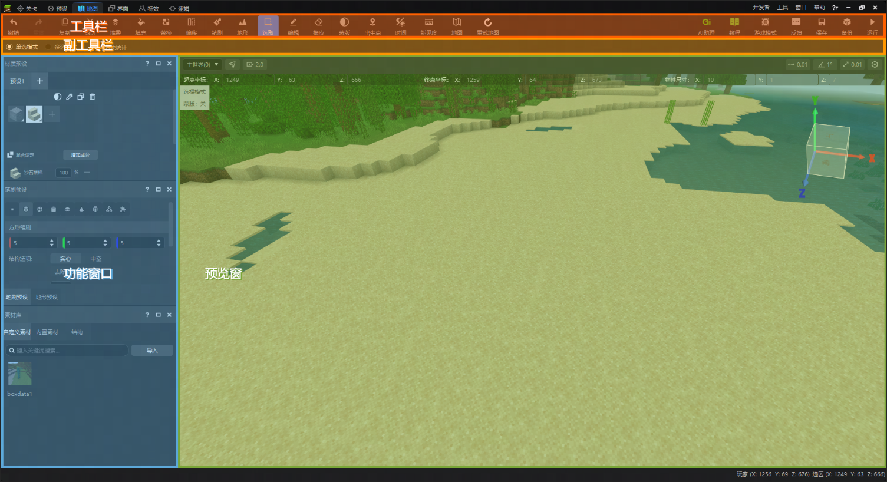

# 地图编辑器使用说明

**在本文中**

- [界面介绍](#界面介绍)
- [预览窗功能](#预览窗功能)
- [维度切换](#维度切换)
- [主要工具](#主要工具)
- [其他相关文档](#其他相关文档)
- [常用快捷键](#常用快捷键)

::: warning 注意

以下内容仅适用于 **新版编辑器** 。旧版编辑器现已停止更新，请将作品升级至新版使用。

:::

使用本章可快速查找并了解地图编辑器的工具资源和其他相关文档，以及常用快捷键。

## 界面介绍

地图编辑器的功能分区如下图所示：

1. ###  界面划分

   - **工具栏：** 包含地图编辑器主要编辑功能的入口按钮，同时还有撤销重做、保存、游戏模式、运行等编辑常用功能入口。

   - **副工具栏：** 用于展示工具栏中部分功能的配置项。在副工具栏中配置的功能通常较为简单，可配置项不多。

   - **功能窗口：** 如果一个编辑工具的功能较为庞杂，需要很多配置项，则会单独为其展示一个功能窗口，比如材质、笔刷、地形、素材库等，都有单独的窗口供您使用。

   - **预览窗：** 用于在编辑器内嵌游戏中提供编辑操作的预览效果。同时还兼具维度切换、坐标展示等功能。

2. ### 窗口布局调整

   -
     您可以根据自己的编辑需要，自行移动、开关功能窗口。

## 预览窗功能

编辑器预览窗里，默认的镜头移动方式类似我的世界创造模式的飞行：

- WASD键控制前后左右的移动，Shift键向下移动，空格键向上移动；
- 长按鼠标右键并移动鼠标，可调整当前视角；
- 使用鼠标滚轮沿当前镜头方向前进/后退。

在菜单栏点击【作品】-【设置】，可以调整操作方式为【镜头模式】：

- 在镜头模式下，W/S键控制移动为沿镜头方向的前进/后退。

## 维度切换

如果您需要在主世界以外的其他维度进行地图编辑，可以点击预览窗左上角的维度下拉菜单，将内嵌游戏切换至其他维度，如下界、末地，或者您自行创建的自定义维度。

如果在切换维度前存在自定义维度增删等操作，您可能会遇到弹窗提醒重载地图。详情请见关卡编辑器文档中[关于维度增删特殊情况的说明](../20-玩法开发/11-组装简单玩法/0-关卡编辑器.md#4-增删维度的特殊情况)。

## 主要工具

1. [选区工具](./3-选取工具.md)
2. [编辑工具](./4-编辑工具.md)
3. [材质选择](./5-材质选择.md)
4. [笔刷工具](./6-笔刷工具.md)
5. [地形工具](./7-地形工具.md)
6. [素材库、结构与剪贴板](./8-素材库、结构与剪贴板.md)

## 其他相关文档

1. [方块状态值设置说明](./91-方块状态值设置说明.md)
2. [蒙版工具说明](./92-蒙版工具说明.md)

## 常用快捷键

以下为常用的快捷键。

| 功能 | 快捷键| | 功能 | 快捷键 |
| :--- | :--- | :--- | :--- | :--- |
| 撤销 |  ctrl+Z | | 复制 | ctrl+C |
| 重做 | ctrl+Y | | 剪切 | ctrl+X |
| 保存地图 | ctrl+S | | 粘贴 | ctrl+V |
| 笔刷 | B | | 打开材质 | E |
| 地形 | L | | 切换材质 | 数字键1到0 |
| 选取 | M | | 以当前材质填充 | alt+delete |
| 取消选取 | ctrl+D | | 切换材质预设分页 | ~ |
| 编辑 | Q | | 调整选区/模型位置 | ctrl+鼠标滚轮 |
| 删除 | delete | | 吸管 | I |
| 完成 | 回车 | | 堆叠 | ctrl+M |
| 放弃编辑 | esc | | 填充 | ctrl+F |
| 橡皮 | Y | | 替换 | ctrl+H |
| 出生点 | ctrl+B || 偏移 | V |