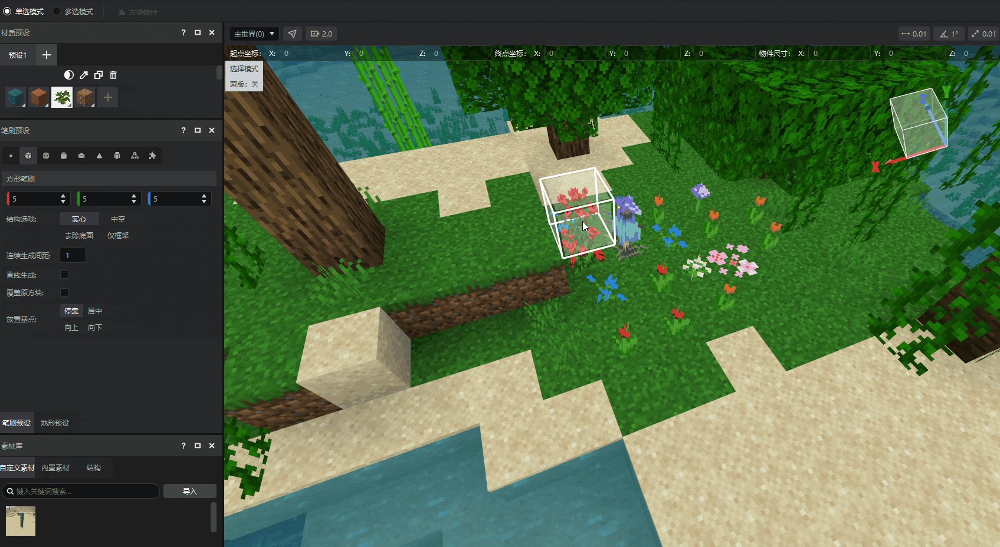
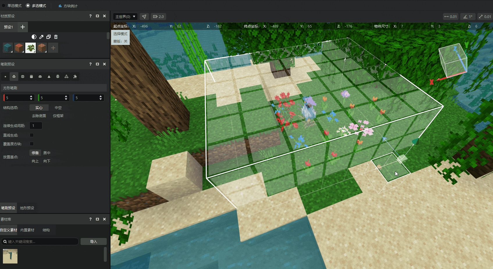
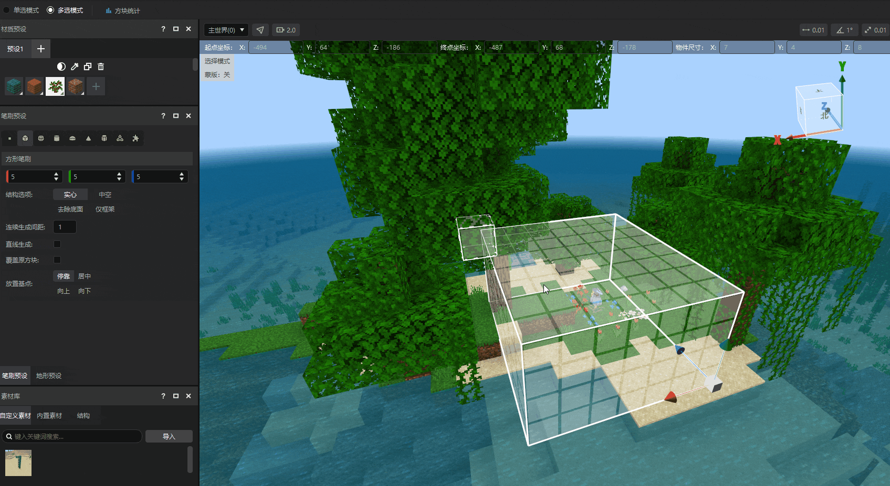
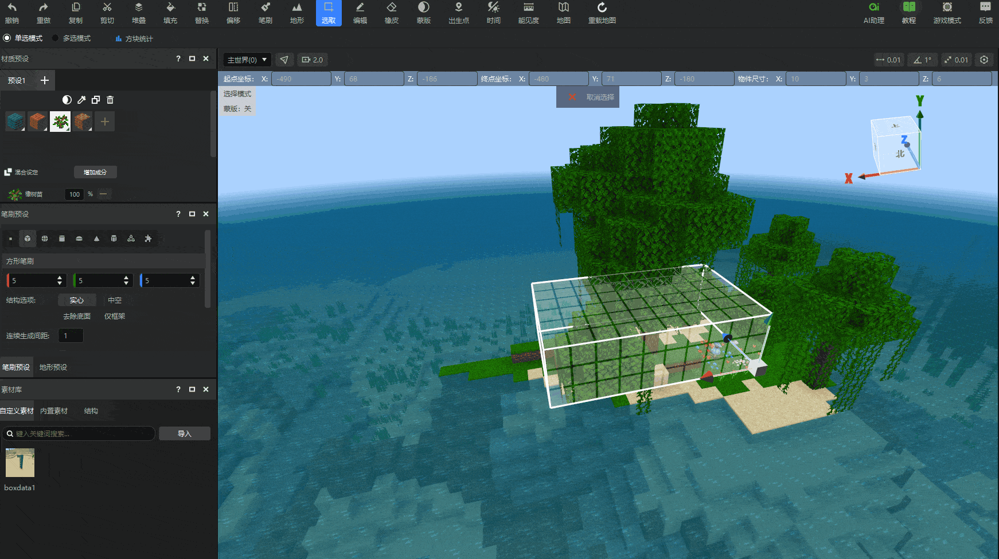
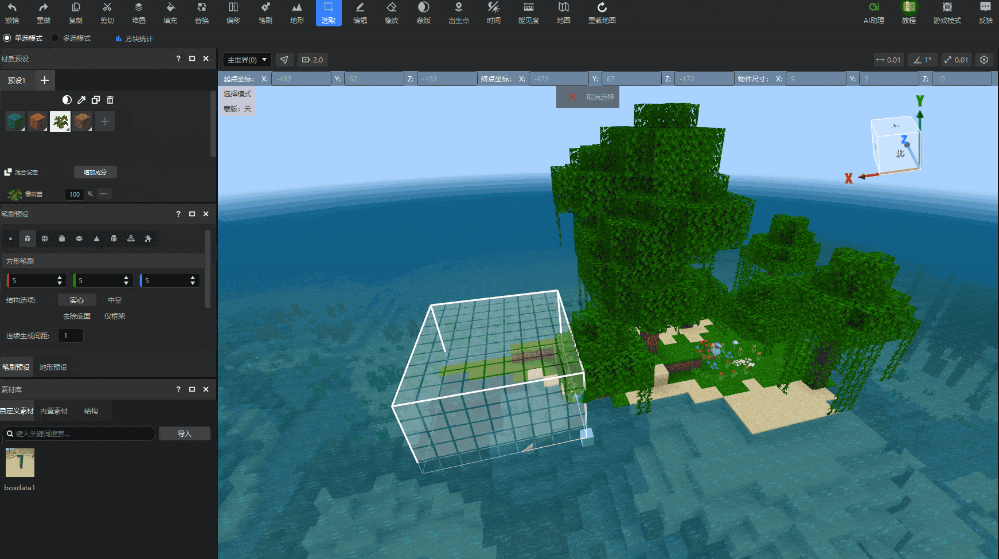
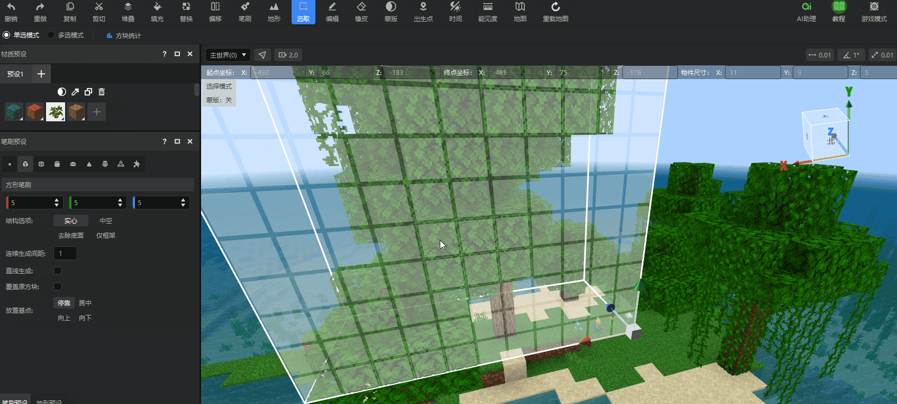
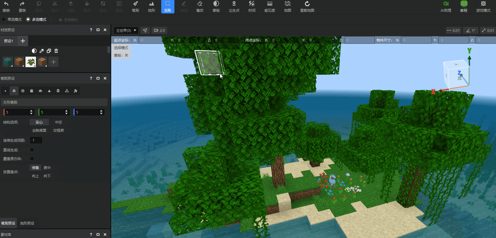
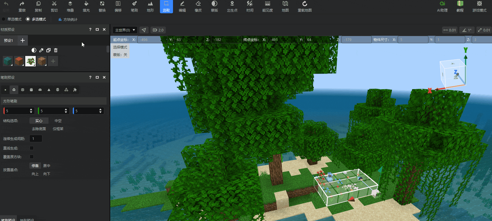
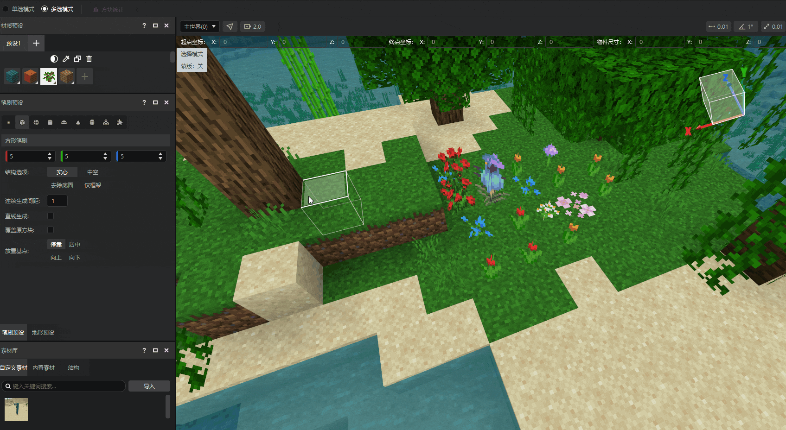
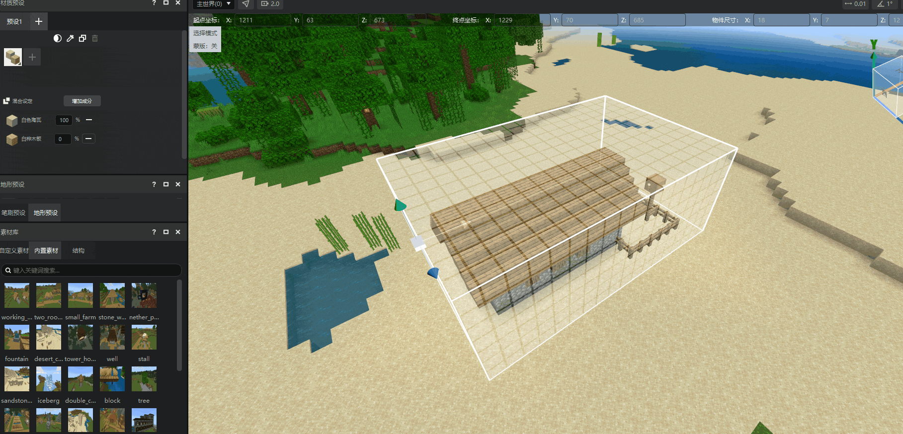

# 选取工具

选取工具能让您能够更加方便地对范围内的方块进行选中。在开始之前，您应该知道如何启动 **MC Studio** 、 **创建项目** 、 **进入编辑器模式** 并学会在内嵌游戏中 **移动** 。

在本指南中，您将学会：

- 如何使用 **地图编辑器** 基础操作—— **选取工具** 。

## 要求

建议在开始本指南之前完成以下内容。

- [MC Studio使用说明](../12-入门教程/20-MC%20Studio使用说明.md)
- [地图编辑器使用说明](./2-地图编辑器使用说明.md)

## 基础选取操作

点击工具栏中的【选取】按钮，即可进入选取模式。在选取模式下，选择一个方块作为 **起点** ，然后 **按住左键** 拖拽至 **终点** ，以起点和终点为对角线生成 **选区（包围盒）** 。

## 选区调整

选好选区后，您可以对选区进行如下调整：

- 拖动位移拖柄，对选区的位置进行X、Y、Z轴的移动.

- 点击工具栏【偏移】按钮，可以对选区位置进行更精确地调整。

::: tip 快捷键

Ctrl+鼠标滚轮调整包围盒的纵向位置，用键盘↑↓←→方向键调整包围盒的水平位置。

:::

- 拖动某个平面，调整选区尺寸；

- 点击空气区域或按ESC键取消选取选区。

- 单选模式下，当选区存在时，可以直接框选另一处选区以创建新的包围盒。

## 选区操作

选定好选区之后，您就可以对选区内方块进行进一步的操作了。

- **删除**（delete）：快速删除选区内的方块。

- **复制/剪切**（ctrl+X/ctrl+Z）：将选区及内部方块复制/剪切至剪贴版。此时包围盒会变成黄色状态，并进入[编辑](./4-编辑工具.html)状态。

- **堆叠**（ctrl+M）：点击堆叠按钮，将选中区域沿X、Y、Z轴定向堆叠指定次数， **确定** 选择后即可生成。

- **填充**（ctrl+F）：将选中区域中的全部空间替换成选定的方块，按下 **填充** 后即可生成。

- **替换**（ctrl+H）：将选中区域中含有的一种方块全部替换为选定的方块。点击每一行替代方块的右槽方块，选取您想要的方块材质，点击 **替换** 按钮一键看到结果。

::: tip 提示

填充和替换工具可以指定所用方块的状态值，例如您可以指定使用朝东的原木楼梯来填充选区。关于状态值的使用，请查看[这篇文档](./91-方块状态值设置说明.md)。

:::

## 多选模式

选取工具默认为【单选模式】，我们可以在副工具栏上切换为【多选模式】，这样我们可以同时选出多个选区。

- 选中多个选区后，可以对其中单独一个选区进行位置、尺寸的调整。

::: tip 提示

复制、剪切、堆叠、填充、替换、偏移等工具将对全部选区共同生效。

:::

## 智能识别物体

选中建筑区域后，右键选择 **智能识别物体**，即可框选出指定的建筑结构，并将包围盒缩小至建筑大小，方便进一步操作。

## 下一步：编辑工具

选取区域还仅仅只是第一步，使用[编辑工具](./4-编辑工具.md)对世界做些改变吧！
