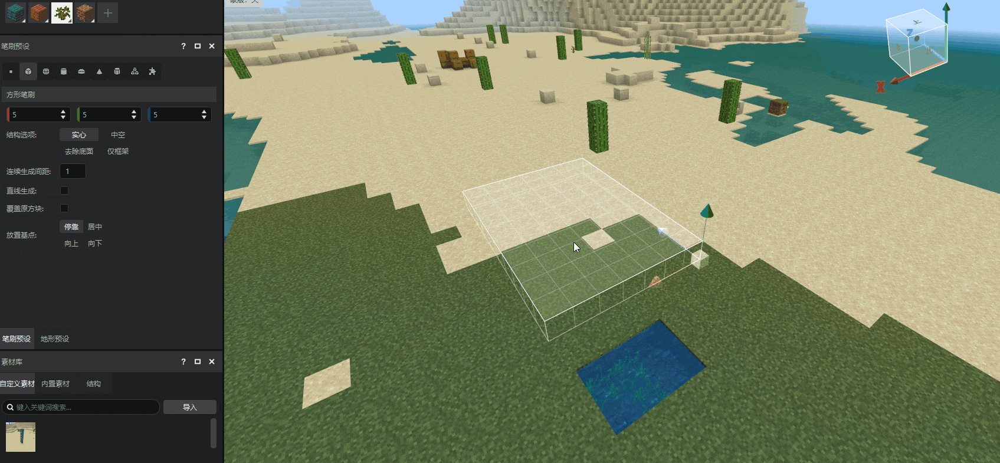
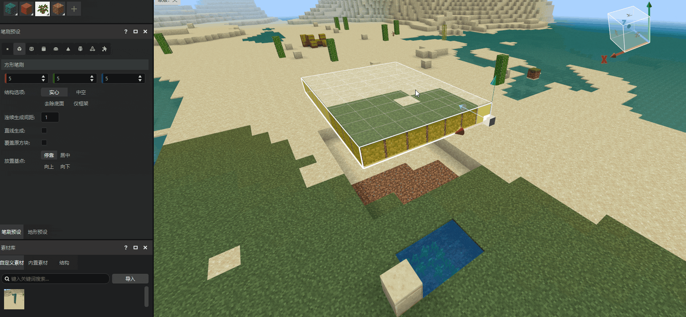
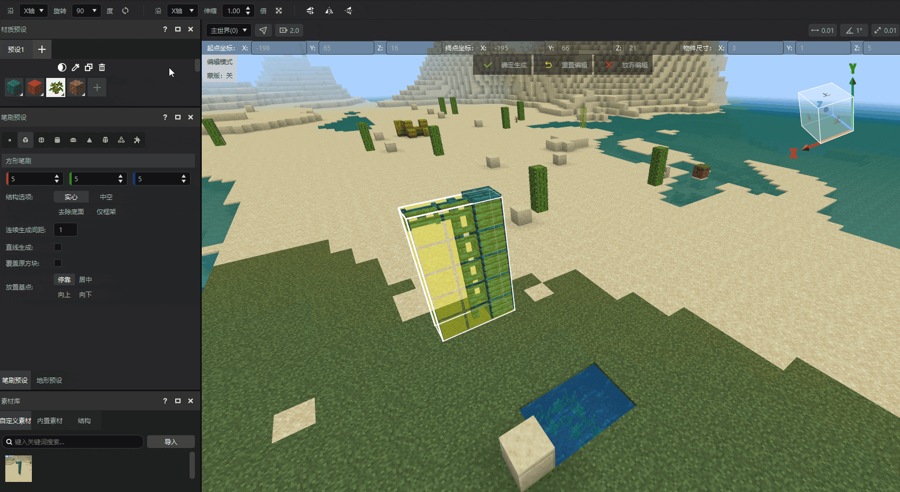
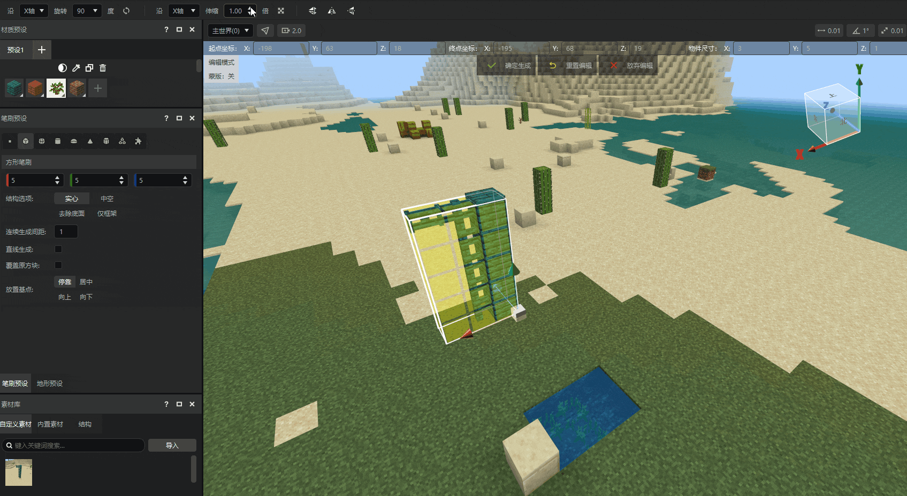

# 编辑工具

选好选区后，编辑工具将选取方块模拟生成，并通过操作系列使其在世界中生效。在开始之前，您应该学会熟悉地图编辑器的布局与选取工具。

在本指南中，您将学会：

- 如何使用 **地图编辑器** 基础操作—— **编辑工具** 。

::: danger 快捷键

使用快捷键Q快速切换选区模式至编辑模式，对包围盒内的方块结构进行编辑。

:::

## 要求

建议在开始本指南之前完成以下内容。

- [选取工具](./3-选取工具.md)

## 常用编辑操作

在编辑模式下，我们可以：

- **使用拖柄移动选区内的方块。**

- **使用拖柄缩放选区内的方块。**

- **选区方块绕轴旋转：** 在 **编辑工具** 的 **副工具栏** 可以选择沿一个轴旋转`90°`、`180°`或`-90°`。

- **选区方块沿轴按倍数伸缩：** 在 **编辑工具** 的 **副工具栏** 可以选择沿一个轴旋转`90°`、`180°`或`-90°`。

::: danger 提示

需要注意的是，如果选区内有明确方向状态的方块，一般不适合直接对齐进行尺寸伸缩，或进行沿X、Z轴的旋转操作，因为在大多数情况下这样做并不能带来期望的效果。

:::

## 对多选选区的编辑

在多选模式下，编辑操作影响所有子选区。点击 **编辑** 会显示一个大的包围盒，实际编辑人移动、旋转、缩放时，会将之前子选区内方块整合后统一处理。

## 下一步：材质选择

现在您已经学习了编辑工具的所有功能，包括如何将选取工具切换至编辑工具，并对所选区域进行移动、缩放、旋转。

在下一节中，您将学习如何使用材质工具在地图中选取想要铺设的方块。
